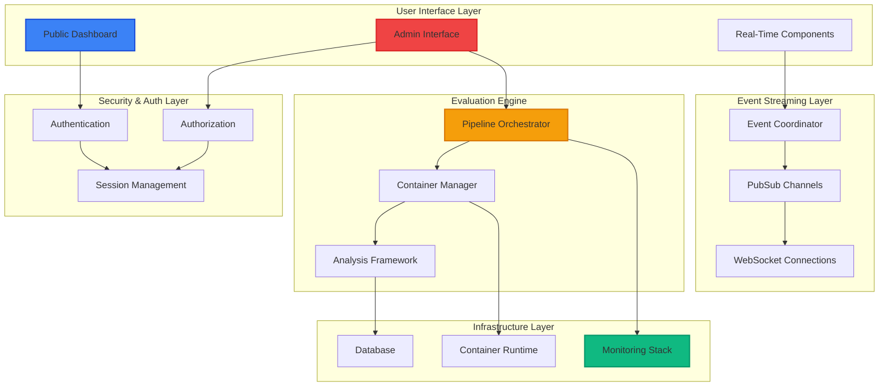

# SWE-bench-Elixir Developer Guides

Welcome to the comprehensive developer documentation for SWE-bench-Elixir. These guides provide detailed technical documentation for understanding, contributing to, and extending the automated evaluation platform for AI-generated Elixir code.

## Quick Start

### For New Developers

1. **Start Here**: [Architectural Overview](./architectural-overview.md) - Understand the complete system architecture
2. **Core Pipeline**: [Pipeline Architecture](./pipeline-architecture.md) - Learn how evaluations are processed
3. **Web Interface**: [Web Interface](./web-interface.md) - Understand the user-facing components
4. **Real-Time Features**: [Real-Time Events](./real-time-events.md) - Learn the event streaming system

### For Contributors

1. **Authentication**: [Authentication System](./authentication-system.md) - Security and access control
2. **Monitoring**: [Monitoring Infrastructure](./monitoring-infrastructure.md) - Observability and alerting
3. **Containers**: [Container Management](./container-management.md) - Execution environments

## System Architecture Overview



## Component Guides

### Core System Components

#### [Architectural Overview](./architectural-overview.md)
**Essential reading for all developers**
- Complete system architecture and technology stack
- High-level component interaction and data flow
- Key design principles and patterns
- Development workflow and getting started guide

#### [Pipeline Architecture](./pipeline-architecture.md) 
**Core evaluation engine documentation**
- GenStage-based evaluation pipeline design
- Container integration and resource management
- Advanced features: caching, throttling, optimization
- Performance tuning and monitoring integration

#### [Container Management](./container-management.md)
**Secure execution environment documentation**
- Advanced container pool management and scaling
- Security isolation and resource protection
- Performance optimization and container reuse
- Health monitoring and automatic recovery

### User Interface Components

#### [Web Interface](./web-interface.md)
**Phoenix LiveView interface documentation**
- Public dashboard with advanced filtering capabilities
- Admin interface with secure evaluation submission
- Real-time component architecture and state management
- Authentication integration and role-based rendering

#### [Real-Time Events](./real-time-events.md)
**Event streaming system documentation**
- Phoenix.PubSub-based event architecture
- WebSocket connection management and recovery
- Event sourcing and replay capabilities
- Performance optimization and reliability patterns

### Security and Operations

#### [Authentication System](./authentication-system.md)
**Security and access control documentation**
- Multi-tier role-based access control (admin/researcher/public)
- Session management with analytics and security monitoring
- Comprehensive audit logging for compliance
- Usage limiting with tier-based quotas and enforcement

#### [Monitoring Infrastructure](./monitoring-infrastructure.md)
**Observability and alerting documentation**
- Enterprise-grade monitoring with custom metrics
- SLI/SLO monitoring with intelligent alerting
- Distributed tracing with OpenTelemetry compatibility
- Structured logging with trace correlation

## Key Features by Component

### Phase 1-3: Core Infrastructure
- ✅ **Container Management**: Isolated execution with advanced pool management
- ✅ **Test Runner**: Comprehensive test execution with multiple frameworks  
- ✅ **Repository Setup**: Automated repository configuration and task extraction
- ✅ **Pipeline Processing**: GenStage-based evaluation with intelligent caching

### Phase 4: Advanced Capabilities  
- ✅ **Distributed Testing**: Multi-node cluster evaluation coordination
- ✅ **Hot Code Reloading**: Zero-downtime upgrade evaluation
- ✅ **Performance Benchmarking**: Benchee integration with detailed analysis
- ✅ **Partial Credit Scoring**: Multi-dimensional evaluation beyond pass/fail
- ✅ **Concurrent Evaluation**: Race condition and deadlock detection
- ✅ **Repository Expansion**: 30+ repository support with production applications

### Phase 5: Production Interface
- ✅ **Web Interface**: Phoenix LiveView with advanced dual filtering
- ✅ **Real-Time Events**: Instant updates through Phoenix.PubSub streaming
- ✅ **LiveView Components**: Modular component architecture with state management
- ✅ **Authentication**: Role-based security with comprehensive audit logging
- ✅ **Monitoring**: Enterprise observability with SLI/SLO tracking and alerting
- ✅ **Integration Tests**: Comprehensive validation for production deployment

## Repository and Model Support

### Supported Repositories (17+)
- **Core Libraries**: Phoenix, Ecto, Jason, Tesla, Credo
- **Expanded Libraries**: Phoenix LiveView, Oban, Broadway, Benchee, ExDoc, Bamboo, Guardian, Absinthe, Nx, Membrane
- **Production Applications**: Plausible Analytics (ClickHouse), Changelog.com (Media Processing)

### Supported LLM Models
- **OpenAI**: GPT-4, GPT-3.5-Turbo
- **Anthropic**: Claude-3.5-Sonnet, Claude-3-Haiku
- **Google**: Gemini-Pro, Gemini-1.5-Flash

## Development Patterns

### Adding New Features

1. **Follow Existing Patterns**: Use established GenServer and LiveView patterns
2. **Add Comprehensive Tests**: Include unit, integration, and property-based tests
3. **Implement Monitoring**: Add telemetry events and custom metrics
4. **Update Guides**: Document new features in relevant guides
5. **Security Review**: Ensure proper authentication and authorization

### Code Quality Standards

- **Credo Compliance**: All code must pass strict Credo analysis
- **Test Coverage**: Minimum 90% test coverage for new features
- **Documentation**: Comprehensive module and function documentation
- **Performance**: Consider performance implications and add monitoring
- **Security**: Security-first approach with proper access control

## Configuration Reference

### Development Environment

```elixir
config :swe_bench,
  # Core pipeline
  evaluation_timeout: 300_000,
  container_pool_size: 5,
  
  # Real-time events
  pubsub_adapter: Phoenix.PubSub.PG2,
  event_store_enabled: true,
  
  # Authentication
  session_timeout: 3600,
  audit_logging: true,
  
  # Monitoring
  metrics_collection: true,
  tracing_enabled: true,
  alerting_enabled: false
```

### Production Environment

```elixir
config :swe_bench,
  # Core pipeline
  evaluation_timeout: 600_000,
  container_pool_size: 50,
  
  # Real-time events  
  event_store_enabled: true,
  bandwidth_optimization: true,
  
  # Authentication
  session_timeout: 3600,
  audit_logging: true,
  usage_limiting: true,
  
  # Monitoring
  metrics_collection: true,
  prometheus_enabled: true,
  tracing_enabled: true,
  alerting_enabled: true,
  slo_monitoring: true
```

## Getting Help

### Resources
- **Elixir Documentation**: [hexdocs.pm/elixir](https://hexdocs.pm/elixir)
- **Phoenix Framework**: [hexdocs.pm/phoenix](https://hexdocs.pm/phoenix)
- **LiveView**: [hexdocs.pm/phoenix_live_view](https://hexdocs.pm/phoenix_live_view)
- **GenStage**: [hexdocs.pm/gen_stage](https://hexdocs.pm/gen_stage)

### Contributing

1. **Read the Guides**: Understand the architecture before contributing
2. **Check Issues**: Look for open issues or feature requests
3. **Follow Patterns**: Maintain consistency with existing code patterns
4. **Add Tests**: Comprehensive test coverage is required
5. **Update Documentation**: Keep guides current with changes

## Advanced Topics

### Custom Analysis Framework
Learn how to add new analysis dimensions to the evaluation pipeline

### Repository Integration
Understand how to add support for new Elixir repositories  

### Performance Optimization
Advanced techniques for optimizing evaluation throughput

### Security Hardening
Additional security measures for enterprise deployment

These guides provide comprehensive documentation for understanding, developing, and extending the SWE-bench-Elixir platform. Each guide includes detailed explanations, code examples, and Mermaid diagrams to illustrate complex concepts and relationships.