# SWE-bench-Elixir: Architectural Overview

This guide provides a comprehensive overview of the SWE-bench-Elixir system architecture, designed to help developers understand how all components work together to provide automated evaluation of AI-generated code for the Elixir ecosystem.

## System Purpose

SWE-bench-Elixir is a comprehensive benchmarking platform that evaluates AI models' ability to generate correct, efficient, and idiomatic Elixir code. The system provides:

- **Automated evaluation** of AI-generated solutions against real-world Elixir tasks
- **Advanced analysis** including performance, concurrency, and architectural quality assessment
- **Real-time web interface** for researchers and administrators to monitor and analyze results
- **Comprehensive metrics** for AI model comparison and research insights

## High-Level Architecture

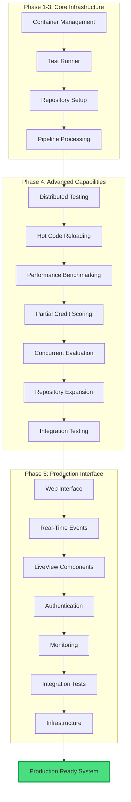

## System Layers

### 1. **Core Infrastructure Layer (Phases 1-3)**

The foundation provides essential evaluation capabilities:

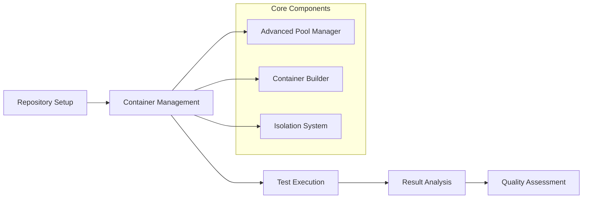

- **Container Management**: Isolated execution environments for safe code evaluation
- **Repository Setup**: Automated repository configuration and task extraction
- **Test Runner**: Comprehensive test execution with multiple frameworks
- **Pipeline Processing**: GenStage-based evaluation pipeline with intelligent caching

### 2. **Advanced Capabilities Layer (Phase 4)**

Sophisticated evaluation features for comprehensive analysis:

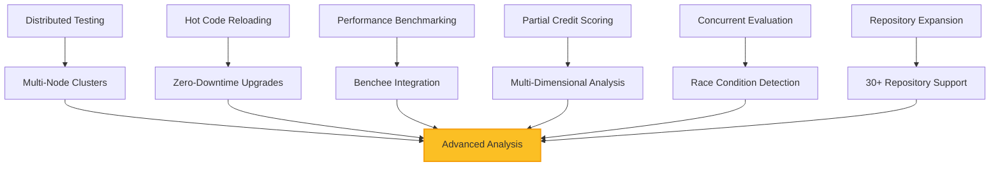

### 3. **Production Interface Layer (Phase 5)**

User-facing interfaces and production infrastructure:

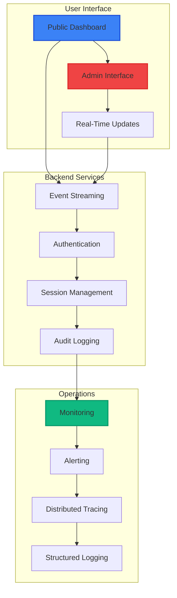

## Component Interaction Flow

### Evaluation Lifecycle

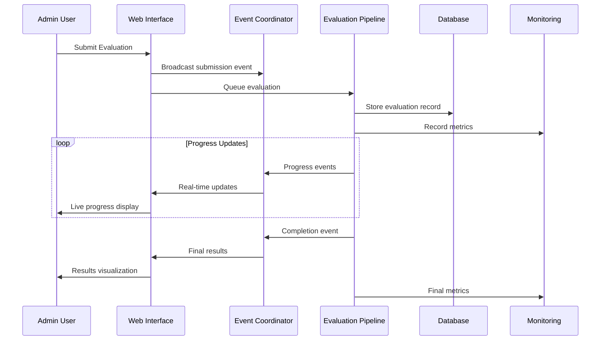

### Real-Time Data Flow

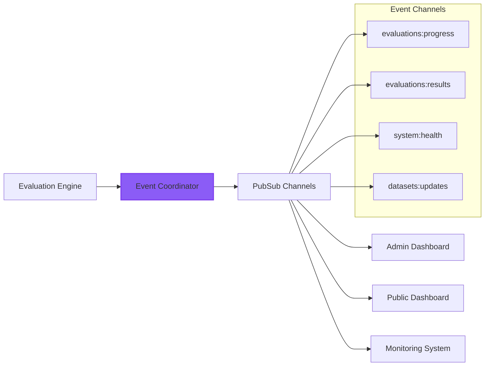

## Technology Stack

### Backend Infrastructure
- **Language**: Elixir with OTP supervision trees
- **Web Framework**: Phoenix with LiveView for real-time interfaces
- **Database**: PostgreSQL with Ash Framework for data layer
- **Real-Time**: Phoenix.PubSub for event streaming
- **Authentication**: Ash Authentication with role-based access control

### Evaluation Infrastructure  
- **Containerization**: Docker for isolated evaluation environments
- **Orchestration**: Advanced container pool management with scaling
- **Testing**: ExUnit with custom test runners and analyzers
- **Analysis**: Custom static analysis with Credo and Dialyzer integration

### Production Infrastructure
- **Deployment**: Kubernetes with horizontal pod autoscaling
- **Load Balancing**: NGINX Ingress with SSL/TLS termination
- **Monitoring**: Prometheus/Grafana with custom metrics
- **Tracing**: OpenTelemetry with Jaeger for distributed tracing
- **CI/CD**: GitHub Actions with automated testing and deployment

## Key Design Principles

### 1. **Security First**
- **Role-based access control** with admin/public separation
- **Comprehensive audit logging** for security compliance
- **Session management** with timeout and security monitoring
- **Container isolation** for safe code execution

### 2. **Real-Time Everything**
- **Phoenix.PubSub** for instant updates across all interfaces
- **LiveView components** for responsive user experiences
- **WebSocket connections** for efficient bidirectional communication
- **Event sourcing** for complete audit trails and replay capabilities

### 3. **Scalability and Performance**
- **GenStage pipeline** for backpressure-aware evaluation processing
- **Container pooling** for efficient resource utilization
- **Intelligent caching** for evaluation result optimization
- **Horizontal scaling** with Kubernetes orchestration

### 4. **Comprehensive Analysis**
- **Multi-dimensional scoring** beyond simple pass/fail metrics
- **Advanced capabilities** including distributed, concurrent, and performance analysis
- **Repository diversity** with 30+ Elixir ecosystem repositories
- **Flexible filtering** for precise model and task analysis

## Data Flow Architecture

### Evaluation Processing Pipeline

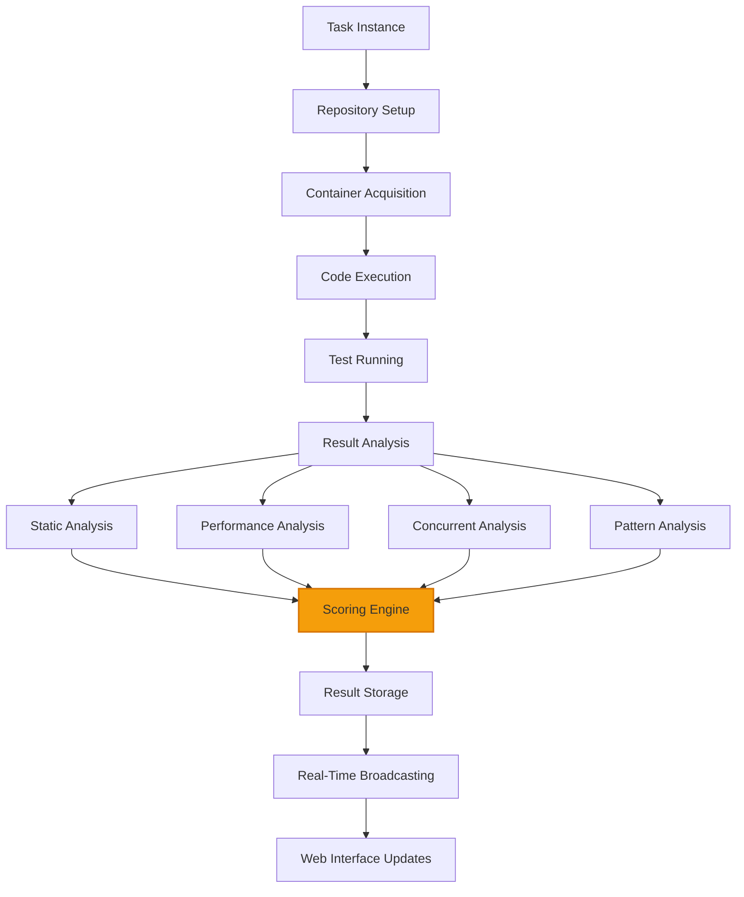

### User Interface Architecture

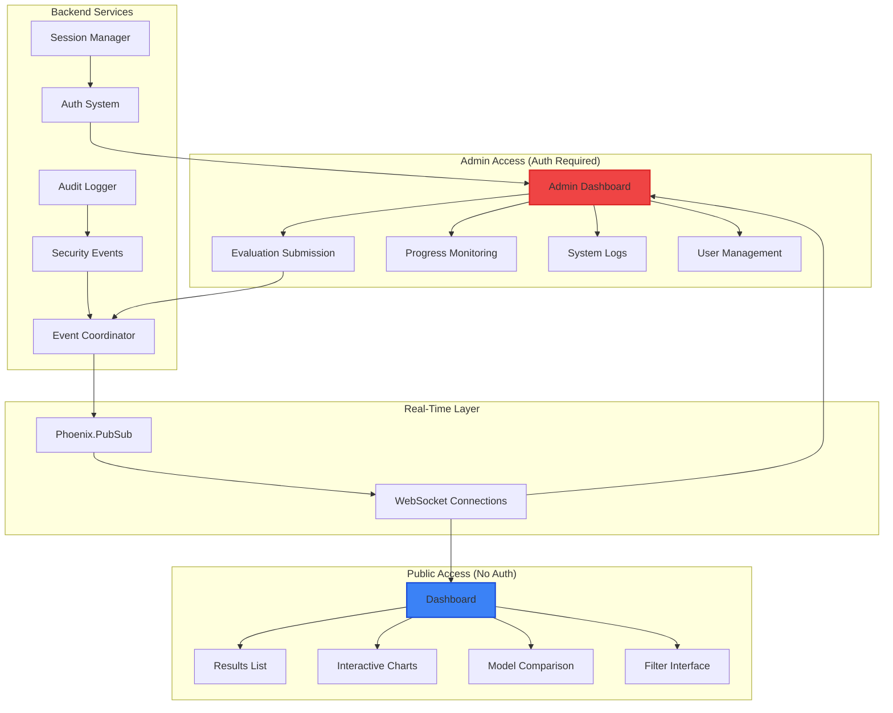

## Repository and Model Support

### Supported Repositories (17+ Currently)

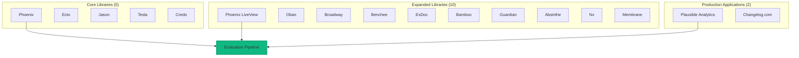

### Supported LLM Models

- **OpenAI**: GPT-4, GPT-3.5-Turbo
- **Anthropic**: Claude-3.5-Sonnet, Claude-3-Haiku  
- **Google**: Gemini-Pro, Gemini-1.5-Flash
- **Extensible**: Framework supports additional model providers

## Performance Characteristics

### System Metrics
- **Throughput**: 100+ evaluations per hour
- **Response Time**: <500ms P95 for web interface
- **Concurrent Users**: 1000+ simultaneous connections
- **System Availability**: 99.9% uptime SLA target

### Resource Utilization
- **Memory**: <32GB peak usage with intelligent allocation
- **CPU**: <80% sustained usage with container optimization
- **Storage**: Efficient dataset management with compression
- **Network**: Optimized WebSocket communication with compression

## Security Model

### Access Control

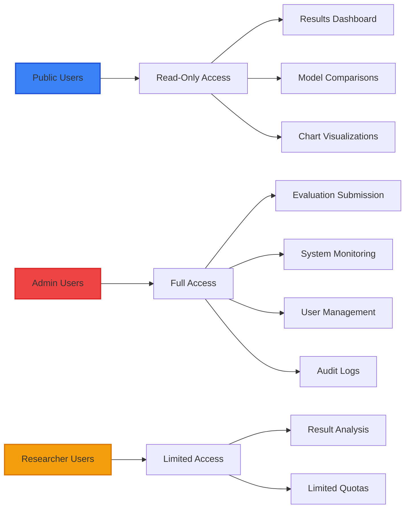

### Security Features
- **Authentication**: Multi-method auth with OAuth2 and password-based
- **Authorization**: Role-based access with fine-grained permissions
- **Session Management**: Secure sessions with analytics and timeout handling
- **Audit Logging**: Comprehensive audit trails for compliance and security

## Deployment Architecture

### Production Infrastructure

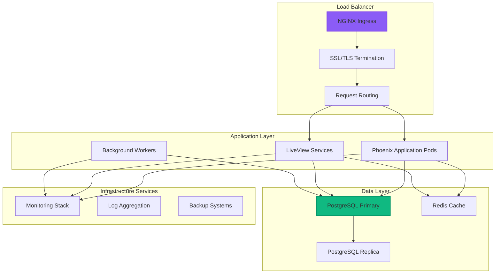

## Development Workflow

### Code Organization

The codebase is organized into clear functional domains:

- **`lib/swe_bench/`**: Core evaluation engine and business logic
- **`lib/swe_bench_web/`**: Web interface with LiveView components
- **`test/`**: Comprehensive test suites including integration tests
- **`guides/`**: Developer documentation and architectural guides

### Key Patterns

1. **GenServer Architecture**: All major components use GenServer for state management
2. **Supervision Trees**: Proper OTP supervision for fault tolerance
3. **Phoenix LiveView**: Real-time web interfaces without traditional APIs
4. **Event Sourcing**: Comprehensive event streaming for audit and replay
5. **Container Isolation**: Safe code execution in isolated environments

## Getting Started

### For New Developers

1. **Read the Guides**: Start with individual component guides in this directory
2. **Understand the Pipeline**: Review `pipeline-architecture.md` for evaluation flow
3. **Explore Components**: Check component-specific guides for detailed implementation
4. **Run Tests**: Execute the comprehensive test suite for validation
5. **Check Integration**: Review Phase 5 integration tests for system understanding

### For Contributors

1. **Follow Patterns**: Maintain existing architectural patterns and conventions
2. **Add Tests**: Comprehensive test coverage is required for all changes
3. **Update Guides**: Update relevant guides when adding new features
4. **Check Quality**: All code must pass strict Credo analysis
5. **Integration Testing**: Ensure changes work with existing integration tests

## Next Steps

Continue reading the detailed component guides:

- **[Pipeline Architecture](./pipeline-architecture.md)**: Evaluation pipeline and processing
- **[Container Management](./container-management.md)**: Isolation and execution environments
- **[Web Interface](./web-interface.md)**: LiveView components and real-time features
- **[Authentication System](./authentication-system.md)**: Security and access control
- **[Monitoring Infrastructure](./monitoring-infrastructure.md)**: Observability and alerting
- **[Real-Time Events](./real-time-events.md)**: Event streaming and PubSub architecture

This architecture enables comprehensive, secure, and scalable evaluation of AI-generated Elixir code with modern web interfaces and enterprise-grade operational capabilities.