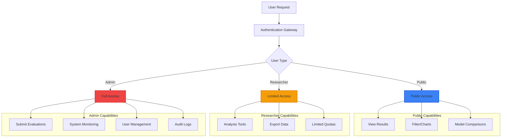
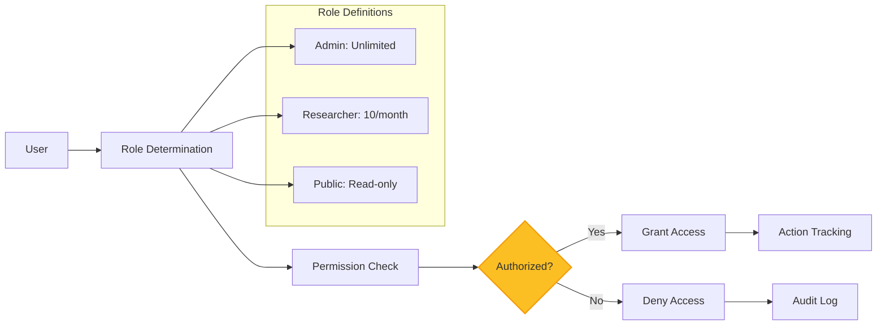
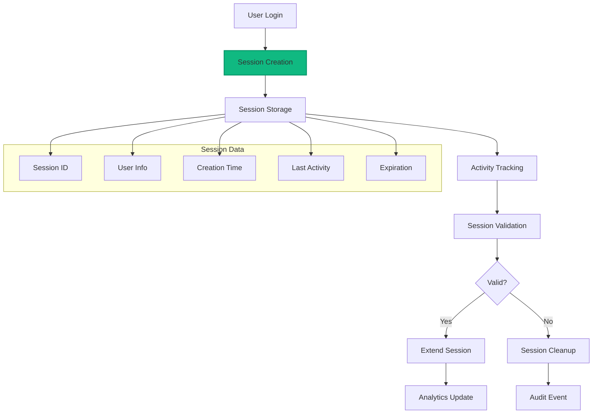
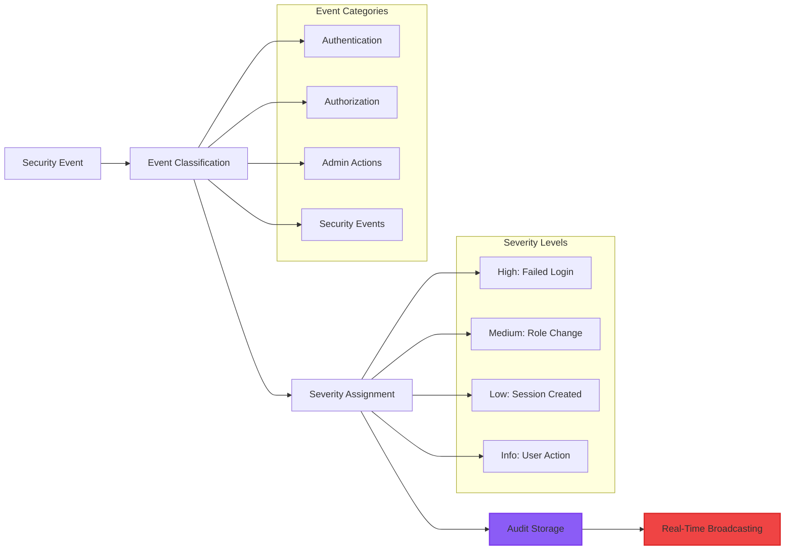
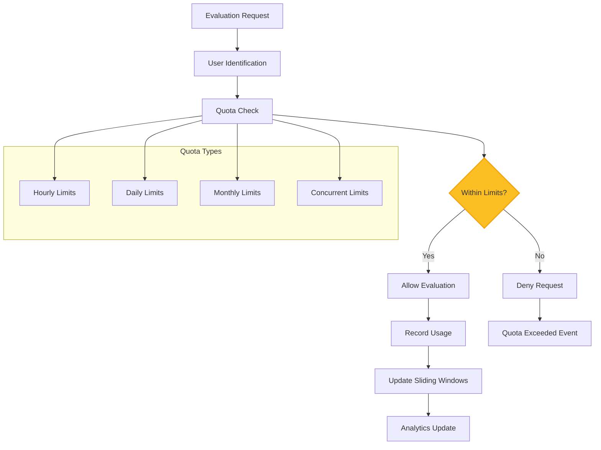
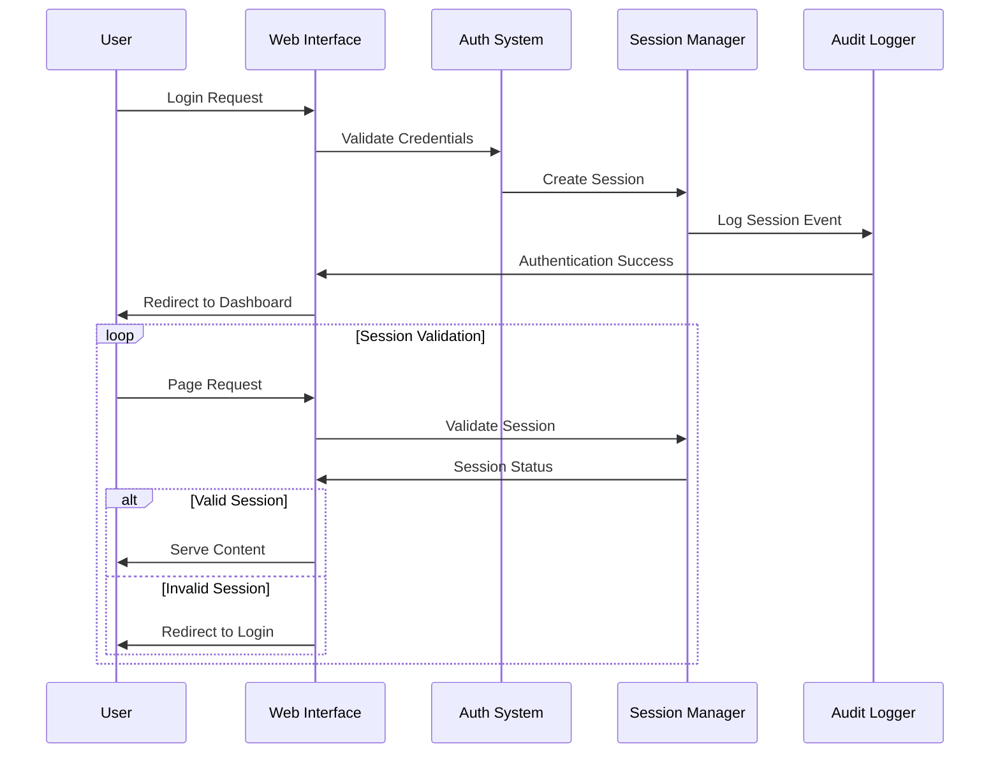
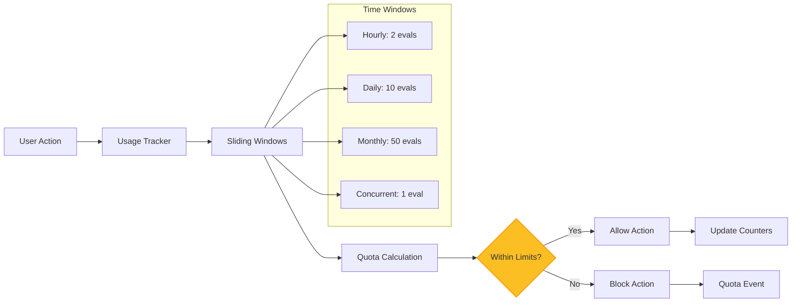

# Authentication System Guide

This guide explains the comprehensive authentication and authorization system that provides secure access control with admin/public separation and enterprise-grade security features.

## Security Architecture

### Multi-Tier Access Control



## Core Components

### 1. Authorization Framework (`lib/swe_bench/accounts/authorization.ex`)

**Purpose**: Role-based permission system with clear capability definitions



**Permission Matrix**:
```elixir
@user_roles %{
  admin: %{
    can_submit_evaluations: true,
    can_view_system_logs: true,
    can_access_admin_interface: true,
    evaluation_quota: :unlimited
  },
  researcher: %{
    can_submit_evaluations: false,
    evaluation_quota: 10  # 10 evaluations per month
  },
  public: %{
    can_submit_evaluations: false,
    evaluation_quota: 0   # Read-only access
  }
}
```

### 2. Session Manager (`lib/swe_bench/accounts/session_manager.ex`)

**Purpose**: Secure session management with analytics and monitoring



**Session Features**:
- **Secure IDs**: Cryptographically secure session identifiers
- **Analytics**: Session duration, login methods, and activity patterns
- **Automatic Cleanup**: Expired session cleanup with configurable retention
- **Multi-Session**: Support for multiple concurrent sessions per user

### 3. Audit Logger (`lib/swe_bench/accounts/audit_logger.ex`)

**Purpose**: Comprehensive audit trail for security compliance



### 4. Usage Limiter (`lib/swe_bench/accounts/usage_limiter.ex`)

**Purpose**: Fair resource allocation through tier-based quotas



## Authentication Flow

### User Authentication Process



### Role Assignment and Verification

```elixir
# Role determination
def get_user_role(user) do
  case user do
    %{role: role} when is_atom(role) -> role
    %{"role" => role} when is_binary(role) -> String.to_existing_atom(role)
    nil -> :public
    _ -> :public
  end
end

# Permission checking
def authorized?(user, action) do
  role = get_user_role(user)
  permissions = get_role_permissions(role)
  Map.get(permissions, action, false)
end
```

## Security Features

### Session Security

**Session Data Structure**:
```elixir
%{
  session_id: "crypto_secure_id",
  user_id: user.id,
  user_role: :admin,
  created_at: DateTime.utc_now(),
  expires_at: DateTime.add(DateTime.utc_now(), 3600, :second),
  ip_address: "192.168.1.100", 
  user_agent: "Browser/Version",
  login_method: :oauth,
  status: :active
}
```

### Audit Event Structure

**Audit Entry Format**:
```elixir
%{
  id: "unique_audit_id",
  category: :authentication,
  event_type: :user_login,
  user_id: user.id,
  severity: :low,
  timestamp: DateTime.utc_now(),
  ip_address: "192.168.1.100",
  metadata: %{session_id: "session_id", login_method: :oauth}
}
```

## Usage Limiting

### Quota Management



### Tier-Based Limits

**Usage Tiers**:
```elixir
@usage_tiers %{
  public: %{
    evaluations_per_hour: 0,
    evaluations_per_month: 0,
    concurrent_evaluations: 0
  },
  researcher: %{
    evaluations_per_hour: 2,
    evaluations_per_day: 10, 
    evaluations_per_month: 50,
    concurrent_evaluations: 1
  },
  admin: %{
    evaluations_per_hour: :unlimited,
    evaluations_per_day: :unlimited,
    evaluations_per_month: :unlimited,
    concurrent_evaluations: :unlimited
  }
}
```

## Integration with Web Interface

### LiveView Authentication

```elixir
# In LiveView modules
on_mount {SweBenchWeb.LiveUserAuth, :live_user_required}  # Admin routes
on_mount {SweBenchWeb.LiveUserAuth, :live_user_optional}  # Public routes

# Role-based rendering
def render(assigns) do
  ~H"""
  <%= if @current_user && @current_user.role == :admin do %>
    <.admin_interface />
  <% else %>
    <.public_interface />
  <% end %>
  """
end
```

### Component Authorization

```elixir
def update(assigns, socket) do
  # Check user permissions for component features
  user = assigns[:current_user]
  
  socket = 
    socket
    |> assign(assigns)
    |> assign(:can_submit, Authorization.can_submit_evaluation?(user))
    |> assign(:can_view_logs, Authorization.can_view_logs?(user))
  
  {:ok, socket}
end
```

## Configuration

### Authentication Configuration

```elixir
config :swe_bench, :authentication,
  session_timeout_minutes: 60,
  max_sessions_per_user: 5,
  audit_logging_enabled: true,
  usage_limiting_enabled: true,
  
  # OAuth providers
  github_client_id: "github_client_id",
  google_client_id: "google_client_id"
```

### Security Settings

```elixir
config :swe_bench, :security,
  password_min_length: 12,
  session_security: :high,
  audit_retention_days: 365,
  failed_login_lockout: true,
  ip_whitelist_enabled: false
```

This authentication system provides enterprise-grade security while maintaining user-friendly access patterns and comprehensive audit capabilities for compliance and monitoring.