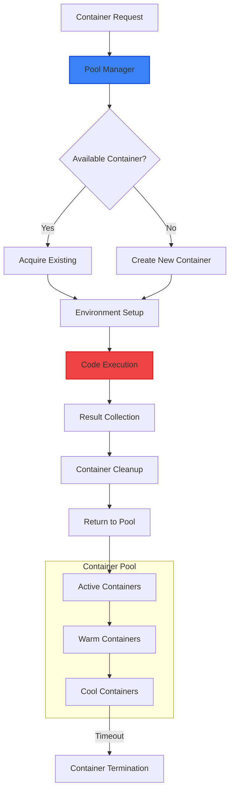
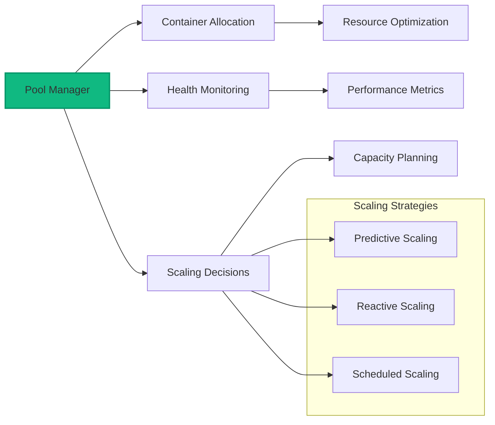
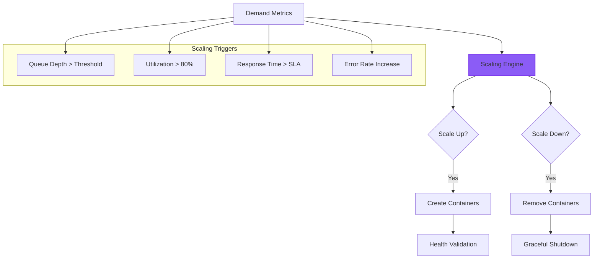
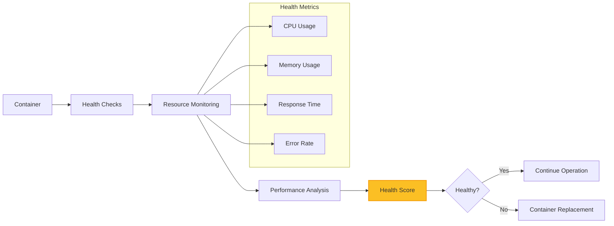
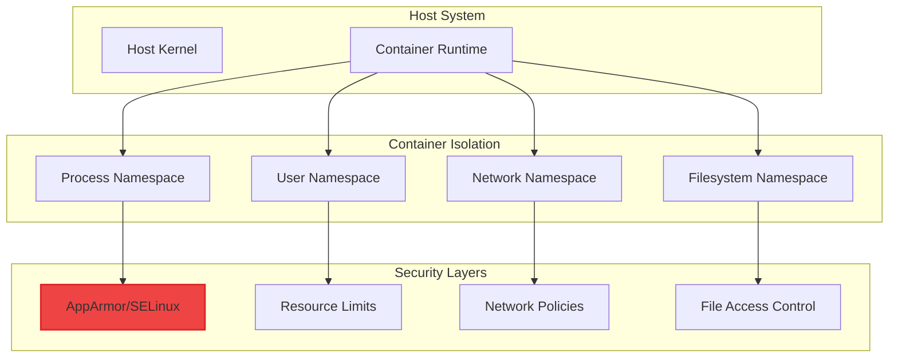
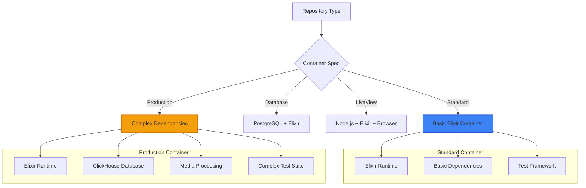
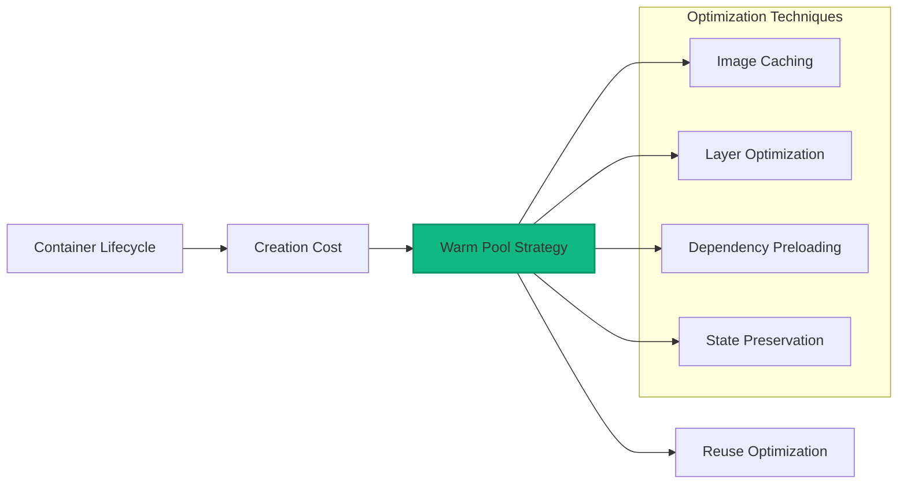
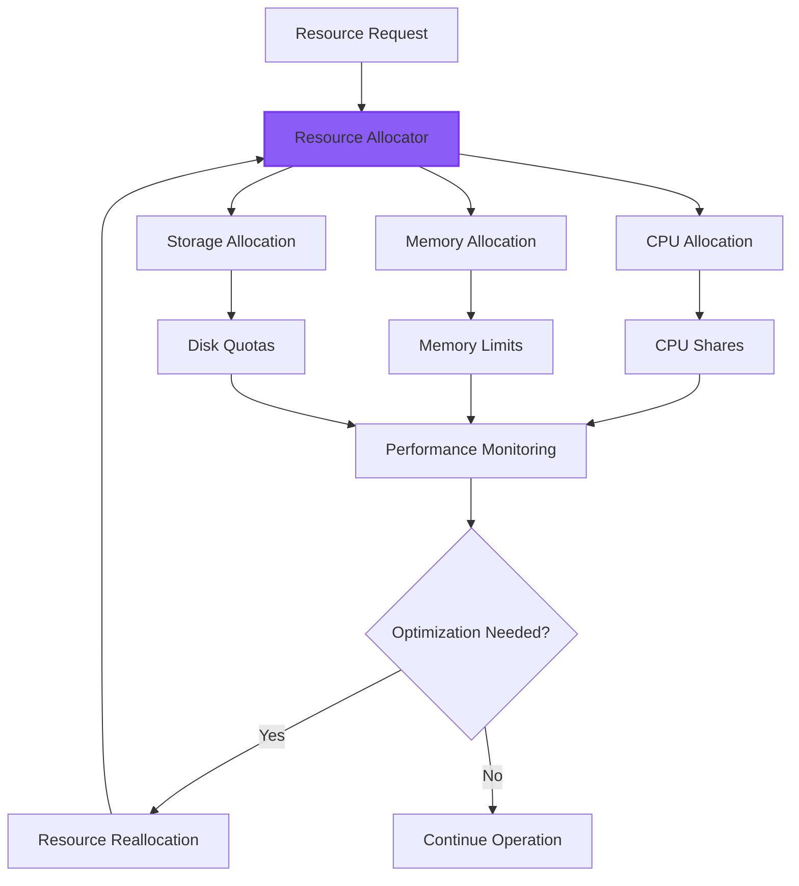
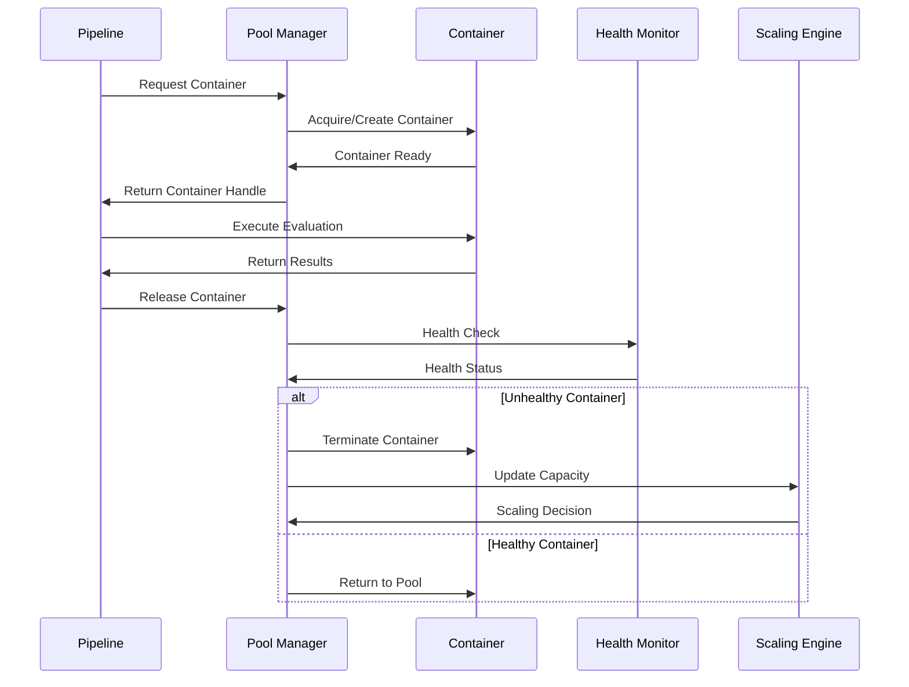

# Container Management Guide

This guide explains the sophisticated container management system that provides secure, isolated execution environments for AI-generated code evaluation.

## Overview

The container management system ensures **safe execution** of untrusted AI-generated code while maintaining **high performance** and **resource efficiency** through advanced pooling and scaling strategies.

## Architecture

### Container Lifecycle



## Core Components

### 1. Advanced Pool Manager (`lib/swe_bench/container/advanced_pool/pool_manager.ex`)

**Purpose**: Intelligent container pool management with predictive scaling



**Key Features**:
- **Predictive Scaling**: ML-based container demand forecasting
- **Health Monitoring**: Continuous container health assessment
- **Resource Optimization**: Efficient memory and CPU allocation
- **Performance Metrics**: Detailed container performance analytics

**Configuration Example**:
```elixir
config :swe_bench, :advanced_pool,
  min_pool_size: 5,
  max_pool_size: 50,
  target_utilization: 0.8,
  scaling_factor: 1.5,
  health_check_interval: 30_000,
  container_timeout: 300_000
```

### 2. Scaling Engine (`lib/swe_bench/container/advanced_pool/scaling_engine.ex`)

**Purpose**: Automated scaling decisions based on demand and performance



**Scaling Algorithms**:
- **Reactive Scaling**: Based on current queue depth and utilization
- **Predictive Scaling**: ML models predicting future demand
- **Time-based Scaling**: Scheduled scaling for known traffic patterns
- **Error-driven Scaling**: Scaling adjustments based on failure rates

### 3. Health Monitor (`lib/swe_bench/container/advanced_pool/health_monitor.ex`)

**Purpose**: Continuous container health assessment and maintenance



## Container Security

### Isolation Strategy



### Security Features

1. **Process Isolation**: Complete process namespace separation
2. **Network Isolation**: Controlled network access with policies
3. **Filesystem Protection**: Read-only base filesystem with controlled writes
4. **Resource Limits**: CPU, memory, and I/O limits preventing resource exhaustion
5. **User Namespace**: Non-root execution with privilege dropping

## Container Types

### Repository-Specific Containers

Different repositories require specialized container configurations:



### Container Specifications

**Standard Repository Container**:
```yaml
image: elixir:1.15-alpine
memory: 2GB
cpu: 1 core
timeout: 5 minutes
dependencies: [postgresql-client, git]
```

**Production Application Container**:
```yaml
image: elixir:1.15-alpine
memory: 8GB
cpu: 4 cores  
timeout: 15 minutes
dependencies: [clickhouse-client, ffmpeg, imagemagick]
services: [postgresql, redis, clickhouse]
```

## Performance Optimization

### Container Reuse Strategy



**Optimization Strategies**:
- **Image Caching**: Pre-built images with common dependencies
- **Layer Optimization**: Efficient Docker layer structure
- **Warm Pools**: Pre-warmed containers for immediate availability
- **State Preservation**: Maintaining container state between evaluations

### Resource Efficiency



## Integration with Evaluation Pipeline

### Pipeline Integration



### Performance Metrics

The container system provides detailed metrics for optimization:

- **Container Utilization**: CPU, memory, and I/O usage per container
- **Pool Efficiency**: Container reuse rates and warming effectiveness
- **Scaling Performance**: Scaling decision accuracy and timing
- **Resource Optimization**: Cost per evaluation and efficiency metrics

## Configuration Examples

### Development Configuration
```elixir
config :swe_bench, :container,
  pool_manager: SweBench.Container.AdvancedPool.PoolManager,
  min_pool_size: 2,
  max_pool_size: 5,
  container_timeout: 60_000,
  health_check_interval: 30_000
```

### Production Configuration
```elixir
config :swe_bench, :container,
  pool_manager: SweBench.Container.AdvancedPool.PoolManager,
  min_pool_size: 10,
  max_pool_size: 100,
  container_timeout: 300_000,
  health_check_interval: 15_000,
  scaling_enabled: true,
  predictive_scaling: true,
  monitoring_enabled: true
```

## Troubleshooting

### Common Issues

1. **Container Startup Delays**
   - **Cause**: Image pulling or dependency installation
   - **Solution**: Pre-built images with cached dependencies

2. **Resource Exhaustion**
   - **Cause**: Insufficient container pool size
   - **Solution**: Adaptive scaling configuration adjustment

3. **Memory Leaks**
   - **Cause**: Container state not properly cleaned
   - **Solution**: Enhanced container lifecycle management

### Debugging Tools

- **Container Logs**: Detailed logging for container lifecycle events
- **Health Metrics**: Real-time container health and performance data
- **Pool Statistics**: Container pool utilization and efficiency metrics
- **Scaling Analytics**: Scaling decision history and effectiveness

## Advanced Features

### Container Warming

Pre-warming containers for immediate availability:

```elixir
# Warm containers for expected load
SweBench.Container.AdvancedPool.PoolManager.warm_pool([
  {repository: "phoenix", count: 5},
  {repository: "ecto", count: 3},
  {repository: "plausible_analytics", count: 2}
])
```

### Custom Container Configurations

Repository-specific container customization:

```elixir
defmodule MyApp.CustomContainerConfig do
  use SweBench.Container.Config
  
  def container_spec("my_repository") do
    %{
      image: "custom/elixir-extended:latest",
      memory: "4GB",
      cpu: "2",
      environment: %{
        "CUSTOM_VAR" => "value"
      },
      volumes: [
        "custom-data:/data"
      ]
    }
  end
end
```

This container management system provides the foundation for secure, scalable, and efficient evaluation of AI-generated code while maintaining excellent performance characteristics and operational reliability.