# Monitoring Infrastructure Guide

This guide explains the comprehensive monitoring and observability system that provides deep visibility into system behavior, performance, and operational health.

## Overview

The monitoring infrastructure provides **enterprise-grade observability** with metrics collection, distributed tracing, structured logging, and intelligent alerting for proactive issue detection and performance optimization.

## Monitoring Stack

### Architecture Overview

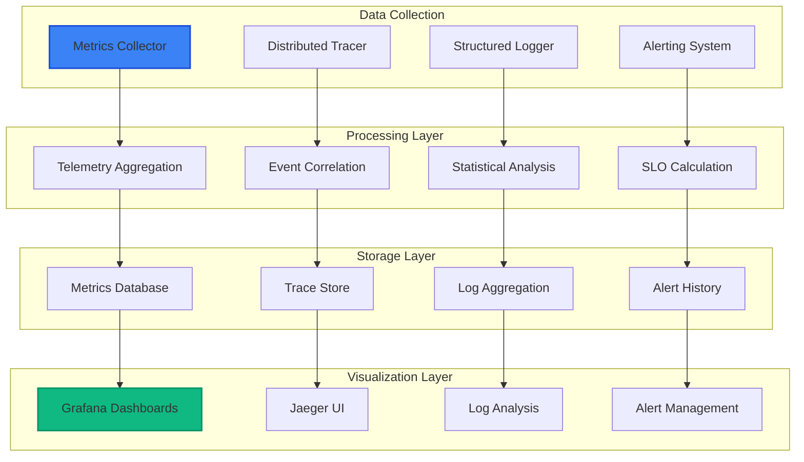

## Core Components

### 1. Metrics Collector (`lib/swe_bench/monitoring/metrics_collector.ex`)

**Purpose**: Enhanced telemetry with custom business metrics

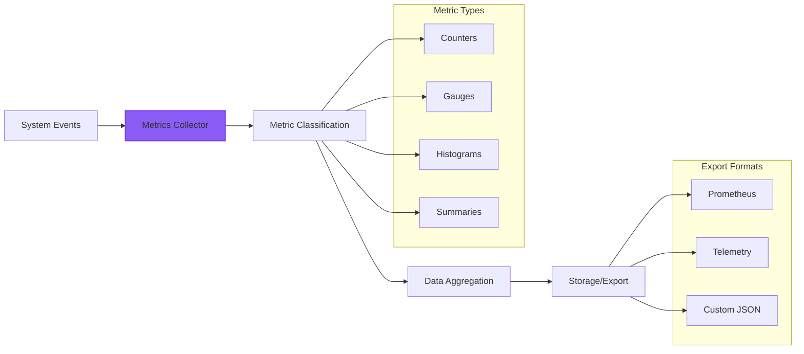

**Custom Metrics Categories**:

**Evaluation Pipeline Metrics**:
```elixir
:evaluations_submitted_total      # Counter: Total evaluations submitted
:evaluations_completed_total      # Counter: Total evaluations completed  
:evaluation_duration_seconds      # Histogram: Evaluation execution time
:evaluation_queue_depth           # Gauge: Current queue depth
```

**Model Performance Metrics**:
```elixir
:model_evaluation_score          # Gauge: Latest model scores
:model_evaluation_count          # Counter: Evaluations per model
:repository_evaluation_count     # Counter: Evaluations per repository
```

**System Resource Metrics**:
```elixir
:container_pool_size             # Gauge: Active container count
:memory_usage_bytes              # Gauge: System memory usage
:cpu_usage_percent               # Gauge: CPU utilization
:websocket_connections_active    # Gauge: Active WebSocket connections
```

### 2. Alerting System (`lib/swe_bench/monitoring/alerting_system.ex`)

**Purpose**: SLI/SLO monitoring with intelligent alerting

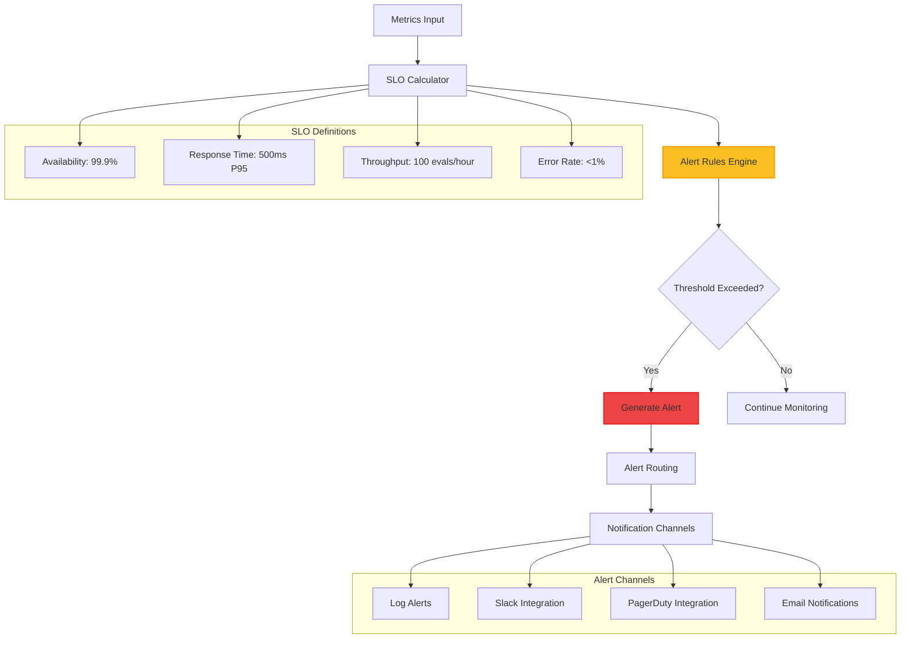

**SLO Definitions**:
```elixir
@slos %{
  system_availability: %{
    target: 99.9,           # 99.9% uptime target
    measurement_window: :monthly,
    alert_threshold: 99.5   # Alert below 99.5%
  },
  response_time_p95: %{
    target: 500,            # 500ms P95 response time
    measurement_window: :hourly,
    alert_threshold: 1000   # Alert above 1000ms
  },
  evaluation_throughput: %{
    target: 100,            # 100 evaluations per hour
    measurement_window: :hourly,
    alert_threshold: 50     # Alert below 50/hour
  }
}
```

### 3. Distributed Tracer (`lib/swe_bench/monitoring/distributed_tracer.ex`)

**Purpose**: OpenTelemetry-compatible distributed tracing

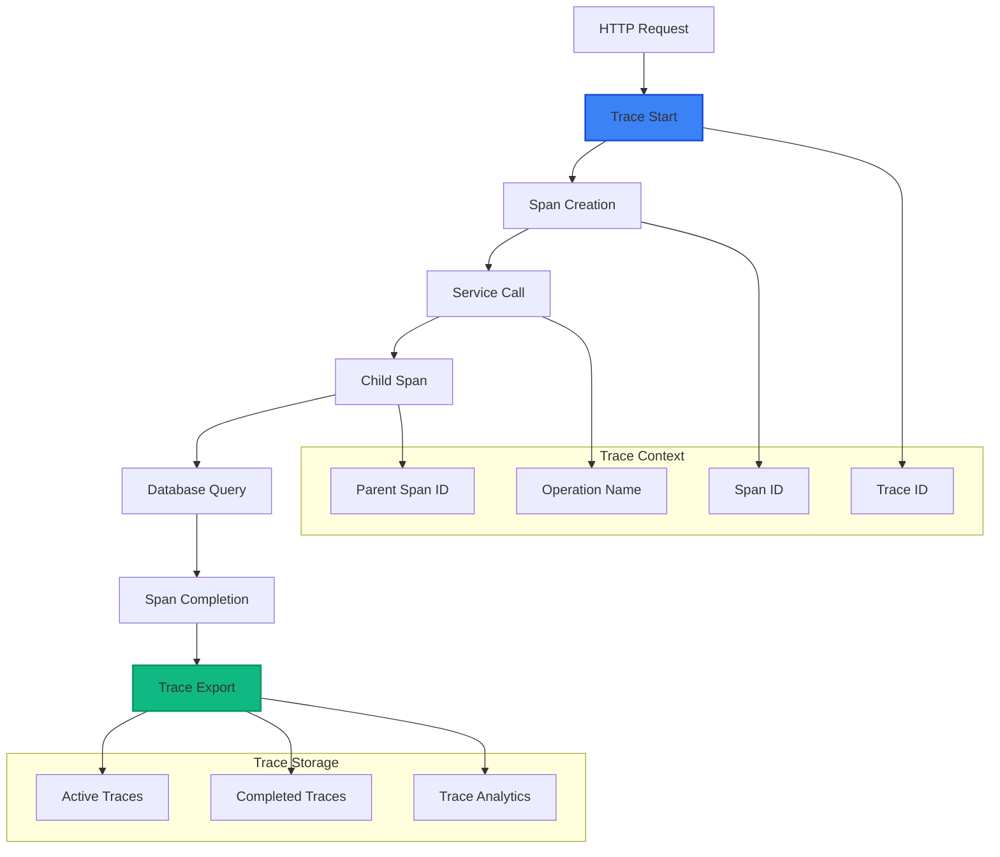

**Tracing Operations**:
- **Evaluation Workflows**: Complete evaluation lifecycle tracing
- **HTTP Requests**: Phoenix endpoint and controller tracing  
- **Database Queries**: Ecto query performance tracking
- **Real-Time Events**: PubSub event delivery tracing

**Sampling Configuration**:
```elixir
%{
  default_rate: 0.1,              # 10% default sampling
  operation_rates: %{
    evaluation_submission: 1.0,    # 100% - Always trace evaluations
    evaluation_processing: 0.5,    # 50% - Half of processing operations
    dashboard_rendering: 0.01,     # 1% - Minimal dashboard tracing
    authentication: 0.1            # 10% - Auth event sampling
  }
}
```

### 4. Structured Logger (`lib/swe_bench/monitoring/structured_logger.ex`)

**Purpose**: JSON-structured logging with trace correlation

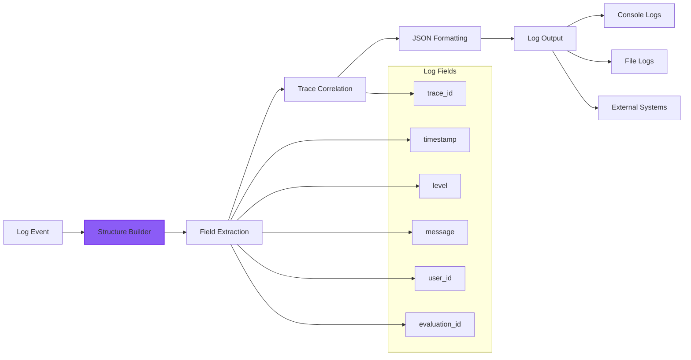

**Structured Log Entry**:
```json
{
  "timestamp": "2025-08-28T10:30:45.123Z",
  "level": "info",
  "message": "Evaluation completed successfully",
  "module": "SweBench.Evaluation.Engine",
  "trace_id": "abc123def456",
  "span_id": "span789", 
  "evaluation_id": "eval_001",
  "user_id": "user_admin",
  "repository": "phoenix",
  "model": "GPT-4",
  "score": 87.5,
  "duration_ms": 45000
}
```

## Monitoring Integration

### Telemetry Events

The system emits comprehensive telemetry events:

```elixir
# Evaluation events
:telemetry.execute([:swe_bench, :evaluation, :completed], %{
  duration: 45_000,
  score: 87.5
}, %{
  evaluation_id: "eval_001",
  model: "GPT-4",
  repository: "phoenix"
})

# Performance events  
:telemetry.execute([:swe_bench, :container, :acquired], %{
  acquisition_time: 150
}, %{
  pool_size: 15,
  utilization: 0.75
})

# User activity events
:telemetry.execute([:swe_bench_web, :dashboard, :view], %{
  user_count: 1,
  load_time: 250
}, %{
  user_role: :public,
  filters_applied: ["gpt-4", "phoenix"]
})
```

### Dashboard Integration

**Grafana Dashboard Panels**:

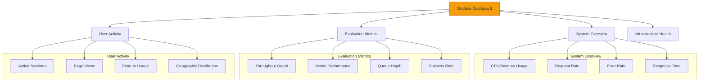

## Alert Rules

### Critical Alert Rules

```elixir
@alert_rules [
  %{
    name: "high_evaluation_queue_depth",
    condition: {:greater_than, :evaluation_queue_depth, 20},
    severity: :warning,
    message: "Evaluation queue depth is high (>20)"
  },
  %{
    name: "low_evaluation_throughput", 
    condition: {:less_than, :evaluations_completed_total, 50},
    severity: :critical,
    message: "Evaluation throughput below threshold (<50/hour)"
  },
  %{
    name: "container_pool_exhaustion",
    condition: {:greater_than, :container_utilization_percent, 90},
    severity: :critical,
    message: "Container pool utilization critically high (>90%)"
  }
]
```

### Escalation Policies

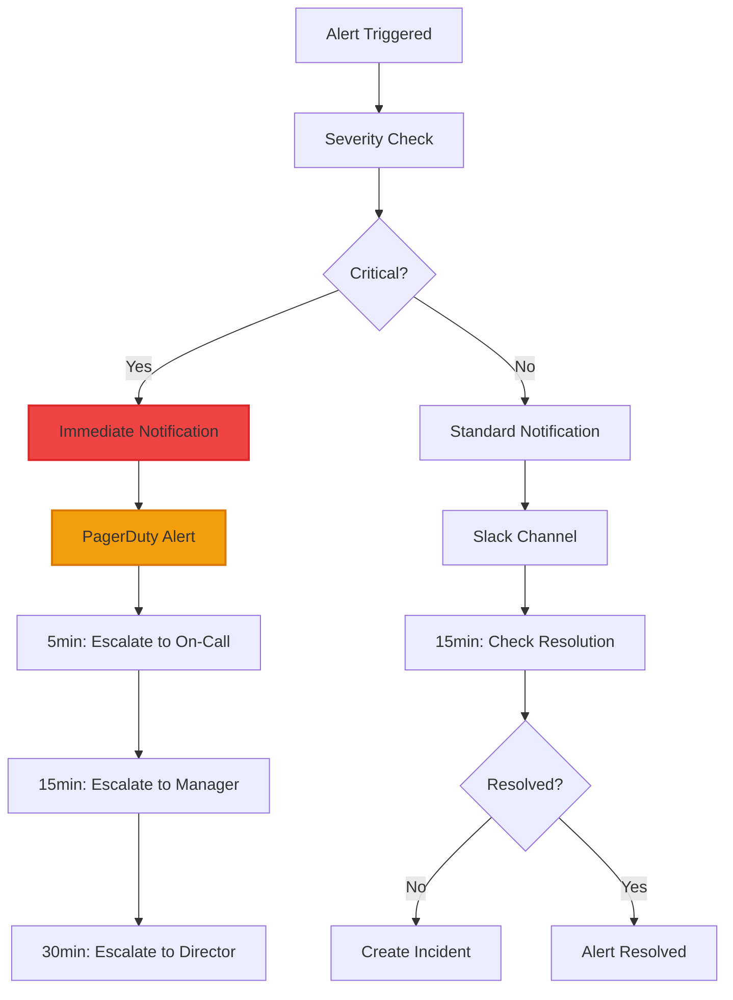

## Performance Monitoring

### System Performance Metrics

**Key Performance Indicators**:

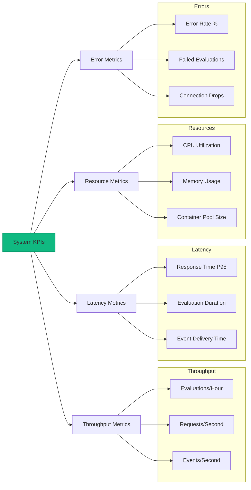

### Business Metrics

**Evaluation Analytics**:
- Model performance trends and comparisons
- Repository evaluation distribution and success rates
- User engagement metrics and feature usage
- Geographic usage patterns and peak times

## Distributed Tracing

### Trace Lifecycle

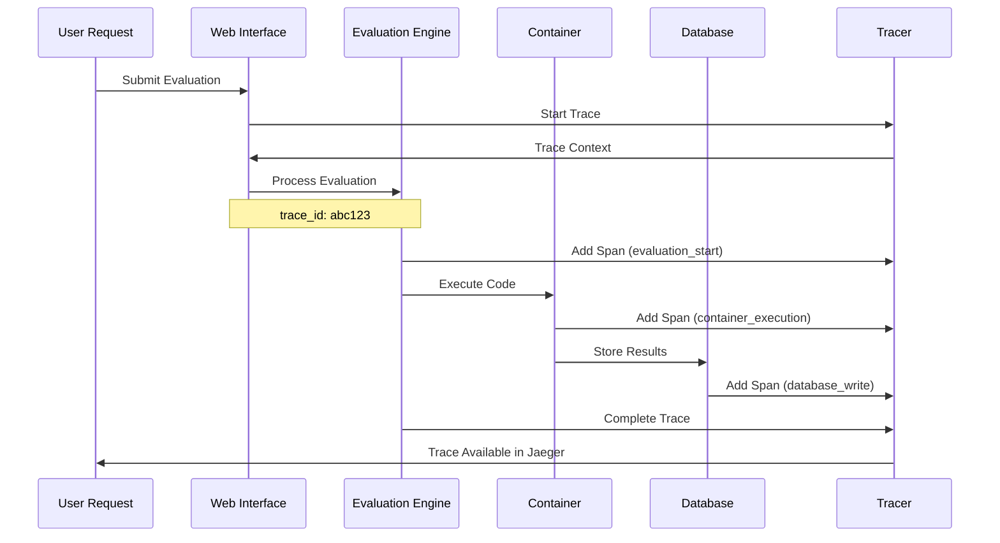

### Span Correlation

**Evaluation Workflow Tracing**:
```elixir
# Start evaluation trace
{:ok, trace_context} = DistributedTracer.start_trace(:evaluation_processing, %{
  evaluation_id: "eval_001",
  model: "GPT-4",
  repository: "phoenix"
})

# Add spans throughout process
DistributedTracer.add_span(trace_context.trace_id, :container_setup, %{
  container_id: "container_123"
})

DistributedTracer.add_span(trace_context.trace_id, :test_execution, %{
  test_count: 25
})

# Complete trace
DistributedTracer.complete_trace(trace_context.trace_id, %{
  final_score: 87.5,
  total_duration_ms: 45_000
})
```

## Structured Logging

### Log Categories

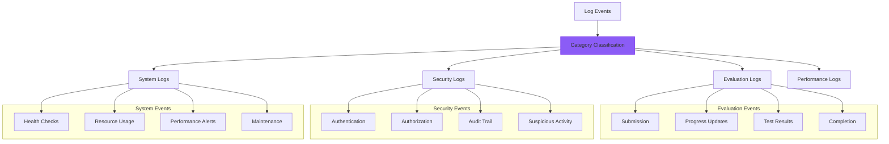

### Log Correlation

**Trace ID Integration**:
```elixir
# Evaluation logging with correlation
StructuredLogger.log_evaluation_event(
  :evaluation_started,
  "eval_001", 
  "Starting GPT-4 evaluation on Phoenix repository",
  %{
    trace_id: "abc123",
    user_id: "admin_user",
    model: "GPT-4",
    repository: "phoenix"
  }
)
```

**Log Output Example**:
```json
{
  "timestamp": "2025-08-28T10:30:45.123Z",
  "level": "info", 
  "message": "Starting GPT-4 evaluation on Phoenix repository",
  "trace_id": "abc123",
  "evaluation_id": "eval_001",
  "user_id": "admin_user",
  "model": "GPT-4",
  "repository": "phoenix",
  "category": "evaluation"
}
```

## SLI/SLO Implementation

### Service Level Indicators

**Availability SLI**:
```elixir
def calculate_availability_sli(time_window) do
  total_requests = get_request_count(time_window)
  successful_requests = get_successful_request_count(time_window)
  
  if total_requests > 0 do
    successful_requests / total_requests * 100.0
  else
    100.0  # No requests = 100% availability
  end
end
```

**Response Time SLI**:
```elixir
def calculate_response_time_sli(time_window) do
  response_times = get_response_times(time_window)
  
  if length(response_times) > 0 do
    percentile_95 = calculate_percentile(response_times, 0.95)
    percentile_95 / 1_000_000  # Convert to milliseconds
  else
    0.0
  end
end
```

### SLO Monitoring Dashboard

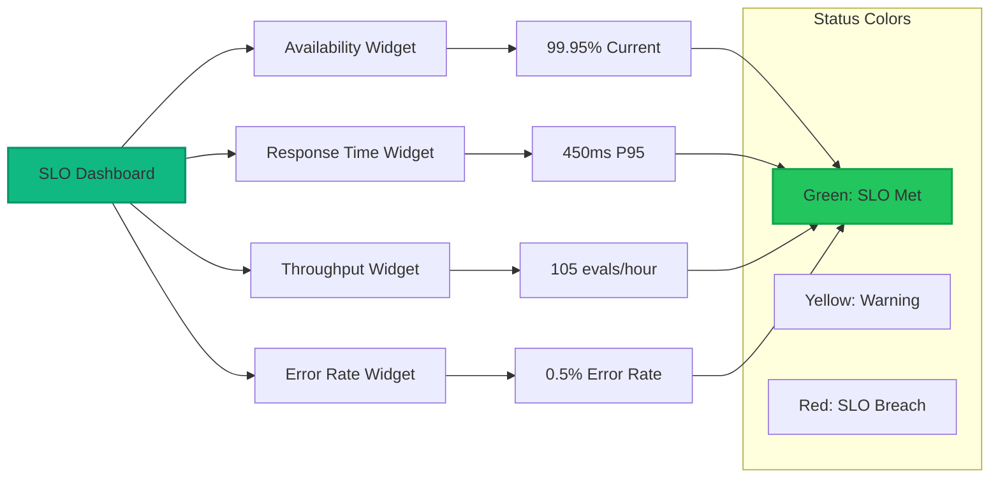

## Monitoring Configuration

### Metrics Collection Setup

```elixir
# Enhanced telemetry configuration
config :swe_bench, :monitoring,
  metrics_collector: SweBench.Monitoring.MetricsCollector,
  collection_interval_ms: 10_000,
  prometheus_enabled: true,
  custom_metrics_enabled: true,
  
  # Performance settings
  retention_hours: 24,
  aggregation_enabled: true,
  compression_enabled: true
```

### Alerting Configuration

```elixir
config :swe_bench, :alerting,
  alerting_system: SweBench.Monitoring.AlertingSystem,
  alert_evaluation_interval_ms: 30_000,
  
  # Notification channels
  notification_channels: [:log, :slack, :pagerduty],
  
  # SLO settings
  slo_calculation_enabled: true,
  alert_deduplication_enabled: true,
  escalation_policies_enabled: true
```

### Distributed Tracing Setup

```elixir
config :swe_bench, :tracing,
  distributed_tracer: SweBench.Monitoring.DistributedTracer,
  sampling_rate: 0.1,
  trace_retention_hours: 24,
  jaeger_enabled: true,
  automatic_instrumentation: true
```

## Production Monitoring

### External Tool Integration

**Prometheus Integration**:
```elixir
# Prometheus metrics endpoint
def prometheus_metrics do
  SweBench.Monitoring.MetricsCollector.get_prometheus_metrics()
end
```

**Jaeger Integration**:
```elixir
# Jaeger trace export  
def export_traces_to_jaeger do
  traces = DistributedTracer.get_trace_history(100)
  JaegerExporter.export_traces(traces)
end
```

**ELK Stack Integration**:
```elixir
# Structured log forwarding
config :logger, :console,
  format: {StructuredLogger, :format},
  metadata: [:trace_id, :user_id, :evaluation_id]
```

### Health Check Endpoints

```elixir
# Health check for monitoring systems
def health_check do
  %{
    metrics_collector: MetricsCollector.health_status(),
    alerting_system: AlertingSystem.health_status(), 
    distributed_tracer: DistributedTracer.health_status(),
    overall_status: :healthy
  }
end
```

## Troubleshooting

### Common Monitoring Issues

1. **High Memory Usage in Metrics Collection**
   - **Cause**: Excessive metric retention or high-cardinality metrics
   - **Solution**: Reduce retention period or implement metric sampling

2. **Alert Fatigue**
   - **Cause**: Too many low-priority alerts or incorrect thresholds
   - **Solution**: Tune alert thresholds and implement intelligent grouping

3. **Trace Storage Growth**
   - **Cause**: High sampling rate or long retention period
   - **Solution**: Adjust sampling rates and implement trace cleanup

### Debugging Tools

```elixir
# Check metrics health
SweBench.Monitoring.MetricsCollector.get_metrics_summary()

# View active alerts
SweBench.Monitoring.AlertingSystem.get_active_alerts()

# Check SLO status
SweBench.Monitoring.AlertingSystem.get_slo_status()

# View recent traces
SweBench.Monitoring.DistributedTracer.get_trace_history(10)
```

## Advanced Features

### Custom Metrics

**Adding Business Metrics**:
```elixir
defmodule MyCustomMetrics do
  def track_model_performance(model, score) do
    MetricsCollector.record_metric(:model_performance_score, score, %{
      model: model,
      timestamp: DateTime.utc_now()
    })
  end
  
  def track_user_engagement(user_id, action) do
    MetricsCollector.increment_counter(:user_actions_total, %{
      user_id: user_id,
      action: action
    })
  end
end
```

### Custom Dashboards

**Dashboard Configuration**:
```json
{
  "dashboard": {
    "title": "SWE-bench Evaluation Metrics",
    "panels": [
      {
        "title": "Evaluation Throughput",
        "type": "graph",
        "query": "rate(swe_bench_evaluations_completed_total[5m])"
      },
      {
        "title": "Model Performance",
        "type": "stat", 
        "query": "avg(swe_bench_model_evaluation_score) by (model)"
      }
    ]
  }
}
```

This monitoring infrastructure provides comprehensive system visibility enabling proactive issue detection, performance optimization, and operational excellence for enterprise-scale deployment.