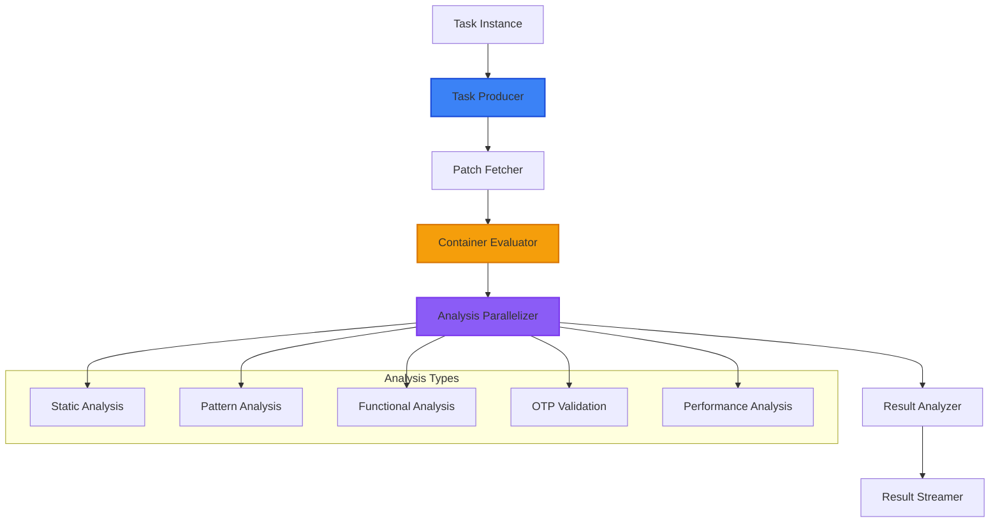
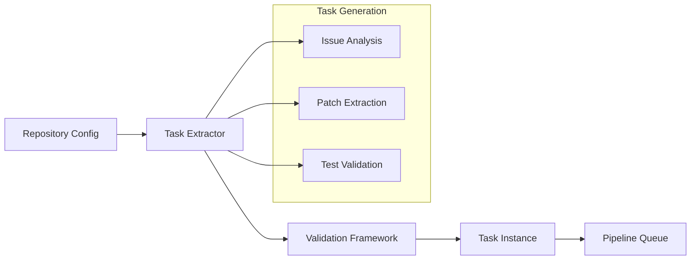
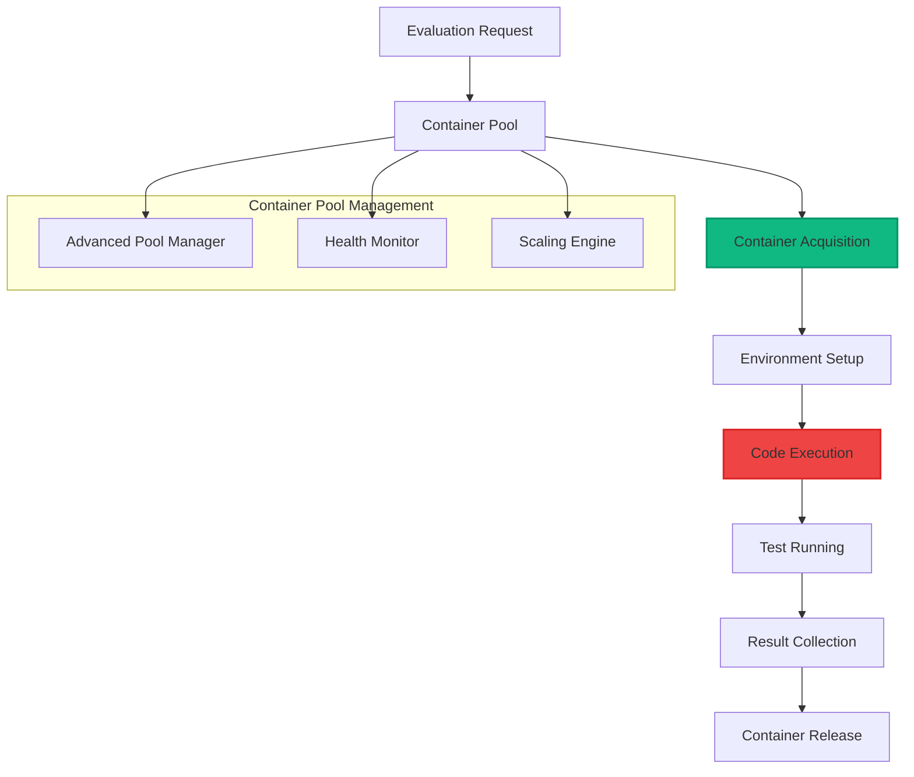
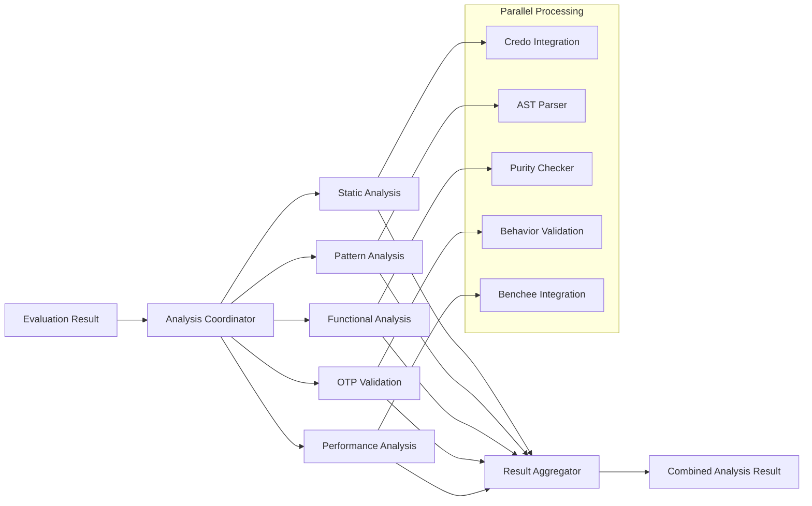
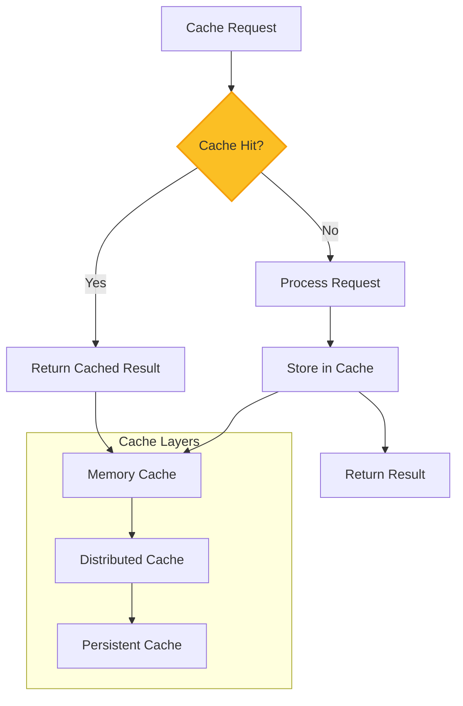
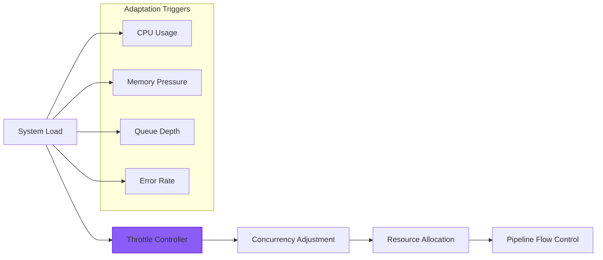
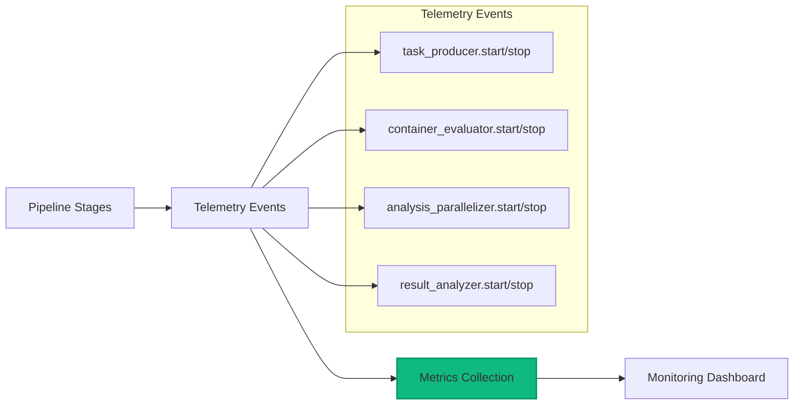
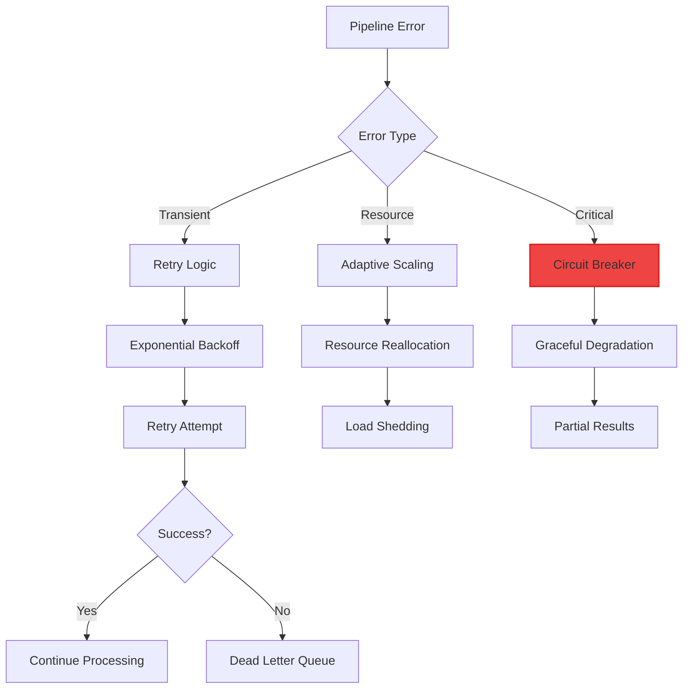

# Pipeline Architecture Guide

This guide explains the core evaluation pipeline architecture that processes AI-generated code submissions through comprehensive analysis and scoring.

## Overview

The SWE-bench evaluation pipeline is built on **GenStage** for backpressure-aware processing, ensuring efficient resource utilization and reliable evaluation delivery at scale.

## Pipeline Flow

### High-Level Processing Flow



## Core Pipeline Components

### 1. Task Producer (`lib/swe_bench/pipeline/task_producer.ex`)

**Purpose**: Generates evaluation tasks from repository configurations



**Key Features**:
- Automated task extraction from GitHub repositories
- Validation framework ensuring task quality
- Intelligent batching for optimal pipeline throughput
- Integration with repository expansion system

### 2. Container Evaluator (`lib/swe_bench/pipeline/container_evaluator.ex`)

**Purpose**: Manages isolated code execution in containerized environments



**Key Features**:
- Advanced container pool with intelligent scaling
- Health monitoring and automatic container replacement  
- Resource optimization with container reuse strategies
- Isolation guarantees for secure code execution

### 3. Analysis Parallelizer (`lib/swe_bench/pipeline/analysis_parallelizer.ex`)

**Purpose**: Coordinates parallel analysis across multiple dimensions



**Analysis Types**:
- **Static Analysis**: Code quality, style, and complexity analysis
- **Pattern Analysis**: Elixir-specific pattern usage and idiomatic code
- **Functional Analysis**: Functional programming adherence and purity
- **OTP Validation**: Proper use of OTP behaviors and supervision
- **Performance Analysis**: Benchmarking and optimization opportunities

## Advanced Pipeline Features

### 1. Intelligent Caching (`lib/swe_bench/pipeline/intelligent_cache.ex`)



**Features**:
- Multi-layer caching with memory, distributed, and persistent layers
- Intelligent invalidation based on repository and evaluation changes
- Performance optimization reducing duplicate evaluation overhead
- Integration with advanced pool management for cache warming

### 2. Adaptive Throttle (`lib/swe_bench/pipeline/adaptive_throttle.ex`)



**Adaptive Features**:
- Dynamic concurrency adjustment based on system load
- Resource-aware throttling with intelligent backpressure
- Queue depth management for optimal throughput
- Error rate monitoring with automatic scaling adjustments

### 3. Batch Optimizer (`lib/swe_bench/pipeline/batch_optimizer.ex`)

**Purpose**: Optimizes evaluation batching for maximum efficiency

- **Dynamic Batching**: Adjusts batch sizes based on repository complexity
- **Priority Scheduling**: Prioritizes evaluations based on user tier and urgency  
- **Resource Optimization**: Groups similar evaluations for efficient resource usage
- **Load Distribution**: Balances load across available container resources

## Configuration and Tuning

### Pipeline Configuration

Key configuration parameters for pipeline optimization:

```elixir
config :swe_bench, :pipeline,
  # GenStage configuration
  producer_concurrency: 5,
  consumer_concurrency: 10,
  
  # Container pool settings
  min_pool_size: 3,
  max_pool_size: 20,
  scaling_threshold: 0.8,
  
  # Performance tuning
  batch_size: 10,
  timeout_multiplier: 1.5,
  cache_enabled: true,
  
  # Advanced features
  adaptive_throttling: true,
  intelligent_batching: true,
  parallel_analysis: true
```

### Monitoring Integration

The pipeline is fully instrumented with telemetry events:



## Error Handling and Recovery

### Fault Tolerance



### Recovery Mechanisms
- **Automatic Retry**: Exponential backoff for transient failures
- **Circuit Breaker**: Protection against cascading failures
- **Graceful Degradation**: Partial results when full analysis fails
- **Dead Letter Queue**: Failed evaluation handling and investigation

## Performance Optimization

### Advanced Features

1. **Parallel Analysis**: Multiple analysis dimensions processed concurrently
2. **Container Reuse**: Efficient container lifecycle management
3. **Intelligent Caching**: Multi-layer caching with smart invalidation
4. **Adaptive Throttling**: Dynamic resource allocation based on system state
5. **Batch Optimization**: Efficient grouping of similar evaluations

### Scalability Patterns

- **Horizontal Scaling**: Additional worker nodes for increased throughput
- **Vertical Scaling**: Resource allocation optimization within nodes  
- **Geographic Distribution**: Multi-region deployment for global accessibility
- **Edge Computing**: Edge evaluation nodes for reduced latency

## Integration Points

### Phase 4 Advanced Capabilities

The pipeline integrates seamlessly with Phase 4 advanced capabilities:

- **Distributed Testing**: Multi-node evaluation coordination
- **Hot Code Reloading**: Zero-downtime pipeline updates
- **Performance Benchmarking**: Benchee integration for detailed analysis
- **Concurrent Evaluation**: Race condition and deadlock detection
- **Partial Credit Scoring**: Multi-dimensional evaluation scoring

### Phase 5 Production Features

Full integration with production infrastructure:

- **Real-Time Events**: Pipeline events streamed to web interface
- **Web Interface**: Progress monitoring and result visualization
- **Authentication**: Role-based access to evaluation submission
- **Monitoring**: Comprehensive observability and alerting integration

This pipeline architecture provides the foundation for scalable, reliable, and comprehensive evaluation of AI-generated Elixir code while maintaining excellent performance and operational characteristics.