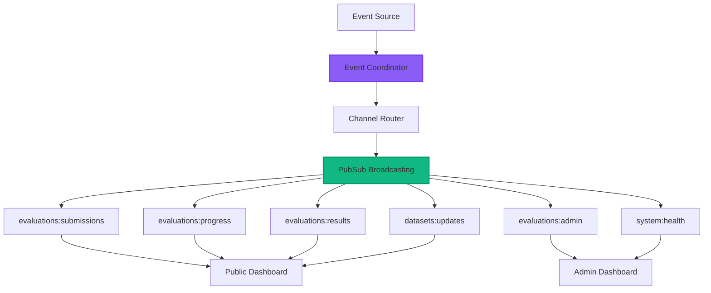
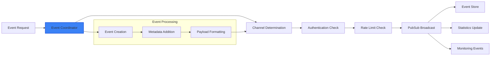
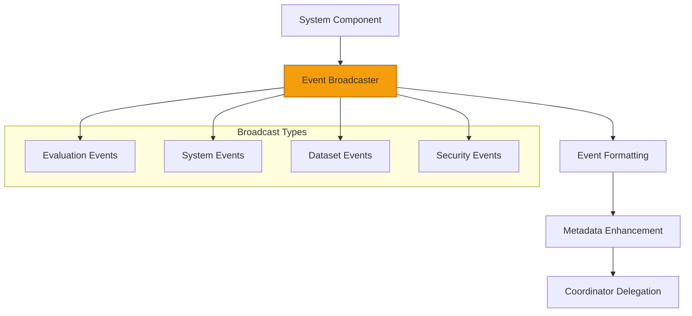
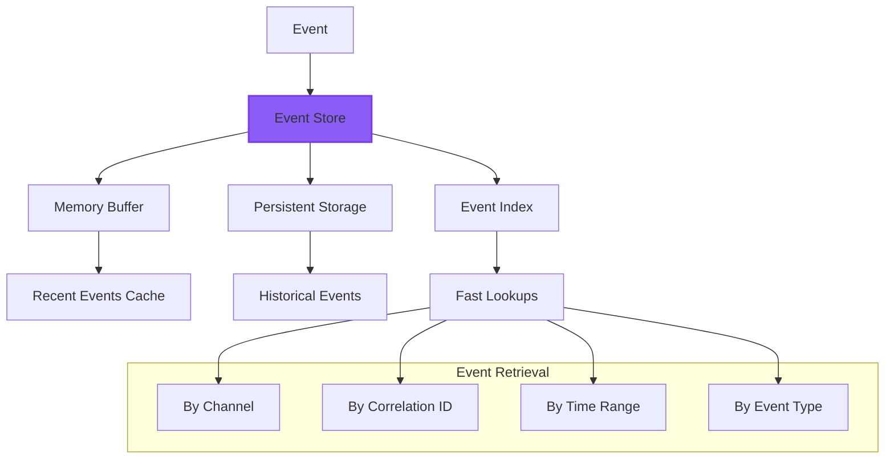
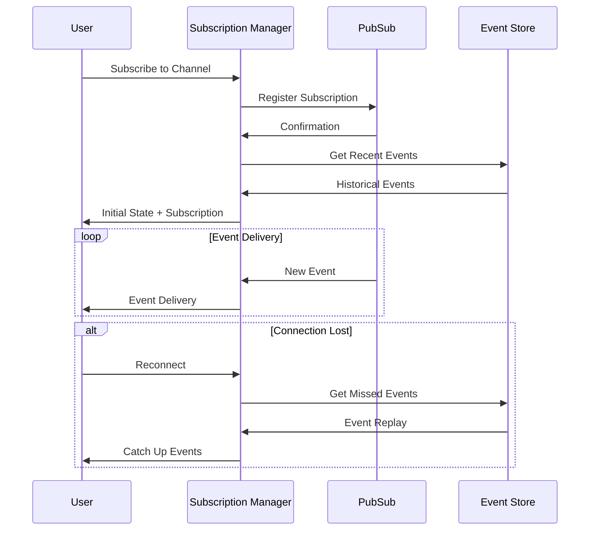
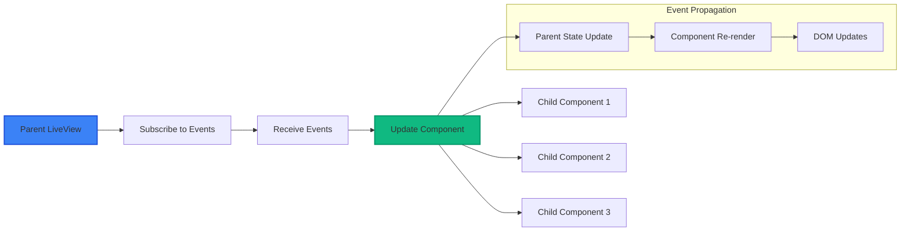
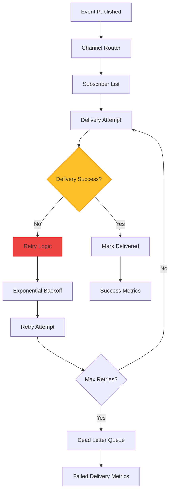
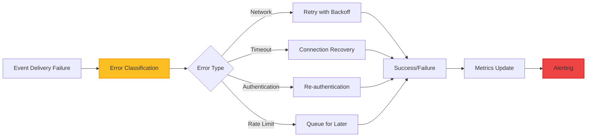
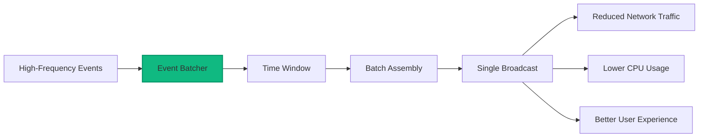
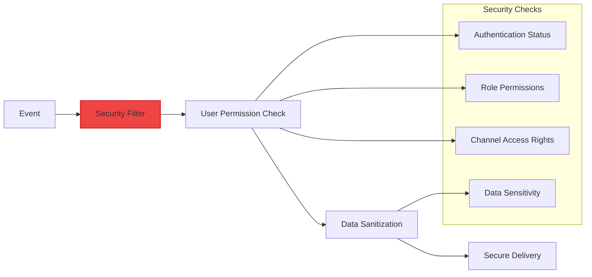

# Real-Time Events Guide

This guide explains the Phoenix.PubSub-based real-time event streaming system that enables instant updates across the web interface without traditional polling mechanisms.

## Overview

The real-time events system provides **instant updates** through **WebSocket connections**, enabling responsive user experiences with live evaluation progress, result updates, and system notifications.

## Event Architecture

### Event Flow



### Channel Structure

| Channel | Auth Required | Purpose | Rate Limit |
|---------|---------------|---------|------------|
| `evaluations:submissions` | No | New evaluation notifications | 100/min |
| `evaluations:progress` | No | Live progress updates | 1000/min |
| `evaluations:results` | No | Completion notifications | 500/min |
| `evaluations:admin` | Yes | Admin-only events | 200/min |
| `datasets:updates` | No | Dataset changes | 50/min |
| `system:health` | Yes | System monitoring | 100/min |

## Core Components

### 1. Event Coordinator (`lib/swe_bench/real_time_events/event_coordinator.ex`)

**Purpose**: Central coordination for real-time event distribution



**Key Features**:
- **Automatic Routing**: Events routed to appropriate channels based on type
- **Authentication Integration**: Channel access control with role verification
- **Rate Limiting**: Per-channel rate limiting preventing spam
- **Event Store Integration**: Persistent storage for event replay

### 2. Event Broadcaster (`lib/swe_bench/real_time_events/event_broadcaster.ex`)

**Purpose**: Convenient APIs for broadcasting specific event types



**Usage Examples**:

```elixir
# Broadcast evaluation progress
EventBroadcaster.broadcast_evaluation_progress("eval_123", %{
  percentage: 65.5,
  stage: :test_execution,
  tests_completed: 15,
  tests_total: 23
})

# Broadcast evaluation completion
EventBroadcaster.broadcast_evaluation_completed("eval_123", %{
  model: "GPT-4",
  repository: "phoenix",
  score: 87.5,
  completed_at: DateTime.utc_now()
})

# Broadcast system health
EventBroadcaster.broadcast_system_health(%{
  status: :healthy,
  cpu_usage: 45.2,
  memory_usage: 12_500_000_000,
  active_evaluations: 5
})
```

### 3. Event Store (`lib/swe_bench/real_time_events/event_store.ex`)

**Purpose**: Event sourcing with replay capabilities



**Event Replay**:
```elixir
# Get recent events for new connections
recent_events = EventStore.get_recent_events("evaluations:progress", 10)

# Get all events for specific evaluation
evaluation_events = EventStore.get_evaluation_events("eval_123")
```

### 4. Subscription Manager (`lib/swe_bench/real_time_events/subscription_manager.ex`)

**Purpose**: WebSocket connection lifecycle management



## Event Types and Payloads

### Evaluation Events

**Progress Update Event**:
```elixir
%{
  id: "evt_abc123",
  type: :progress_update,
  payload: %{
    evaluation_id: "eval_123",
    progress_percentage: 65.5,
    current_stage: :test_execution,
    stage_details: "Running integration tests",
    estimated_completion: DateTime.add(DateTime.utc_now(), 300, :second),
    tests_completed: 15,
    tests_total: 23
  },
  metadata: %{
    timestamp: DateTime.utc_now(),
    source: :evaluation_engine,
    correlation_id: "eval_123"
  }
}
```

**Completion Event**:
```elixir
%{
  id: "evt_def456", 
  type: :evaluation_completed,
  payload: %{
    evaluation_id: "eval_123",
    model: "GPT-4",
    repository: "phoenix",
    overall_score: 87.5,
    test_results: %{
      total_tests: 23,
      passed_tests: 20,
      failed_tests: 3
    },
    advanced_analysis: %{
      distributed_score: 85.0,
      concurrent_score: 90.0,
      performance_score: 82.0
    }
  },
  metadata: %{
    timestamp: DateTime.utc_now(),
    source: :evaluation_system,
    correlation_id: "eval_123"
  }
}
```

## LiveView Integration

### Component Event Handling

**Subscribing to Events**:
```elixir
defmodule SweBenchWeb.Live.MyLive do
  use SweBenchWeb, :live_view
  
  def mount(_params, _session, socket) do
    if connected?(socket) do
      # Subscribe to relevant channels
      Phoenix.PubSub.subscribe(SweBench.PubSub, "evaluations:progress")
      Phoenix.PubSub.subscribe(SweBench.PubSub, "evaluations:results")
    end
    
    {:ok, socket}
  end
  
  def handle_info({:event, %{type: :progress_update, payload: data}}, socket) do
    # Handle real-time progress updates
    socket = update_evaluation_progress(socket, data)
    {:noreply, socket}
  end
  
  def handle_info({:event, %{type: :evaluation_completed, payload: data}}, socket) do
    # Handle evaluation completion
    socket = add_new_result(socket, data)
    {:noreply, socket}
  end
end
```

### Component Communication



## Performance and Reliability

### Connection Management

**Features**:
- **Automatic Reconnection**: Seamless reconnection on connection loss
- **Event Replay**: Missed event delivery for connection recovery
- **Bandwidth Optimization**: Event compression and batching
- **Connection Pooling**: Efficient WebSocket connection reuse

### Event Delivery Guarantees



## Monitoring and Debugging

### Event Metrics

The real-time system provides comprehensive metrics:

```elixir
# Event delivery metrics
:telemetry.execute([:swe_bench, :real_time_events, :delivered], %{
  event_count: 1,
  delivery_time_ms: 15
}, %{
  channel: "evaluations:progress",
  event_type: :progress_update
})

# Connection metrics  
:telemetry.execute([:swe_bench, :real_time_events, :connection], %{
  connection_count: 1
}, %{
  connection_type: :websocket,
  user_role: :public
})
```

### Debugging Tools

**Event Inspection**:
```elixir
# Check active channels
EventCoordinator.get_active_channels()

# View event statistics
EventCoordinator.get_event_statistics() 

# Inspect subscription status
SubscriptionManager.get_subscription_metrics()
```

## Configuration

### PubSub Configuration

```elixir
config :swe_bench, SweBench.PubSub,
  name: SweBench.PubSub,
  adapter: Phoenix.PubSub.PG2
  
config :swe_bench, :real_time_events,
  event_store_enabled: true,
  channel_monitoring_interval: 30_000,
  max_subscribers_per_channel: 1000,
  event_replay_enabled: true,
  bandwidth_optimization: true
```

### WebSocket Configuration

```elixir
config :swe_bench_web, SweBenchWeb.Endpoint,
  websocket: [
    timeout: 45_000,
    transport_log: false,
    compress: true,
    check_origin: ["https://swe-bench.example.com"]
  ]
```

## Advanced Features

### Event Sourcing

Complete event sourcing for audit trails and analytics:

```elixir
# Event sourcing pattern
defmodule MyEventSourcingExample do
  def handle_evaluation_submitted(evaluation_data) do
    # Store event
    event = create_event(:evaluation_submitted, evaluation_data)
    EventStore.store_event(event)
    
    # Broadcast real-time
    EventBroadcaster.broadcast_evaluation_submitted(evaluation_data)
    
    # Update read model
    update_evaluation_view(evaluation_data)
  end
end
```

### Custom Event Types

**Adding New Event Types**:
```elixir
# 1. Define event type in event_channel_mapping
defp event_channel_mapping do
  %{
    # ... existing events
    my_custom_event: ["custom:channel"],
  }
end

# 2. Add broadcasting function
def broadcast_custom_event(data) do
  EventCoordinator.broadcast_event(:my_custom_event, data, [
    source: :my_system
  ])
end

# 3. Handle in LiveView
def handle_info({:event, %{type: :my_custom_event}}, socket) do
  # Handle custom event
  {:noreply, socket}
end
```

## Error Handling

### Event Delivery Failures



### Circuit Breaker Pattern

**Implementation**:
```elixir
defmodule EventDeliveryCircuitBreaker do
  def deliver_event(event, channel) do
    case CircuitBreaker.call(:event_delivery) do
      {:ok, result} -> 
        deliver_event_impl(event, channel)
      
      {:error, :circuit_open} ->
        # Store for later delivery
        queue_for_retry(event, channel)
    end
  end
end
```

## Integration Examples

### Adding Real-Time Features to Components

**Step 1**: Subscribe to Events
```elixir
def mount(_params, _session, socket) do
  if connected?(socket) do
    Phoenix.PubSub.subscribe(SweBench.PubSub, "my_channel")
  end
  
  {:ok, assign(socket, :live_data, [])}
end
```

**Step 2**: Handle Events
```elixir  
def handle_info({:event, %{type: :my_event, payload: data}}, socket) do
  socket = update(socket, :live_data, fn current_data ->
    [data | current_data] |> Enum.take(100)
  end)
  
  {:noreply, socket}
end
```

**Step 3**: Update UI
```elixir
def render(assigns) do
  ~H"""
  <div id="live-data" phx-update="prepend">
    <%= for item <- @live_data do %>
      <div id={"item-#{item.id}"}>
        <%= item.name %>: <%= item.value %>
      </div>
    <% end %>
  </div>
  """
end
```

## Performance Optimization

### Event Batching



**Batching Implementation**:
```elixir
defmodule EventBatcher do
  def batch_events(events, window_ms \\ 100) do
    events
    |> Enum.group_by(&get_channel/1)
    |> Enum.each(fn {channel, channel_events} ->
        batch_payload = %{
          event_count: length(channel_events),
          events: channel_events,
          batch_id: generate_batch_id()
        }
        
        Phoenix.PubSub.broadcast(SweBench.PubSub, channel, {:batch_event, batch_payload})
    end)
  end
end
```

### Connection Optimization

**WebSocket Compression**:
```elixir
# Enable compression in endpoint configuration
config :swe_bench_web, SweBenchWeb.Endpoint,
  websocket: [
    compress: true,
    timeout: 45_000,
    max_frame_size: 1_000_000
  ]
```

**Event Filtering**:
```elixir
# Filter events based on user permissions
def filter_event_for_user(event, user) do
  case {event.type, user.role} do
    {:admin_action, :admin} -> {:ok, event}
    {:admin_action, _} -> {:filtered, :unauthorized}
    {:system_logs, :admin} -> {:ok, event}
    {:system_logs, _} -> {:filtered, :unauthorized}  
    _ -> {:ok, filter_sensitive_data(event)}
  end
end
```

## Troubleshooting

### Common Issues

1. **Event Delivery Delays**
   - **Cause**: High event volume or network congestion
   - **Solution**: Enable event batching and compression

2. **Connection Drops**
   - **Cause**: Network instability or timeout issues
   - **Solution**: Implement connection recovery with event replay

3. **Memory Usage Growth**
   - **Cause**: Event store retention too high
   - **Solution**: Adjust retention policies and cleanup intervals

### Debugging Commands

```elixir
# Check event coordinator status
EventCoordinator.get_event_statistics()

# View active subscriptions
SubscriptionManager.get_subscription_metrics()

# Check channel health
EventCoordinator.get_active_channels()

# Inspect event store
EventStore.get_storage_statistics()
```

## Security Considerations

### Event Security



### Data Protection

- **Sensitive Data Filtering**: Automatic removal of sensitive information for non-admin users
- **Channel Authentication**: Role-based channel access control
- **Event Sanitization**: Data cleaning before broadcast to public channels
- **Audit Integration**: Security events logged for compliance

## Configuration Examples

### Development Configuration
```elixir
config :swe_bench, :real_time_events,
  event_store_enabled: true,
  channel_monitoring_interval: 30_000,
  max_subscribers_per_channel: 100,
  bandwidth_optimization: false  # Disable for debugging
```

### Production Configuration
```elixir
config :swe_bench, :real_time_events,
  event_store_enabled: true,
  channel_monitoring_interval: 15_000,
  max_subscribers_per_channel: 1000,
  event_replay_enabled: true,
  bandwidth_optimization: true,
  connection_timeout: 60_000,
  
  # Performance tuning
  batch_events: true,
  compression_enabled: true,
  connection_pooling: true
```

This real-time events system provides the foundation for responsive, interactive user experiences while maintaining security, performance, and reliability at enterprise scale.