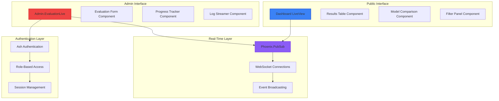
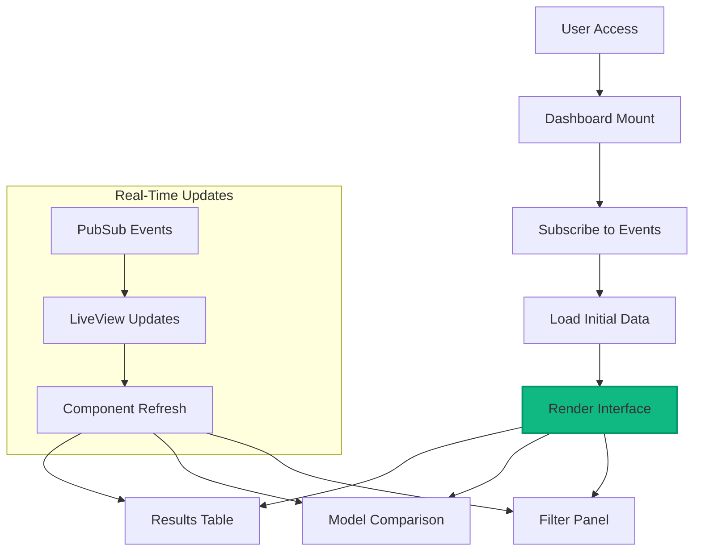
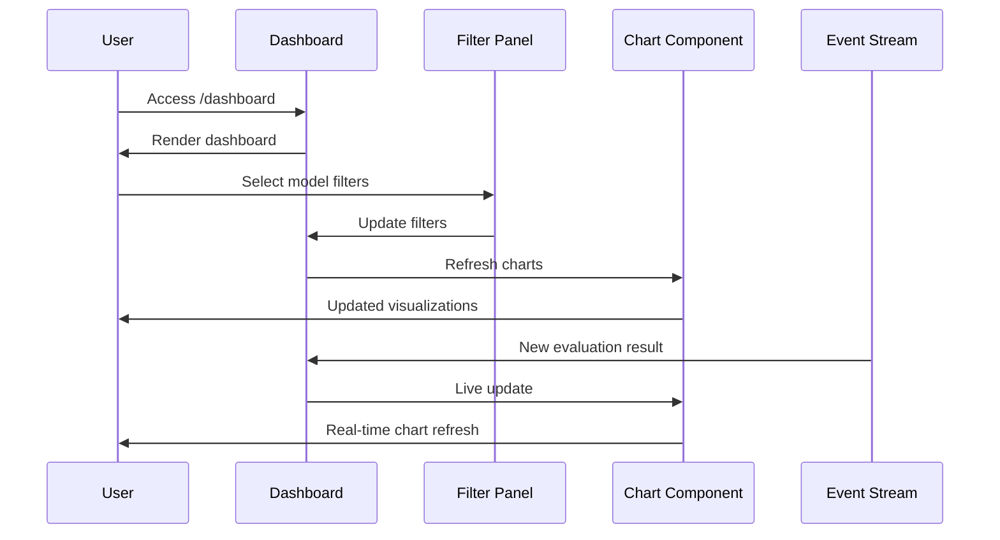
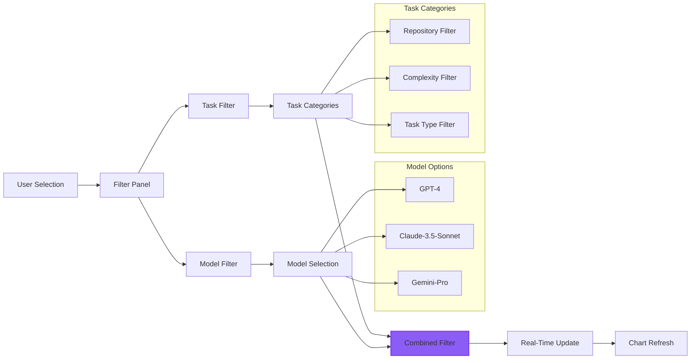
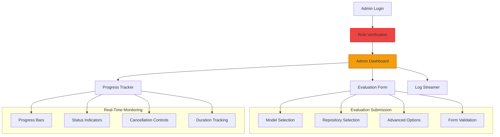
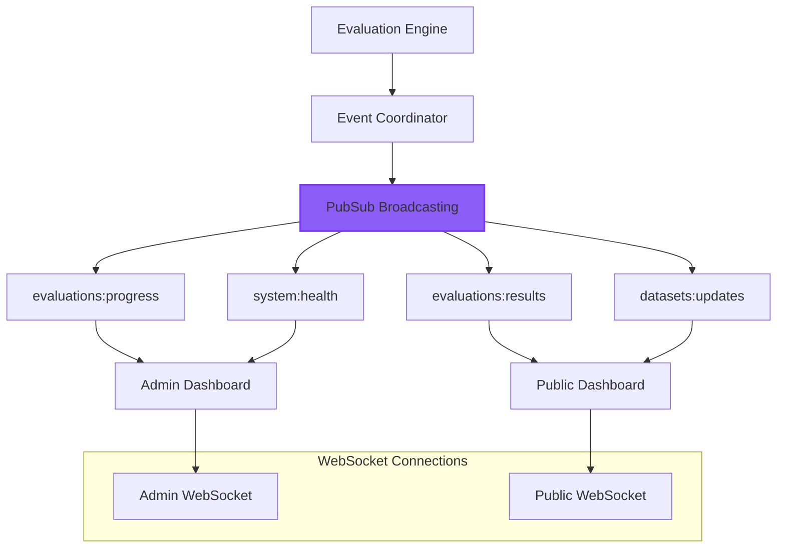
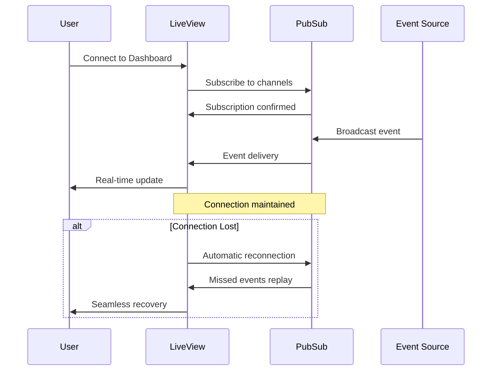
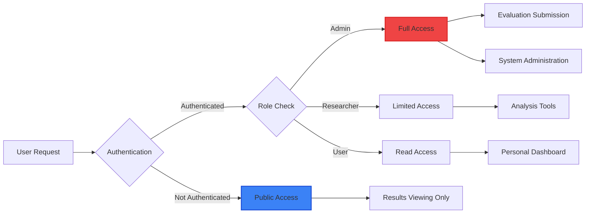

# Web Interface Guide

This guide explains the Phoenix LiveView-based web interface that provides real-time access to evaluation results, model comparisons, and administrative capabilities.

## Architecture Overview

The web interface is built on **Phoenix LiveView** with **real-time event streaming**, providing a modern, responsive experience without traditional APIs.

## Interface Architecture

### System Components



## Public Dashboard

### Dashboard LiveView (`lib/swe_bench_web/live/dashboard_live.ex`)

**Purpose**: Public access to evaluation results with advanced filtering



**Key Features**:
- **No Authentication Required**: Public access to all results and visualizations
- **Real-Time Updates**: Live result updates as evaluations complete
- **Advanced Filtering**: Dual model+task filtering with preset combinations
- **Interactive Charts**: Dynamic visualizations with real-time data binding

### User Experience Flow



## Advanced Filtering System

### Dual Model+Task Filtering

The filtering system enables precise analysis by combining model and task filters:



### Filter Implementation

**Filter Panel Component** (`lib/swe_bench_web/components/dashboard/filter_panel.ex`):

```elixir
def handle_event("update_model_filter", %{"models" => selected_models}, socket) do
  # Update model filters and notify parent
  send(self(), {:filter_models, %{"models" => selected_models}})
  {:noreply, socket}
end

def handle_event("apply_preset", %{"preset" => preset_id}, socket) do
  # Apply filter preset
  preset = find_preset(preset_id)
  send_filter_updates(preset.models, preset.tasks)
  {:noreply, socket}
end
```

## Admin Interface

### Admin Evaluation Interface

**Purpose**: Secure evaluation submission and monitoring for administrators



### Admin Components

#### 1. Evaluation Form (`lib/swe_bench_web/components/admin/evaluation_form.ex`)

**Features**:
- **Model Selection**: Comprehensive LLM model picker with provider categorization
- **Repository Selection**: Available repository selection from 17+ repositories
- **Advanced Options**: Phase 4 capability toggles (distributed, concurrent, performance)
- **Real-Time Validation**: Client-side validation with immediate feedback

#### 2. Progress Tracker (`lib/swe_bench_web/components/admin/progress_tracker.ex`)

**Features**:
- **Live Progress**: Animated progress bars with status indicators
- **Detailed Information**: Expandable evaluation details with stage tracking
- **Cancellation Control**: Admin ability to cancel running evaluations
- **Duration Tracking**: Real-time duration and completion estimates

#### 3. Log Streamer (`lib/swe_bench_web/components/admin/log_streamer.ex`)

**Features**:
- **Terminal Interface**: Professional terminal-style log display
- **Real-Time Filtering**: Dynamic log filtering by level and search terms
- **Auto-Scroll**: Optional automatic scrolling with manual override
- **Search Capability**: Live search through log messages and sources

## Real-Time Communication

### Phoenix.PubSub Integration



### Event Types

**Evaluation Events**:
- `evaluation_submitted`: New evaluation queued
- `progress_update`: Real-time progress information
- `test_executed`: Individual test completion
- `evaluation_completed`: Final results available

**System Events**:
- `system_health`: Health monitoring updates
- `maintenance_notice`: System maintenance notifications
- `dataset_updated`: New task instances or repository changes

### WebSocket Lifecycle



## Authentication and Authorization

### Role-Based Access



### Access Control Matrix

| Feature | Public | Researcher | Admin |
|---------|--------|------------|-------|
| View Results | ✅ | ✅ | ✅ |
| Filter/Charts | ✅ | ✅ | ✅ |
| Submit Evaluations | ❌ | ❌ | ✅ |
| View Logs | ❌ | ❌ | ✅ |
| User Management | ❌ | ❌ | ✅ |
| System Settings | ❌ | ❌ | ✅ |

## Component Development

### Creating New Components

**LiveView Component Template**:
```elixir
defmodule SweBenchWeb.Components.MyComponent do
  use SweBenchWeb, :live_component
  
  @impl true
  def update(assigns, socket) do
    socket = 
      socket
      |> assign(assigns)
      |> prepare_data()
    
    {:ok, socket}
  end
  
  @impl true  
  def handle_event("my_event", params, socket) do
    # Handle user interactions
    {:noreply, socket}
  end
  
  @impl true
  def render(assigns) do
    ~H"""
    <!-- Component template -->
    """
  end
end
```

### Real-Time Integration

**Adding PubSub Subscription**:
```elixir
def mount(_params, _session, socket) do
  if connected?(socket) do
    Phoenix.PubSub.subscribe(SweBench.PubSub, "my_channel")
  end
  
  {:ok, socket}
end

def handle_info({:my_event, data}, socket) do
  socket = update_component_data(socket, data)
  {:noreply, socket}
end
```

## Performance Considerations

### LiveView Optimization

- **Minimal DOM Updates**: Efficient LiveView rendering with targeted updates
- **Component Caching**: Smart component state caching for performance
- **Event Debouncing**: Debounced user inputs for optimal server interaction
- **Connection Pooling**: WebSocket connection optimization

### Monitoring Integration

The web interface is fully instrumented with telemetry:

```elixir
:telemetry.execute([:swe_bench_web, :dashboard, :view], %{
  user_count: 1,
  load_time: duration
}, %{
  user_role: :public,
  filters_applied: socket.assigns.filters
})
```

## Deployment Considerations

### Production Configuration

```elixir
config :swe_bench_web, SweBenchWeb.Endpoint,
  http: [port: 4000],
  url: [host: "swe-bench.example.com", port: 443, scheme: "https"],
  check_origin: ["https://swe-bench.example.com"],
  websocket: [
    timeout: 45_000,
    transport_log: false,
    compress: true
  ]
```

### CDN Integration

Static assets and chart data can be optimized with CDN:

- **Asset Pipeline**: Optimized CSS/JS bundling with Phoenix
- **Image Optimization**: Chart export caching for performance
- **Global Distribution**: Edge caching for worldwide access

This web interface architecture provides a modern, real-time, and scalable user experience while maintaining security and performance at enterprise scale.