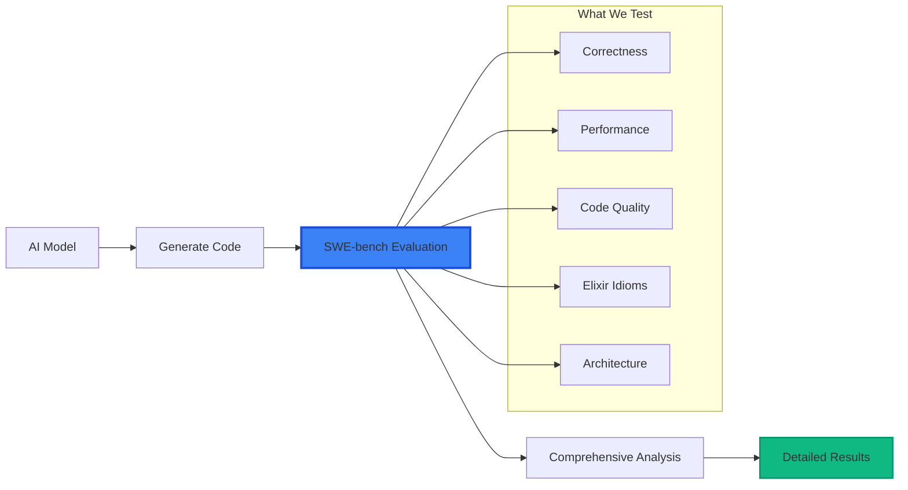
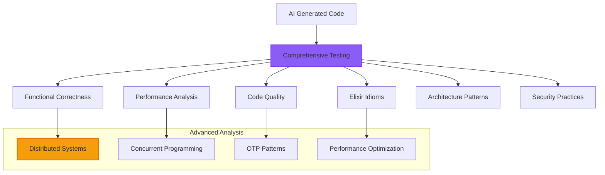
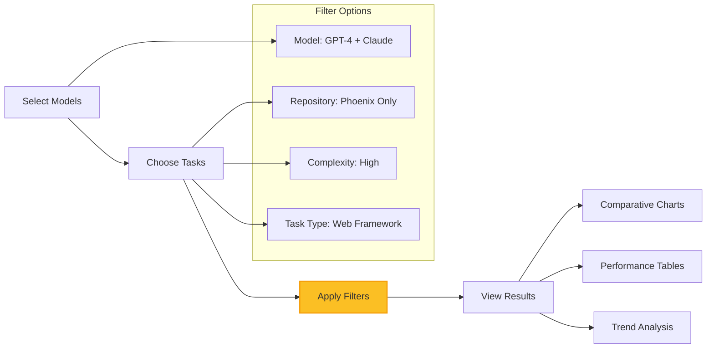

# SWE-bench-Elixir User Guides

Welcome to SWE-bench-Elixir! This comprehensive guide will help you understand and use the automated evaluation platform for AI-generated Elixir code.

## What is SWE-bench-Elixir?

SWE-bench-Elixir is a sophisticated benchmarking platform that evaluates how well AI models can generate correct, efficient, and idiomatic Elixir code. Think of it as a **comprehensive testing ground** for AI coding capabilities in the Elixir ecosystem.

## Quick Overview

## User Guides

### Getting Started
- **[Getting Started](./getting-started.md)** - Quick start guide to using the platform
- **[Installation](./installation.md)** - Complete installation and setup instructions

### Using the Platform
- **[Web Interface](./web-interface.md)** - Using the dashboard and admin interface
- **[Understanding Results](./understanding-results.md)** - How to interpret evaluation results
- **[Model Comparison](./model-comparison.md)** - Comparing AI model performance
- **[Advanced Filtering](./advanced-filtering.md)** - Using dual model+task filtering

### For Researchers
- **[Research Features](./research-features.md)** - Advanced features for AI research
- **[Data Export](./data-export.md)** - Exporting results for analysis
- **[API Reference](./api-reference.md)** - Programmatic access (future)

## Who Should Use This?

### 🔬 **AI Researchers**
Evaluate and compare different AI models' Elixir coding capabilities
- Compare GPT-4, Claude, and Gemini on real Elixir tasks
- Analyze performance trends across different task types
- Export data for academic research and publications

### 👩‍💼 **Engineering Teams**
Assess AI coding assistants for Elixir development
- Evaluate AI tools for your specific Elixir tech stack
- Understand AI strengths and limitations in different scenarios
- Make informed decisions about AI tool adoption

### 🎓 **Educators & Students**
Learn about AI capabilities and Elixir best practices
- Understand how AI approaches different coding challenges
- Learn Elixir patterns through AI-generated examples
- Study the evolution of AI coding capabilities

### 🏢 **Enterprise Users**
Enterprise evaluation of AI coding capabilities
- Assess AI tools for enterprise Elixir development
- Understand compliance and quality implications
- Make strategic decisions about AI integration

## System Capabilities

### What We Evaluate

### Supported Technologies

**Programming Models (6)**:
- GPT-4, GPT-3.5-Turbo (OpenAI)
- Claude-3.5-Sonnet, Claude-3-Haiku (Anthropic)  
- Gemini-Pro, Gemini-1.5-Flash (Google)

**Repository Coverage (17+)**:
- Core Libraries: Phoenix, Ecto, Jason, Tesla, Credo
- Advanced Libraries: LiveView, Oban, Broadway, Absinthe, Nx
- Production Apps: Plausible Analytics, Changelog.com

## User Access Levels

### 👀 **Public Users (No Registration Required)**
- ✅ **View all evaluation results** in sortable tables and interactive charts
- ✅ **Filter results** by AI model, repository, complexity, and task type  
- ✅ **Compare AI models** with head-to-head performance analysis
- ✅ **Explore datasets** with comprehensive task instance browser
- ✅ **Real-time updates** as new evaluation results become available

### 🔬 **Researchers (Registration Required)**
- ✅ **All public features** plus enhanced analysis capabilities
- ✅ **Data export** for academic research and publications
- ✅ **Advanced analytics** with statistical analysis tools
- ✅ **Limited evaluation submission** (10 per month) for research

### 👨‍💼 **Administrators (Special Access)**
- ✅ **All researcher features** plus complete system control
- ✅ **Unlimited evaluation submission** with model and repository selection
- ✅ **Real-time monitoring** of evaluation progress and system health
- ✅ **System administration** including user management and configuration
- ✅ **Audit logs** for security compliance and system oversight

## Key Features

### 🎯 **Advanced Model Comparison**
Compare AI models across multiple dimensions with sophisticated filtering:

### ⚡ **Real-Time Experience**
Get instant updates without page refreshes:
- Live evaluation progress tracking
- Automatic chart updates when new results arrive
- Real-time filtering with immediate visual feedback
- WebSocket-based communication for optimal performance

### 📊 **Rich Visualizations**
Multiple chart types for comprehensive analysis:
- **Bar Charts**: Model performance comparison
- **Radar Charts**: Multi-dimensional capability analysis
- **Heat Maps**: Repository vs model performance matrix
- **Trend Lines**: Performance evolution over time

## Getting Started Quickly

### 1. **Explore Public Dashboard**
Visit the public dashboard to see evaluation results:
- No registration required
- Full access to results and comparisons
- Interactive filtering and charts

### 2. **Try Advanced Filtering**
Use the powerful dual filtering system:
- Select specific AI models to compare
- Filter by repository or task complexity
- Apply preset filter combinations
- Share filter combinations with others

### 3. **Understand the Results**
Learn to interpret comprehensive evaluation metrics:
- Overall scores and detailed breakdowns
- Performance analysis and optimization suggestions
- Code quality assessment and improvement recommendations
- Elixir-specific pattern analysis and compliance

## Support and Community

### 📚 **Documentation**
- **User Guides**: Complete user documentation (you are here!)
- **Developer Guides**: Technical implementation documentation
- **API Reference**: Programmatic access documentation (coming soon)

### 💬 **Getting Help**
- **GitHub Issues**: Report bugs or request features
- **Documentation**: Comprehensive guides for all user levels
- **Examples**: Real-world usage examples and tutorials

### 🤝 **Contributing**
- **Feedback**: Share your experience and suggestions
- **Testing**: Help test new features and improvements
- **Documentation**: Contribute to user guides and examples

## Next Steps

1. **[Getting Started](./getting-started.md)** - Start using the platform immediately
2. **[Installation](./installation.md)** - Set up your own instance (for advanced users)
3. **[Web Interface Guide](./web-interface.md)** - Master the dashboard and admin features
4. **[Understanding Results](./understanding-results.md)** - Interpret evaluation metrics effectively

Welcome to the future of AI coding evaluation for Elixir! 🚀