# Advanced Filtering Guide

This guide explains how to master SWE-bench's powerful dual filtering system to perform precise analysis by combining model selection with task categorization for targeted insights.

## Filtering Overview

### Dual Filtering Concept

SWE-bench's unique capability is **dual filtering** - simultaneously filtering by AI models AND task characteristics:

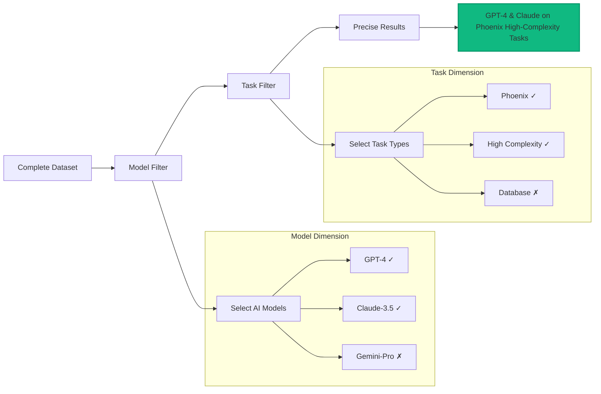

This enables **precise comparisons** like "How do GPT-4 and Claude compare specifically on high-complexity Phoenix tasks?"

## Filter Categories

### Model Selection Filters

#### AI Model Multi-Select

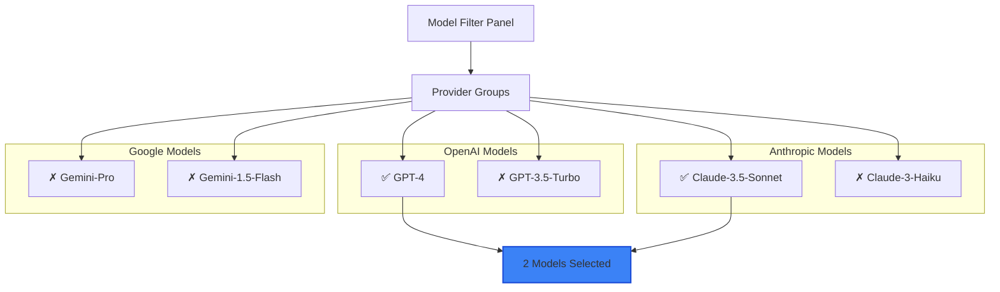

**Selection Strategies**:
- **All Models**: Complete landscape overview
- **Provider Comparison**: OpenAI vs Anthropic vs Google
- **Tier Comparison**: Premium models (GPT-4, Claude-3.5, Gemini-Pro) vs Fast models
- **Head-to-Head**: Direct comparison between two specific models

### Task Category Filters

#### Repository-Based Filtering

Filter by specific Elixir repositories to focus on particular development domains:

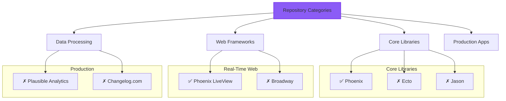

**Repository Categories**:
- **Web Frameworks**: Phoenix, Phoenix LiveView (HTTP, routing, templates)
- **Data Layer**: Ecto (databases, queries, migrations)  
- **Utilities**: Jason, Tesla (JSON, HTTP clients)
- **Job Processing**: Oban (background jobs, queues)
- **Real-Time**: Broadway (data pipelines, streaming)
- **Production**: Plausible Analytics, Changelog.com (complex applications)

#### Complexity-Based Filtering

Filter by task difficulty to understand model limitations:

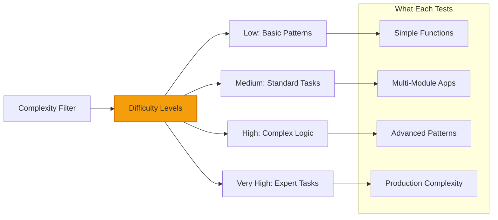

**Complexity Characteristics**:
- **Low Complexity**: Simple functions, basic patterns, straightforward logic
- **Medium Complexity**: Multi-module applications, standard OTP patterns
- **High Complexity**: Advanced patterns, performance optimization, error handling
- **Very High Complexity**: Expert-level tasks requiring deep Elixir knowledge

#### Task Type Filtering

Filter by programming task categories:

- **Web Framework**: HTTP handling, routing, template rendering
- **Database**: Query construction, schema design, data validation
- **Real-Time Web**: WebSocket handling, live updates, event streaming
- **Data Pipeline**: Stream processing, message handling, backpressure
- **Performance**: Optimization, benchmarking, resource management
- **Authentication**: Security patterns, session management, authorization

## Filter Presets

### Quick Analysis Presets

Pre-configured filter combinations for common analysis scenarios:

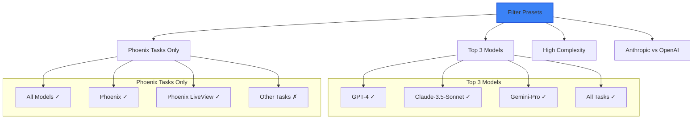

### Custom Preset Creation

While you can't save custom presets in the interface, you can create **bookmark shortcuts**:

1. **Configure your filters** exactly as desired
2. **Copy the URL** which contains all filter parameters
3. **Bookmark in browser** with descriptive name
4. **Share with team** via URL sharing

## Advanced Filter Combinations

### Complex Analysis Scenarios

#### Scenario 1: Performance-Critical Tasks

**Goal**: Find best model for high-performance Elixir applications

**Filter Configuration**:
```
Models: All models
Tasks: High + Very High Complexity
Repositories: Benchee, Nx, Performance-related
```

**Analysis Focus**:
- Performance scores specifically
- Code optimization awareness
- Resource usage consideration
- Algorithmic complexity understanding

#### Scenario 2: Web Development Specialist

**Goal**: Best model for Phoenix/LiveView development team

**Filter Configuration**:
```
Models: GPT-4, Claude-3.5-Sonnet (exclude others)
Tasks: Phoenix, Phoenix LiveView
Complexity: Medium, High (exclude basic tasks)
```

**Analysis Focus**:
- Web-specific pattern usage
- HTTP and WebSocket handling
- Template and component architecture
- Real-time feature implementation

#### Scenario 3: Code Quality Assessment

**Goal**: Which model produces most maintainable code?

**Filter Configuration**:
```
Models: All models
Tasks: All repositories
Analysis: Focus on Code Quality dimension (25% weight)
```

**Analysis Focus**:
- Static analysis scores (Credo compliance)
- Type checking results (Dialyzer)
- Code organization and structure
- Documentation quality

## Filter State Management

### URL-Based State Persistence

Your filter selections are automatically preserved in the URL:

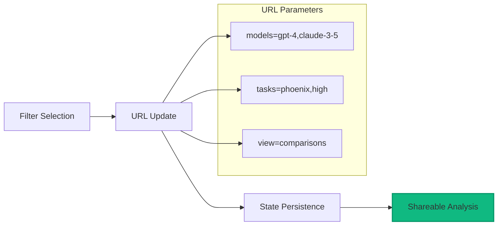

**Benefits**:
- **Browser Back Button**: Navigate through your analysis history
- **Bookmarking**: Save interesting filter combinations
- **Sharing**: Send exact analysis to colleagues
- **Reproducibility**: Return to exact same view later

### Filter URL Structure

Understanding URL parameters for advanced usage:

```
https://swe-bench.com/dashboard?models=MODEL_LIST&tasks=TASK_LIST&view=VIEW_TYPE

Examples:
?models=gpt-4,claude-3-5-sonnet&tasks=phoenix,high&view=comparisons
?models=gpt-4&tasks=ecto,database,medium&view=results  
?models=claude-3-5-sonnet,gemini-pro&tasks=very_high&view=explorer
```

## Real-Time Filter Responsiveness

### Instant Chart Updates

The filtering system provides immediate visual feedback:

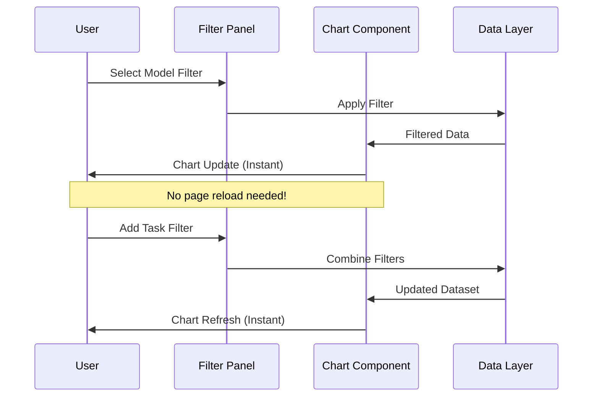

### Performance Optimization

The filtering system is optimized for responsiveness:

- **Client-side filtering**: Initial filter application without server round-trip
- **Debounced updates**: Rapid filter changes grouped for efficiency
- **Smart caching**: Previously filtered data cached for quick access
- **Progressive loading**: Large datasets loaded incrementally

## Filter Analytics

### Understanding Filter Impact

The interface provides feedback on filter effectiveness:

```mermaid
graph LR
    A[Filter Applied] --> B[Result Count Update]
    B --> C[Visual Feedback]
    
    subgraph "Feedback Indicators"
        D[Result Count: "Showing 15 of 150 results"]
        E[Filter Tags: "2 models, 3 tasks selected"]
        F[Chart Scale: Axes adjust to filtered data]
    end
    
    C --> D
    C --> E
    C --> F
    
    style C fill:#8b5cf6,stroke:#7c3aed,stroke-width:2px
```

### Empty Result Handling

When filters are too restrictive:

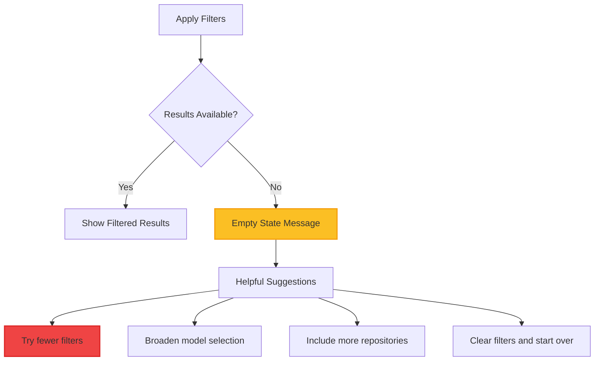

## Expert Filter Techniques

### Progressive Filtering Strategy

Build complex filters incrementally:

1. **Start Broad**: Begin with all models, all tasks
2. **Add Model Focus**: Select specific models of interest  
3. **Narrow Task Scope**: Add repository or complexity filters
4. **Refine Analysis**: Adjust based on initial findings
5. **Document Insights**: Save successful filter combinations

### Filter Combination Patterns

#### Provider Deep Dive
**Pattern**: One provider, multiple models, all tasks
**Purpose**: Understand provider ecosystem capabilities
**Example**: `models=gpt-4,gpt-3.5-turbo&tasks=all`

#### Domain Expertise Assessment  
**Pattern**: All models, specific repository, multiple complexities
**Purpose**: Evaluate model domain expertise
**Example**: `models=all&tasks=phoenix,phoenix_live_view,medium,high`

#### Capability Boundary Testing
**Pattern**: All models, high complexity only
**Purpose**: Find model limitation boundaries  
**Example**: `models=all&tasks=very_high`

#### Head-to-Head Analysis
**Pattern**: Two models, specific task type
**Purpose**: Direct comparison in specific context
**Example**: `models=gpt-4,claude-3-5-sonnet&tasks=ecto,database`

## Troubleshooting Filters

### Common Filter Issues

#### No Results After Filtering
**Cause**: Filter combination too restrictive
**Solutions**:
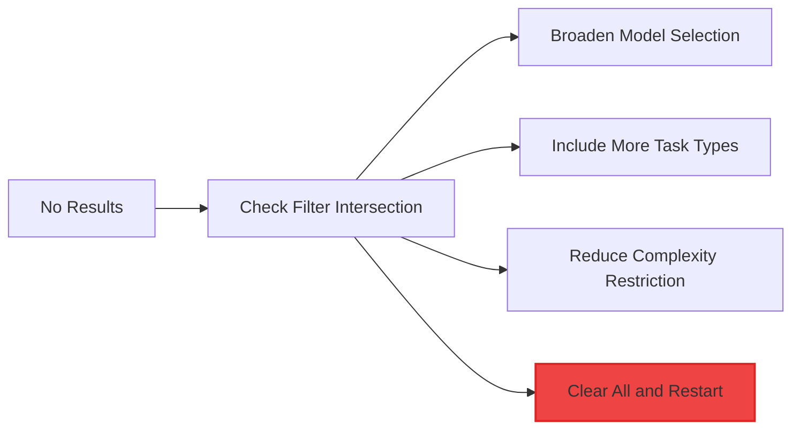

#### Filters Not Responding
**Cause**: JavaScript or connection issues
**Solutions**:
1. **Hard refresh** the page (Ctrl+F5)
2. **Check browser console** for JavaScript errors
3. **Disable browser extensions** temporarily
4. **Try incognito mode** to rule out extension conflicts

#### URL Filters Not Working
**Cause**: Invalid URL parameters or encoding issues
**Solutions**:
1. **Check URL format** against examples in this guide
2. **Try manual filter selection** instead of URL parameters
3. **Copy fresh URLs** from working filter selections

## Advanced Use Cases

### Research Workflows

#### Systematic Model Evaluation

For academic or professional research:

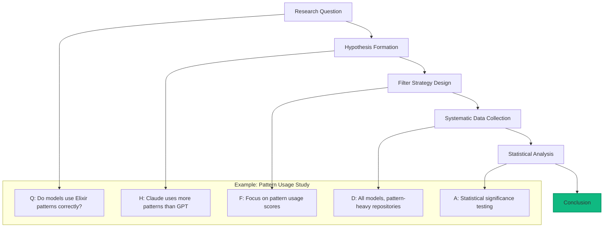

#### Longitudinal Studies

Track model evolution over time:

1. **Bookmark specific filter combinations**
2. **Return periodically** to same analysis
3. **Document changes** in model performance
4. **Identify improvement/degradation trends**
5. **Correlate with model updates** when known

### Business Decision Support

#### Tool Selection for Development Teams

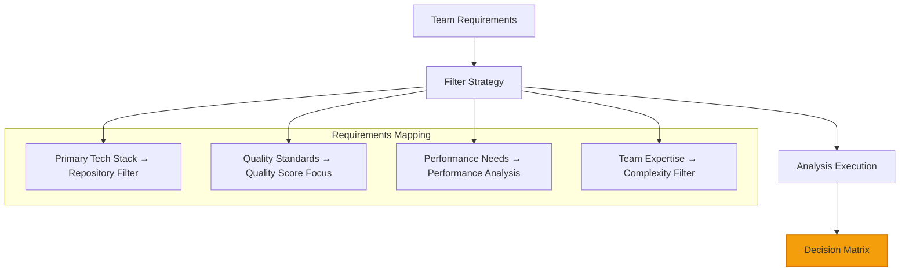

**Example Business Analysis**:
1. **Define stack**: Phoenix + LiveView + Ecto team
2. **Set filters**: `tasks=phoenix,phoenix_live_view,ecto`
3. **Quality focus**: Emphasize code quality and pattern scores
4. **Compare options**: Evaluate 2-3 top-performing models
5. **Make decision**: Based on score + cost + integration factors

## Filter Performance Tips

### Optimizing Filter Experience

#### Efficient Filter Selection

1. **Use presets first**: Start with common combinations
2. **Progressive refinement**: Add filters gradually rather than many at once  
3. **Monitor result counts**: Ensure sufficient data for meaningful analysis
4. **Clear strategically**: Remove less important filters before adding new ones

#### Browser Performance

For large datasets and complex filters:

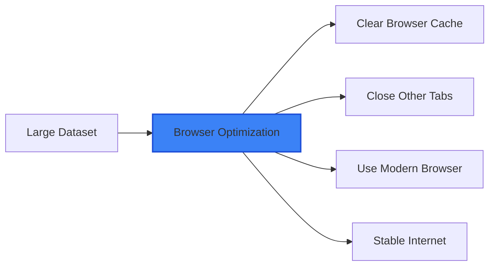

### Mobile Filtering

#### Touch-Optimized Interface

On mobile devices:
- **Tap targets**: Large, touch-friendly checkboxes
- **Collapsible sections**: Expandable filter categories
- **Swipe gestures**: Navigate between filter sections
- **Responsive layout**: Stacked layout for narrow screens

#### Mobile Filter Workflow

1. **Tap filter section header** to expand
2. **Select models** using large checkboxes
3. **Choose task categories** from collapsible lists
4. **Apply preset** for quick common analyses
5. **Clear all** with prominent clear button

## Expert Techniques

### Advanced Analysis Patterns

#### Capability Boundary Mapping

Map where each model's performance drops off:

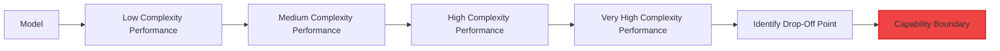

**Process**:
1. Select **single model** for analysis
2. Filter by **complexity only** (all repositories)  
3. Use **line chart** to see performance degradation
4. **Identify point** where performance significantly drops
5. **Repeat for other models** to compare boundaries

#### Domain Expertise Profiling

Understand model specialization areas:

1. **Repository sweep**: Test model on all repositories individually
2. **Performance mapping**: Record scores for each repository
3. **Strength identification**: Find highest-scoring repositories
4. **Weakness identification**: Find lowest-scoring repositories
5. **Profile creation**: Document model's domain expertise

### Power User Workflows

#### Multi-Hypothesis Testing

Test multiple hypotheses systematically:

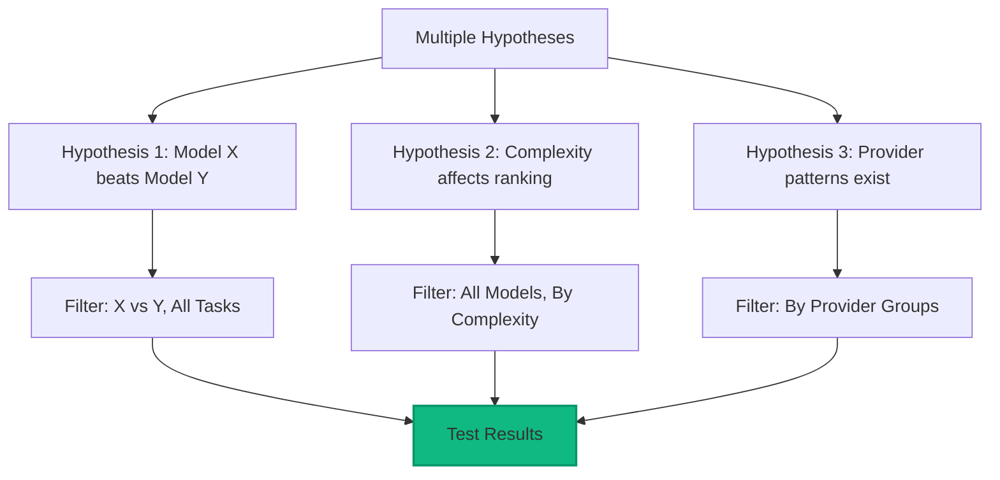

#### Competitive Intelligence

Track competitive model landscape:

1. **Regular monitoring**: Weekly analysis of top models
2. **New model integration**: Analyze new models as they're added
3. **Performance regression detection**: Identify declining performance
4. **Breakthrough identification**: Spot significant improvements

## Filter Automation

### Bookmarking Strategy

Create a systematic bookmark organization:

```
Bookmarks/
├── SWE-bench Analysis/
│   ├── 📊 Overall Rankings/
│   │   ├── Top 3 Models - All Tasks
│   │   ├── Provider Comparison - Complete  
│   │   └── Latest Results - This Month
│   ├── 🎯 Specialized Analysis/
│   │   ├── Web Dev - Phoenix Focus
│   │   ├── Database - Ecto Focus
│   │   ├── Performance - High Complexity
│   │   └── Quality - Code Standards
│   └── 🔬 Research Projects/
│       ├── Longitudinal Study - Q4 2025
│       ├── Pattern Usage Analysis
│       └── Capability Boundary Study
```

### URL Template System

Create URL templates for systematic analysis:

```bash
# Template for provider comparison
PROVIDER_COMPARISON="https://swe-bench.com/dashboard?models=MODEL_SET&tasks=all&view=comparisons"

# Template for domain analysis  
DOMAIN_ANALYSIS="https://swe-bench.com/dashboard?models=all&tasks=REPOSITORY&view=comparisons"

# Template for complexity analysis
COMPLEXITY_ANALYSIS="https://swe-bench.com/dashboard?models=MODEL_SET&tasks=COMPLEXITY_LEVEL&view=comparisons"
```

## Filter Best Practices

### Do's and Don'ts

#### ✅ **Do**:
- **Start with presets** to understand common patterns
- **Document methodology** by saving filter URLs  
- **Compare fairly** using consistent filter approaches
- **Consider context** when interpreting filtered results
- **Share findings** using filter URLs for collaboration

#### ❌ **Don't**:
- **Over-filter** to the point of insufficient data
- **Ignore sample sizes** when drawing conclusions
- **Compare unfairly** by using different filters for different models
- **Assume generalizability** beyond the filtered scope
- **Forget task context** when interpreting performance differences

This advanced filtering system enables precise, targeted analysis of AI model capabilities across any dimension you're interested in exploring. Master these techniques to extract maximum value from the SWE-bench evaluation platform! 🎯📊