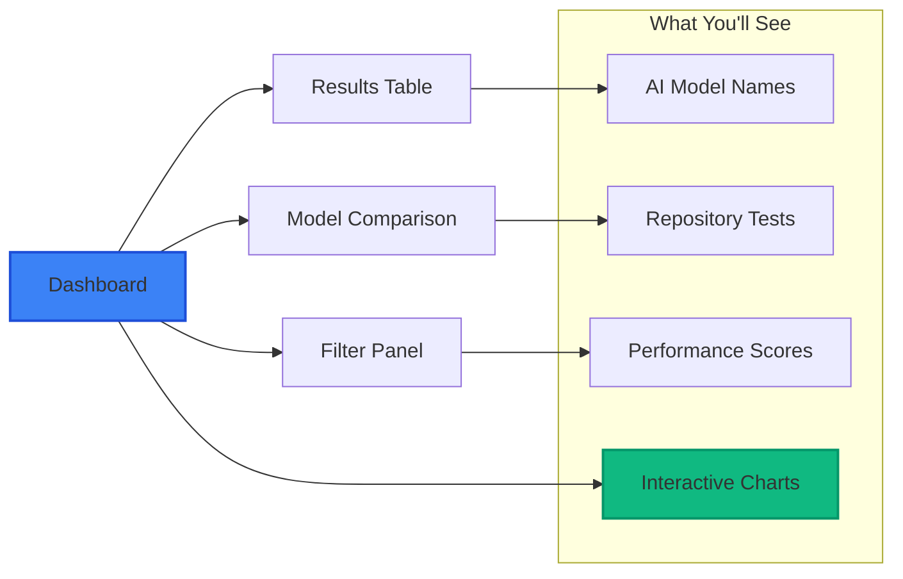
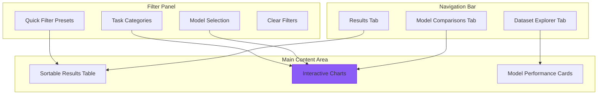
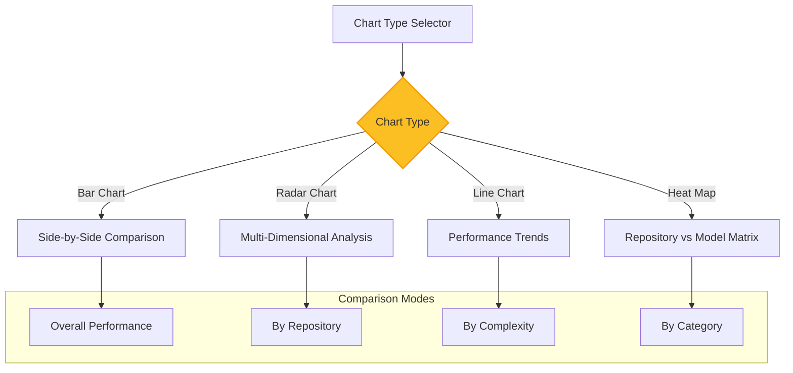
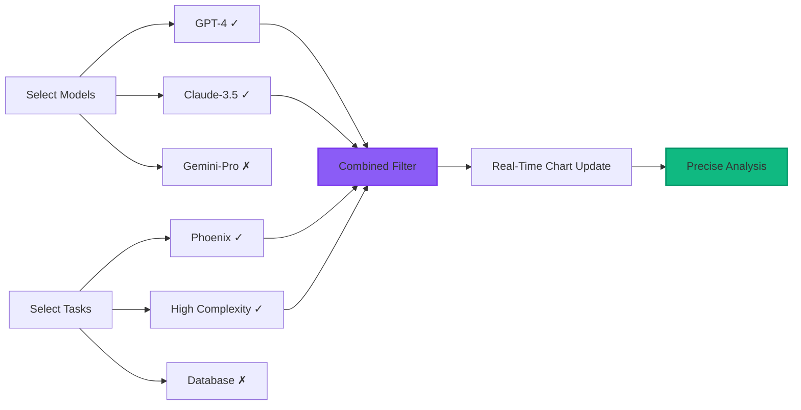
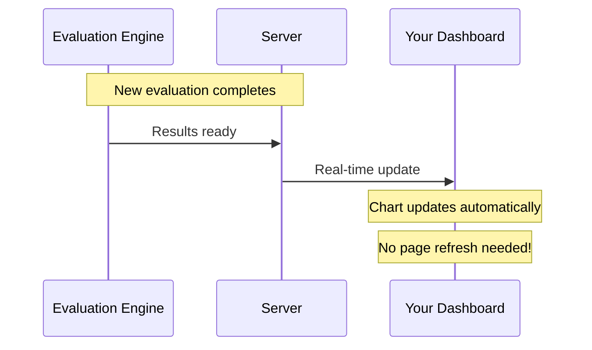
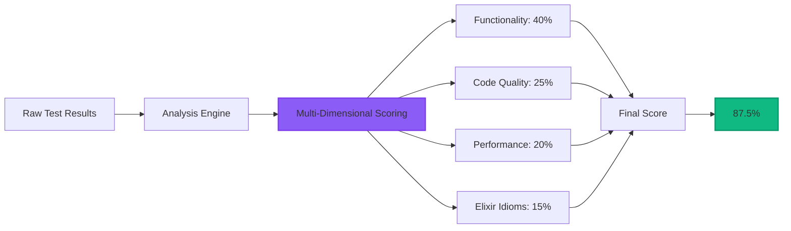

# Getting Started with SWE-bench-Elixir

This guide will get you up and running with the SWE-bench-Elixir platform in just a few minutes. No registration required to start exploring!

## Quick Start (2 Minutes)

### Step 1: Access the Dashboard
Visit the public dashboard - no login required!

```
https://swe-bench-elixir.com/dashboard
```

You'll see the main interface with evaluation results from various AI models.

### Step 2: Explore the Results
The dashboard shows real-time evaluation results:



### Step 3: Try the Filtering
Use the advanced filtering to focus on specific comparisons:

1. **Click "Filter Results"** to open the filter panel
2. **Select AI models** you want to compare (GPT-4, Claude, Gemini)
3. **Choose task types** like "Phoenix" or "High Complexity"
4. **Watch charts update** in real-time!

## Understanding the Interface

### Main Dashboard



### Results Table

The main results table shows comprehensive evaluation data:

| Column | Description | Example |
|--------|-------------|---------|
| **Model** | AI model name | GPT-4, Claude-3.5-Sonnet |
| **Provider** | Model provider | OpenAI, Anthropic, Google |
| **Repository** | Elixir repository tested | Phoenix, Ecto, LiveView |
| **Task Type** | Category of programming task | Web Framework, Database |
| **Complexity** | Task difficulty level | Low, Medium, High, Very High |
| **Score** | Performance percentage | 87.5% (with visual progress bar) |
| **Completed** | When evaluation finished | 2025-08-28 14:30 |
| **Status** | Current evaluation state | Completed, Running, Failed |

### Model Comparison Charts

Switch between different chart types to analyze model performance:



## Advanced Filtering

### Dual Model+Task Filtering

The most powerful feature of SWE-bench is the ability to filter by **both models AND tasks simultaneously**:



### Filter Presets

Use quick presets for common comparisons:

- **"Top 3 Models"**: GPT-4, Claude-3.5-Sonnet, Gemini-Pro comparison
- **"Phoenix Tasks Only"**: Focus on Phoenix framework evaluations
- **"High Complexity"**: See how models handle difficult tasks
- **"Anthropic vs OpenAI"**: Direct provider comparison

### Shareable Filter URLs

Your filter selections are saved in the URL - share specific analyses with colleagues:

```
https://swe-bench-elixir.com/dashboard?models=gpt-4,claude-3-5-sonnet&tasks=phoenix,high
```

## Real-Time Features

### Live Updates

The dashboard updates automatically as new evaluations complete:



### Interactive Experience

- **Instant Filtering**: Charts update immediately when you change filters
- **Live Progress**: See evaluations in progress with real-time status
- **Automatic Refresh**: New results appear without manual refresh
- **Connection Recovery**: Automatic reconnection if connection is lost

## Common Use Cases

### 1. **Compare AI Models on Specific Tasks**

**Scenario**: "How do GPT-4 and Claude compare on Phoenix LiveView tasks?"

**Steps**:
1. Open Filter Panel
2. Select Models: ✅ GPT-4, ✅ Claude-3.5-Sonnet
3. Select Tasks: ✅ Phoenix LiveView
4. View updated charts showing direct comparison

### 2. **Analyze Model Performance by Complexity**

**Scenario**: "Which model handles high-complexity tasks best?"

**Steps**:
1. Apply Filter Preset: "High Complexity"
2. Switch to "Bar Chart" view
3. Set Comparison Mode: "By Complexity"
4. Compare scores across all high-complexity tasks

### 3. **Track Model Performance Trends**

**Scenario**: "How has GPT-4 performance evolved over time?"

**Steps**:
1. Select Model: ✅ GPT-4 only
2. Switch to "Line Chart" view
3. Set Comparison Mode: "By Category"
4. Analyze performance trends across different task categories

## Understanding Scores

### Overall Performance Score

Each evaluation receives a comprehensive score (0-100%):



### Score Interpretation

- **90-100%**: Excellent - Production-ready code with best practices
- **75-89%**: Good - Solid implementation with minor improvements needed
- **60-74%**: Fair - Functional but requires optimization
- **40-59%**: Poor - Significant issues requiring major fixes
- **0-39%**: Failed - Non-functional or severely flawed implementation

### Color Coding

Throughout the interface, consistent color coding helps quick interpretation:

- 🟢 **Green (90%+)**: Excellent performance
- 🔵 **Blue (75-89%)**: Good performance  
- 🟡 **Yellow (60-74%)**: Acceptable performance
- 🟠 **Orange (40-59%)**: Poor performance
- 🔴 **Red (<40%)**: Failed evaluation

## Provider Identification

Each AI model is clearly identified with color-coded provider badges:

- 🟢 **OpenAI** (Green): GPT-4, GPT-3.5-Turbo
- 🔵 **Anthropic** (Blue): Claude-3.5-Sonnet, Claude-3-Haiku
- 🟡 **Google** (Yellow): Gemini-Pro, Gemini-1.5-Flash

## Best Practices

### For Effective Analysis

1. **Start Broad**: Begin with overall model comparison before drilling down
2. **Use Presets**: Try filter presets to quickly see common comparisons
3. **Compare Apples to Apples**: Filter to specific task types for fair comparison
4. **Watch Trends**: Use trend charts to see performance evolution
5. **Share Insights**: Use shareable URLs to discuss findings with colleagues

### For Researchers

1. **Document Methodology**: Note your filter selections and analysis approach
2. **Export Data**: Use data export features for detailed statistical analysis
3. **Track Changes**: Monitor how model performance evolves over time
4. **Consider Context**: Account for task complexity and repository differences
5. **Validate Findings**: Cross-reference results across multiple task types

## Troubleshooting

### Common Issues

**Q: Charts not updating when I change filters**
A: Check your internet connection - the system uses WebSockets for real-time updates

**Q: Can't find specific model in filter**
A: Some models may not have recent evaluations - check the "Last Updated" timestamp

**Q: Results table is empty**
A: Your filter combination might be too restrictive - try clearing filters and starting over

**Q: Page loads slowly**
A: The system loads real evaluation data - initial load may take a few seconds

### Getting Support

- **Check Documentation**: Browse the user guides for detailed information
- **Search Results**: Use the search functionality to find specific evaluations
- **Clear Filters**: Reset filters if results seem unexpected
- **Refresh Page**: Hard refresh (Ctrl+F5) if you encounter display issues

## What's Next?

### Deep Dive Guides

- **[Web Interface](./web-interface.md)**: Master all dashboard features
- **[Understanding Results](./understanding-results.md)**: Learn detailed result interpretation  
- **[Model Comparison](./model-comparison.md)**: Advanced comparison techniques
- **[Advanced Filtering](./advanced-filtering.md)**: Master the filtering system

### For Advanced Users

- **[Research Features](./research-features.md)**: Advanced analytics and export capabilities
- **[Installation](./installation.md)**: Run your own instance

Ready to explore AI coding capabilities in the Elixir ecosystem? Let's dive in! 🚀