# Model Comparison Guide

This guide teaches you how to effectively compare AI models using SWE-bench's advanced comparison features to understand relative strengths, weaknesses, and use case fit.

## Comparison Overview

### Why Compare Models?

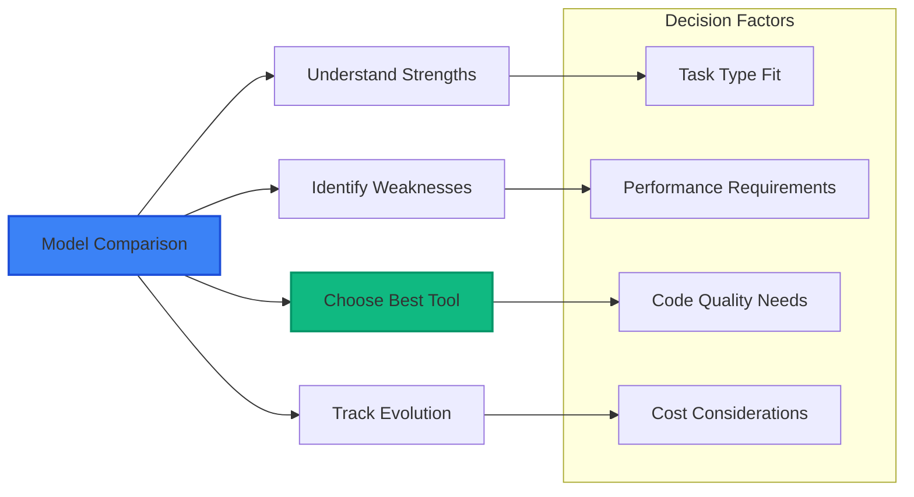

### Available AI Models

**Currently Supported Models**:
- 🟢 **OpenAI**: GPT-4, GPT-3.5-Turbo
- 🔵 **Anthropic**: Claude-3.5-Sonnet, Claude-3-Haiku
- 🟡 **Google**: Gemini-Pro, Gemini-1.5-Flash

## Comparison Techniques

### 1. Overall Performance Comparison

**Best for**: Getting a general sense of model capabilities

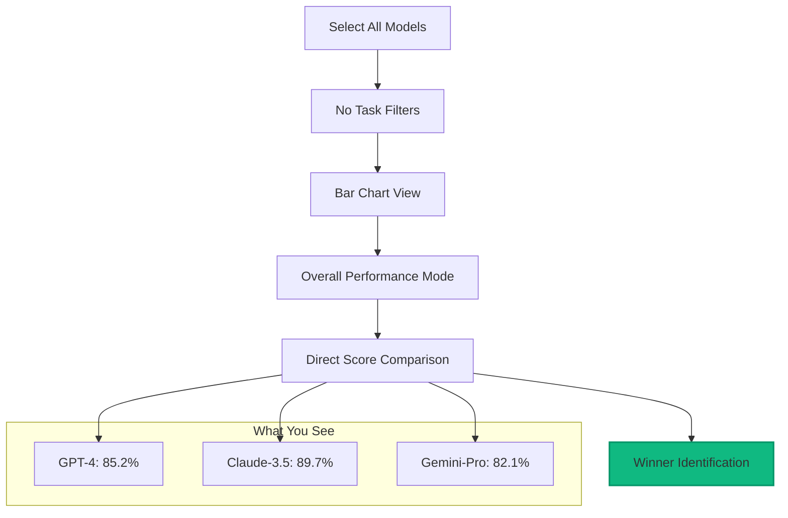

**How to do it**:
1. Clear all filters to see complete dataset
2. Switch to "Model Comparisons" tab
3. Use "Bar Chart" with "Overall Performance" mode
4. Compare average scores across all tasks

### 2. Repository-Specific Comparison

**Best for**: Understanding model fit for specific development areas

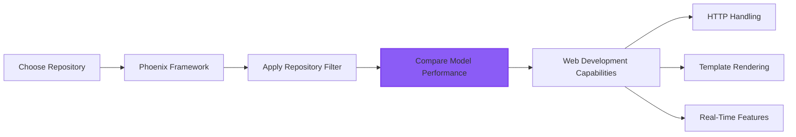

**Example Analysis**: Phoenix Framework Performance
1. Filter by: Repository = "Phoenix"
2. Select models to compare
3. Switch to "By Repository" comparison mode
4. Analyze which models excel at web development tasks

### 3. Complexity-Based Analysis

**Best for**: Understanding how models handle task difficulty

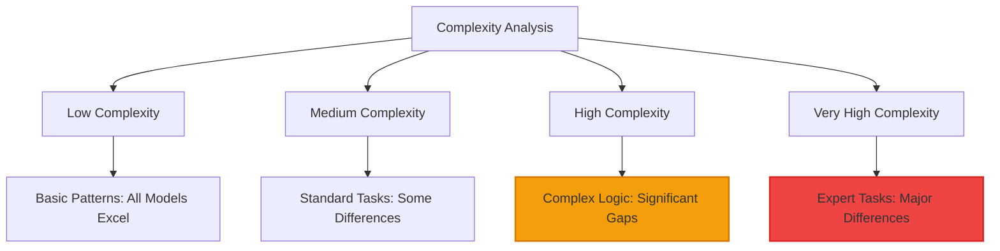

**How to analyze complexity performance**:
1. Use "By Complexity" comparison mode
2. Look for performance degradation patterns
3. Identify which models maintain performance at high complexity
4. Note where models struggle most

### 4. Head-to-Head Comparison

**Best for**: Direct comparison between two specific models

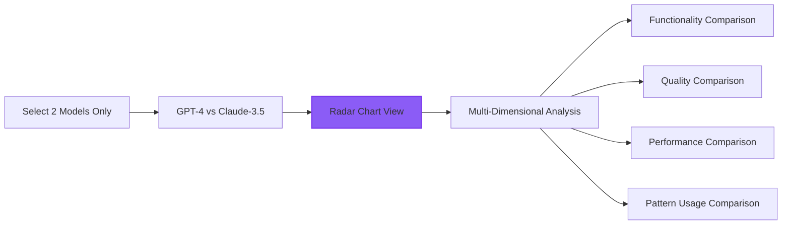

## Advanced Comparison Features

### Provider Ecosystem Analysis

Compare entire AI provider ecosystems:

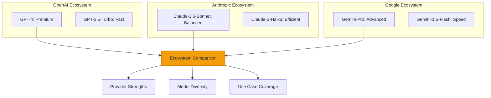

### Capability Radar Analysis

Use radar charts to understand multi-dimensional performance:

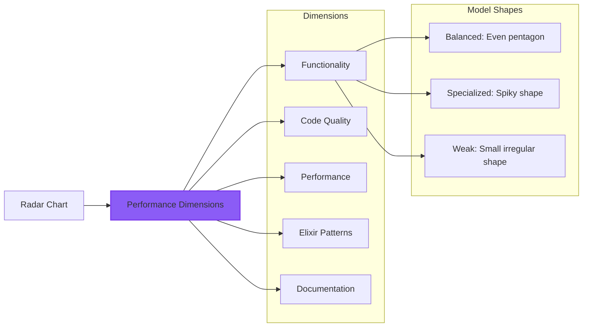

## Practical Comparison Scenarios

### Scenario 1: Choosing AI Coding Assistant

**Goal**: Select best AI model for Phoenix web development team

**Analysis Steps**:
1. **Filter by Repository**: Select "Phoenix" and "Phoenix LiveView"
2. **Compare All Models**: Include GPT-4, Claude-3.5, Gemini-Pro
3. **Examine Multiple Dimensions**: Use radar chart to see capability balance
4. **Check Consistency**: Look at score variance across multiple evaluations

**What to Look For**:
- **High average scores** in web framework tasks
- **Consistent performance** across different Phoenix features
- **Good pattern usage** for maintainable code
- **Strong error handling** for production reliability

### Scenario 2: Academic Research on AI Capabilities

**Goal**: Study how different AI families handle Elixir functional programming

**Analysis Steps**:
1. **Select Representative Models**: One from each provider (GPT-4, Claude-3.5, Gemini-Pro)
2. **Filter by Pattern Type**: Focus on functional programming repositories
3. **Analyze Elixir Patterns Score**: Use "By Category" mode to examine pattern usage
4. **Document Methodology**: Save filter URLs for reproducible research

**What to Look For**:
- **Pattern recognition differences** between model families
- **Functional programming adherence** scores
- **Code organization** and structure quality
- **Idiomatic Elixir usage** patterns

### Scenario 3: Production Readiness Assessment

**Goal**: Evaluate AI models for production Elixir code generation

**Analysis Steps**:
1. **Focus on Production Apps**: Filter by "Plausible Analytics" and "Changelog.com"
2. **Emphasize Quality Metrics**: Use radar charts to examine code quality dimension
3. **Check Performance Scores**: Ensure acceptable performance characteristics
4. **Review Error Handling**: Look for robust error handling patterns

**What to Look For**:
- **High code quality scores** for maintainability
- **Good error handling** for production reliability
- **Performance awareness** for scalable applications
- **Security considerations** in generated code

## Comparison Best Practices

### Effective Comparison Methodology

#### 1. **Fair Comparisons**
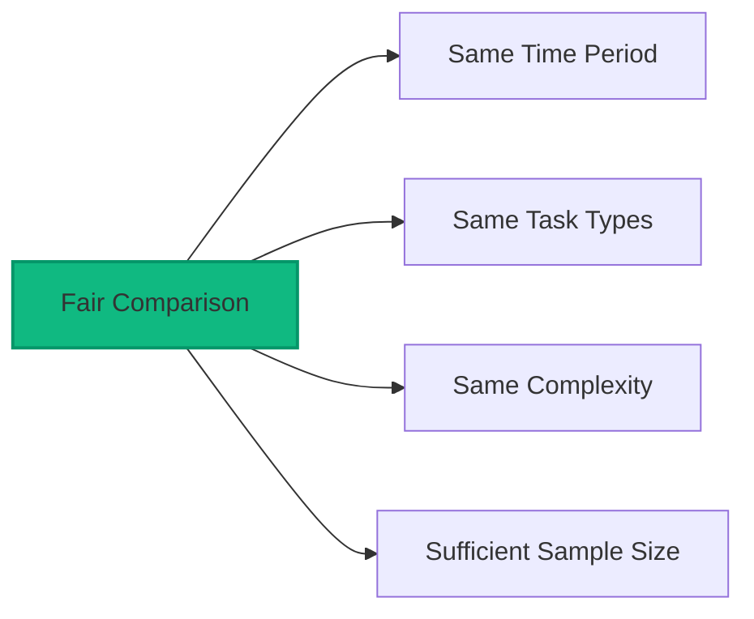

- **Time Period**: Compare evaluations from similar time periods
- **Task Consistency**: Use same repository/complexity filters for all models
- **Sample Size**: Ensure sufficient evaluations for statistical validity
- **Context Awareness**: Consider task characteristics and requirements

#### 2. **Multi-Dimensional Analysis**

Don't rely on overall scores alone:

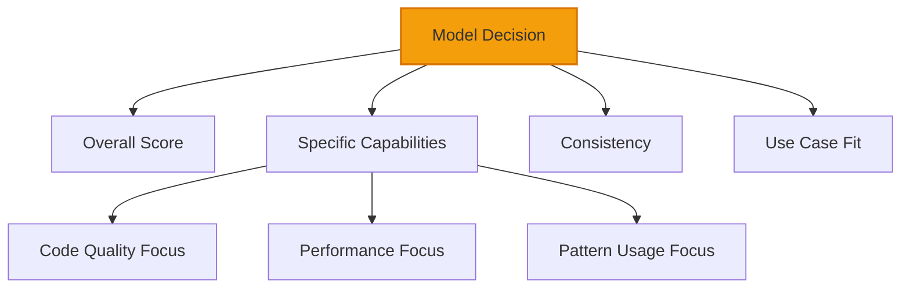

#### 3. **Trend Consideration**

Look at performance evolution:

- **Improving models**: Recent scores higher than historical
- **Stable models**: Consistent performance over time  
- **Declining models**: Recent performance degradation
- **Variable models**: Inconsistent performance patterns

## Interpreting Comparison Results

### Understanding Differences

#### Significant vs. Insignificant Differences

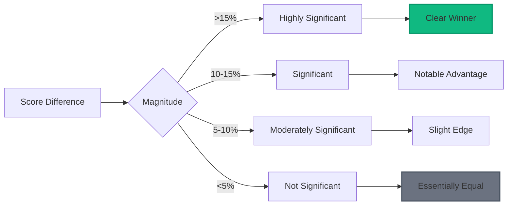

#### Model Performance Categories

**Tier 1 (90%+ Average)**:
- Exceptional performance across most task types
- Production-ready code generation
- Strong pattern recognition and implementation

**Tier 2 (75-89% Average)**:
- Good performance with minor gaps
- Suitable for most development tasks
- May require human review for complex scenarios

**Tier 3 (60-74% Average)**:
- Acceptable performance but inconsistent
- Useful for basic tasks and prototyping
- Requires significant human oversight

**Tier 4 (<60% Average)**:
- Poor performance with major limitations
- Not recommended for production use
- May be suitable for learning or experimental purposes

## Specialized Comparisons

### Provider-Specific Analysis

#### OpenAI Models (GPT Family)
**Characteristics**:
- **Strengths**: General problem solving, complex logic, documentation
- **Weaknesses**: Elixir-specific patterns, idiomatic code
- **Best Use Cases**: Complex business logic, error handling, general development

**Comparison Focus**:
- GPT-4 vs GPT-3.5-Turbo: Quality vs Speed tradeoff
- Consistency across different task complexities
- Performance on domain-specific vs general tasks

#### Anthropic Models (Claude Family)  
**Characteristics**:
- **Strengths**: Code quality, Elixir idioms, functional programming
- **Weaknesses**: Performance optimization, complex algorithms
- **Best Use Cases**: Clean code generation, refactoring, pattern implementation

**Comparison Focus**:
- Claude-3.5-Sonnet vs Claude-3-Haiku: Capability vs Efficiency
- Code quality consistency across repositories
- Functional programming pattern adherence

#### Google Models (Gemini Family)
**Characteristics**:
- **Strengths**: Performance awareness, optimization, mathematical tasks
- **Weaknesses**: Code organization, documentation
- **Best Use Cases**: Performance-critical applications, algorithmic tasks

**Comparison Focus**:
- Gemini-Pro vs Gemini-1.5-Flash: Advanced vs Fast processing
- Performance optimization awareness
- Mathematical and algorithmic task handling

## Visualization Strategies

### Chart Selection Guide

Choose the right visualization for your analysis:

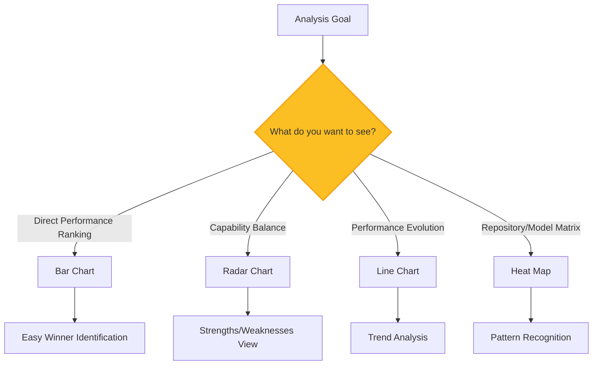

### Comparison Mode Selection

Choose the right comparison dimension:

#### Overall Performance
- **Use when**: Want general model ranking
- **Shows**: Average performance across all evaluated tasks
- **Best for**: Initial model assessment

#### By Repository  
- **Use when**: Analyzing domain-specific performance
- **Shows**: Performance broken down by Elixir repository/project
- **Best for**: Technology stack decisions

#### By Complexity
- **Use when**: Understanding model limitations
- **Shows**: Performance degradation as tasks get harder
- **Best for**: Capability boundary analysis

#### By Category
- **Use when**: Analyzing functional area performance  
- **Shows**: Performance in different programming domains
- **Best for**: Specialized use case evaluation

## Advanced Comparison Techniques

### Multi-Perspective Analysis

Combine multiple comparison approaches:

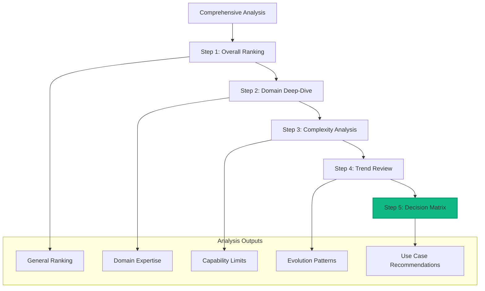

### Statistical Comparison

#### Confidence Assessment

When comparing models, consider statistical confidence:

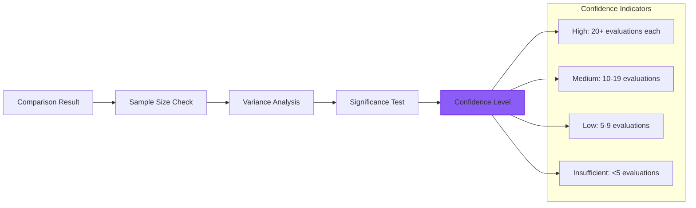

#### Performance Variance

Look for consistency indicators:
- **Low variance**: Reliable, predictable performance
- **High variance**: Inconsistent results, higher risk
- **Outliers**: Exceptional performance (positive or negative)

## Practical Comparison Examples

### Example 1: Web Development Team Selection

**Scenario**: Choose AI assistant for Phoenix LiveView development

**Comparison Approach**:
1. **Filter Setup**:
   - Models: GPT-4, Claude-3.5-Sonnet, Gemini-Pro
   - Tasks: Phoenix, Phoenix LiveView
   - Complexity: Medium, High

2. **Analysis Steps**:
   ```mermaid
   graph LR
       A[Filter Application] --> B[Radar Chart Analysis]
       B --> C[Quality Focus]
       C --> D[Pattern Assessment]
       D --> E[Decision]
       
       style E fill:#10b981,stroke:#059669,stroke-width:2px
   ```

3. **Key Metrics**:
   - Overall performance on web framework tasks
   - Code quality scores for maintainable code
   - Elixir pattern usage for idiomatic code
   - Real-time feature implementation capability

4. **Expected Findings**:
   - Claude-3.5-Sonnet: High code quality and patterns
   - GPT-4: Strong general problem solving
   - Gemini-Pro: Good performance optimization

### Example 2: Research Study Design

**Scenario**: Academic study on AI functional programming capabilities

**Comparison Approach**:
1. **Systematic Selection**:
   - Models: Representative sample from each provider
   - Tasks: Functional programming heavy repositories (Nx, Broadway)
   - Time Period: Consistent evaluation window

2. **Multi-Dimensional Analysis**:
   ```mermaid
   graph TB
       A[Research Design] --> B[Functional Programming Filter]
       B --> C[Pattern Analysis Focus]
       C --> D[Statistical Validation]
       D --> E[Academic Reporting]
       
       style E fill:#3b82f6,stroke:#1d4ed8,stroke-width:2px
   ```

3. **Metrics Collection**:
   - Elixir pattern usage scores
   - Functional programming adherence
   - Code organization quality
   - Performance characteristics

### Example 3: Production Deployment Decision

**Scenario**: Enterprise evaluation for production code generation

**Comparison Approach**:
1. **Production-Focused Filters**:
   - Tasks: Production applications (Plausible, Changelog)
   - Complexity: High, Very High
   - Focus: Quality, Performance, Error Handling

2. **Risk Assessment**:
   ```mermaid
   graph LR
       A[Production Analysis] --> B[Quality Gates]
       B --> C[Performance Thresholds]
       C --> D[Risk Assessment]
       D --> E[Deployment Recommendation]
       
       style D fill:#fbbf24,stroke:#f59e0b,stroke-width:2px
       style E fill:#ef4444,stroke:#dc2626,stroke-width:2px
   ```

## Comparison Insights

### Model Personality Profiles

Based on comprehensive analysis, models show distinct "personalities":

#### GPT-4: "The Generalist"
- **Strength**: Broad capability across many domains
- **Approach**: Methodical problem solving with comprehensive error handling
- **Code Style**: Verbose but thorough, extensive documentation
- **Best For**: Complex business logic, comprehensive solutions

#### Claude-3.5-Sonnet: "The Craftsman"  
- **Strength**: Clean, idiomatic code with excellent patterns
- **Approach**: Functional programming focus with elegant solutions
- **Code Style**: Concise, well-organized, follows best practices
- **Best For**: Maintainable codebases, refactoring, code quality

#### Gemini-Pro: "The Optimizer"
- **Strength**: Performance-aware with optimization focus
- **Approach**: Efficiency-first with algorithmic thinking
- **Code Style**: Performance-oriented, mathematical precision
- **Best For**: High-performance applications, algorithmic challenges

## Decision Framework

### Model Selection Matrix

Use this framework to make informed decisions:

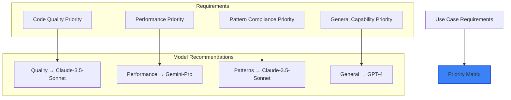

### Decision Criteria

Consider these factors when choosing based on comparisons:

1. **Primary Use Case**: What type of Elixir development?
2. **Quality Requirements**: How important is code maintainability?
3. **Performance Needs**: Are there specific performance requirements?
4. **Team Expertise**: What level of AI assistance is needed?
5. **Risk Tolerance**: How much human review is acceptable?

## Advanced Tips

### Power User Techniques

#### Comparative Bookmarking
Create bookmarks for different comparison scenarios:
- `bookmark://general-comparison` - Overall model ranking
- `bookmark://web-dev-comparison` - Phoenix/LiveView focus  
- `bookmark://quality-comparison` - Code quality emphasis
- `bookmark://performance-comparison` - Performance focus

#### Systematic Analysis Workflow
1. **Baseline establishment**: Overall performance comparison
2. **Domain drilling**: Repository-specific deep dives
3. **Complexity mapping**: Performance vs difficulty analysis
4. **Trend monitoring**: Evolution tracking over time
5. **Decision documentation**: Record findings and rationale

### Research Integration

#### Academic Usage
- **Methodology documentation**: Record exact filter combinations used
- **Reproducible analysis**: Use shareable URLs for verification
- **Statistical rigor**: Consider sample sizes and confidence intervals
- **Bias awareness**: Account for evaluation limitations and scope

#### Industry Application
- **Cost-benefit analysis**: Compare model capabilities vs licensing costs
- **Risk assessment**: Understand limitations and oversight requirements  
- **Team integration**: Consider how models fit existing development workflows
- **Performance monitoring**: Track chosen model performance over time

This model comparison system enables sophisticated analysis of AI coding capabilities, helping you make informed decisions about AI tool adoption and understand the evolving landscape of AI-generated code quality! 🔬📊