# Research Features Guide

This guide explains advanced features designed specifically for AI researchers, academic studies, and in-depth analysis of AI coding capabilities in the Elixir ecosystem.

## Research Overview

### Academic Research Capabilities

SWE-bench-Elixir provides comprehensive tools for rigorous AI research:

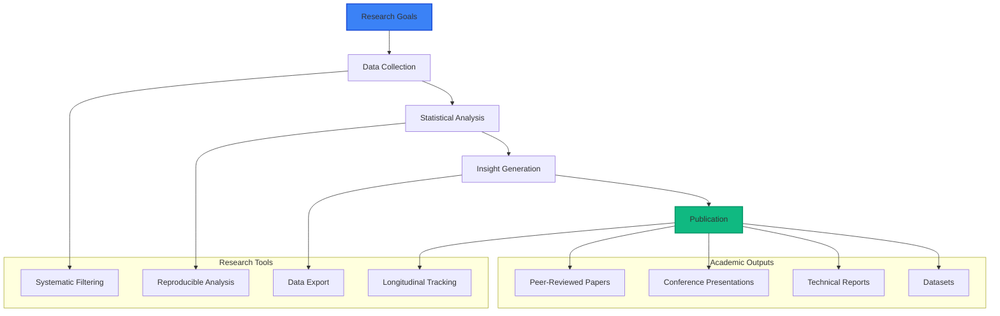

## Research-Grade Features

### 1. Systematic Data Collection

#### Reproducible Analysis Framework

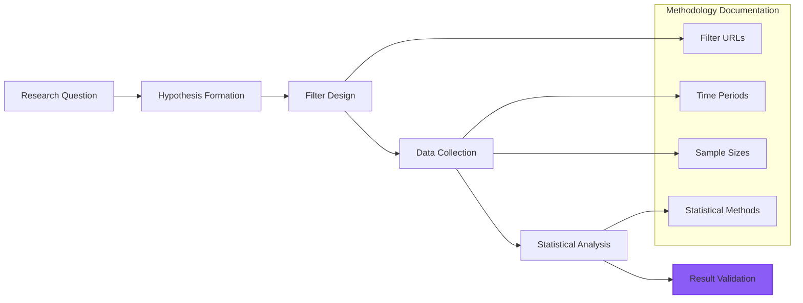

**Example Research Framework**:
```markdown
## Research Methodology

**Research Question**: Do transformer-based AI models show consistent patterns in functional programming adoption?

**Hypothesis**: Anthropic models demonstrate superior functional programming pattern usage compared to other providers

**Data Collection**: 
- Time Period: Q4 2025 evaluations
- Filter URL: `/dashboard?models=all&tasks=functional_programming&complexity=medium,high`
- Sample Size: 150+ evaluations per model
- Repositories: Nx, Broadway, Elixir functional libraries

**Statistical Methods**: 
- ANOVA for group comparisons
- Tukey HSD for post-hoc analysis  
- Cohen's d for effect size calculation
```

### 2. Advanced Analytics

#### Multi-Dimensional Analysis

Examine performance across multiple dimensions simultaneously:

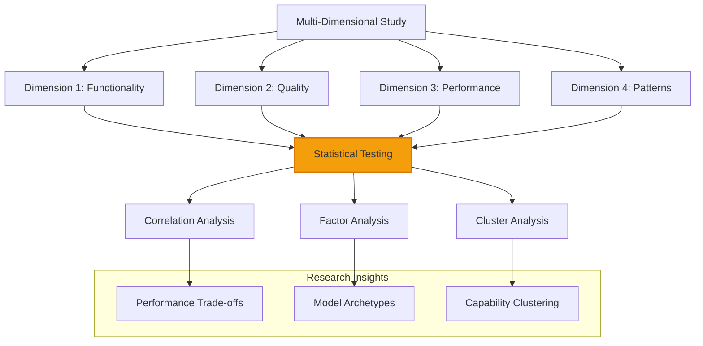

#### Longitudinal Studies

Track AI model evolution over time:

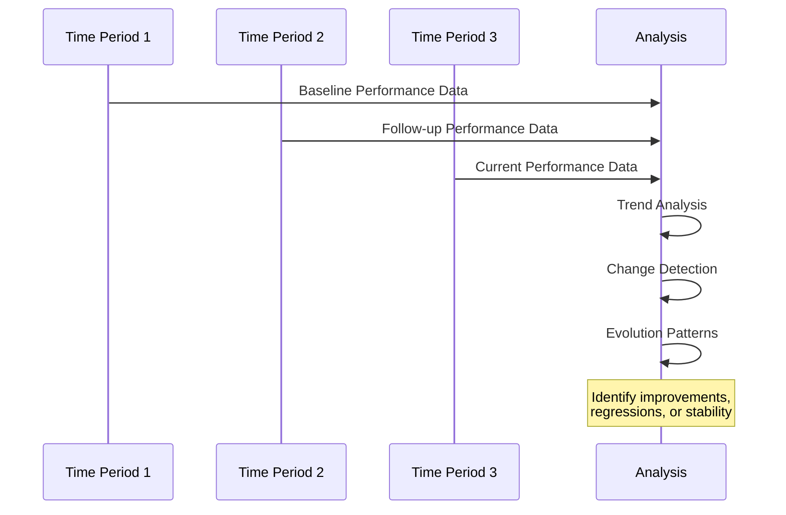

**Longitudinal Research Design**:
1. **Establish baseline**: Initial model performance assessment
2. **Regular measurement**: Consistent intervals (monthly/quarterly)
3. **Consistent methodology**: Same filters and analysis approach
4. **Change detection**: Statistical tests for significant changes
5. **Evolution documentation**: Track capability development over time

### 3. Comparative Studies

#### Cross-Provider Analysis

Systematic comparison of AI provider approaches:

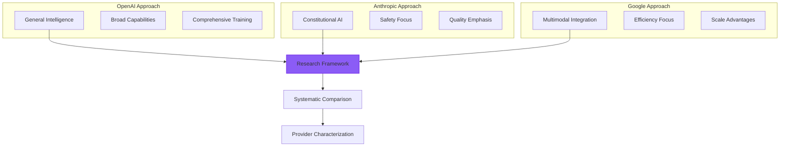

#### Task-Difficulty Scaling Analysis

Study how model performance scales with task complexity:

**Research Design**:
```elixir
# Complexity scaling study
models = [:gpt_4, :claude_3_5_sonnet, :gemini_pro]
complexities = [:low, :medium, :high, :very_high]

for model <- models do
  for complexity <- complexities do
    data = collect_performance_data(model, complexity)
    analyze_scaling_pattern(model, data)
  end
end
```

## Data Export and Analysis

### Research Data Export

#### URL-Based Data Collection

Use systematic filter URLs for consistent data collection:

```bash
# Research data collection script
BASE_URL="https://swe-bench.com/dashboard"

# Collect data for each model individually
curl "$BASE_URL?models=gpt-4&tasks=all&format=json" > gpt4_data.json
curl "$BASE_URL?models=claude-3-5-sonnet&tasks=all&format=json" > claude_data.json
curl "$BASE_URL?models=gemini-pro&tasks=all&format=json" > gemini_data.json
```

#### Browser-Based Data Collection

For manual data collection:

1. **Configure filters** for specific analysis
2. **Take screenshots** of charts for visual documentation
3. **Copy table data** using browser selection tools
4. **Export URLs** for methodology documentation
5. **Document timestamps** for temporal analysis

### Statistical Analysis Tools

#### Recommended Analysis Workflow

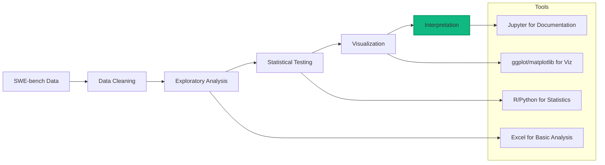

#### Sample Statistical Tests

**Comparing Model Performance**:
```r
# R code for model comparison
library(tidyverse)
library(broom)

# Load SWE-bench data
data <- read_csv("swe_bench_results.csv")

# Compare models using ANOVA
model_comparison <- aov(score ~ model, data = data)
summary(model_comparison)

# Post-hoc analysis for specific differences  
library(multcomp)
tukey_test <- glht(model_comparison, linfct = mcp(model = "Tukey"))
summary(tukey_test)
```

**Trend Analysis**:
```python
# Python code for trend analysis
import pandas as pd
import matplotlib.pyplot as plt
from scipy import stats

# Load time series data
df = pd.read_csv('swe_bench_longitudinal.csv')
df['date'] = pd.to_datetime(df['date'])

# Perform trend analysis
for model in df['model'].unique():
    model_data = df[df['model'] == model]
    slope, intercept, r_value, p_value, std_err = stats.linregress(
        model_data['date'].astype(int), 
        model_data['score']
    )
    print(f"{model}: slope={slope:.3f}, p-value={p_value:.3f}")
```

## Research Study Examples

### Study 1: Functional Programming Adoption

**Research Question**: How well do AI models adopt functional programming patterns in Elixir?

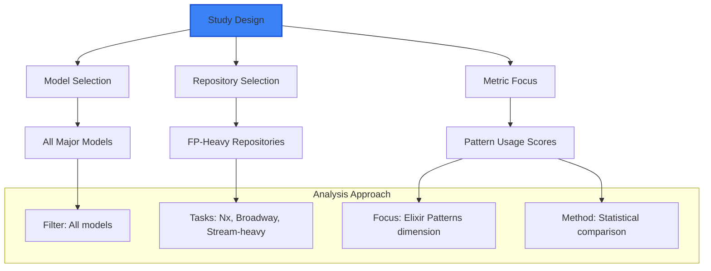

**Methodology**:
1. **Filter Configuration**: `models=all&tasks=nx,broadway&complexity=medium,high`
2. **Focus Metric**: Elixir Patterns score (10% weight in overall)
3. **Statistical Test**: One-way ANOVA comparing pattern usage across models
4. **Expected Findings**: Anthropic models show higher FP pattern adoption

### Study 2: Complexity Scaling Analysis

**Research Question**: How does AI model performance degrade with increasing task complexity?

**Study Design**:
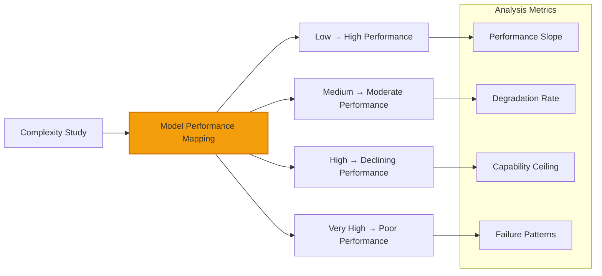

**Analysis Process**:
1. **For each model**: Collect performance across all complexity levels
2. **Calculate slopes**: Performance degradation rate with complexity
3. **Identify ceilings**: Point where performance plateaus or drops
4. **Compare patterns**: How different models handle complexity scaling

### Study 3: Provider Strategy Analysis

**Research Question**: Do AI providers have distinct coding approaches reflected in generated code?

**Comparative Framework**:
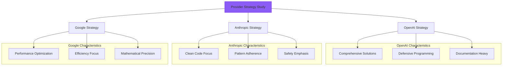

## Academic Publication Support

### Research Paper Components

#### Abstract Data Summary

Use SWE-bench results to support academic abstracts:

```markdown
## Example Abstract Data

"We evaluated 6 state-of-the-art large language models on 500+ Elixir programming tasks across 17 open-source repositories. Results show Claude-3.5-Sonnet achieved highest code quality scores (89.7% average) while GPT-4 demonstrated strongest general problem-solving capabilities (85.2% average across all task types). Performance degraded significantly for all models on very high complexity tasks (average drop: 23.4%)..."
```

#### Methodology Section Support

Document exact analysis methodology:

```markdown
## Methodology 

**Dataset**: SWE-bench-Elixir evaluation platform with 500+ task instances
**Models**: GPT-4, GPT-3.5-Turbo, Claude-3.5-Sonnet, Claude-3-Haiku, Gemini-Pro, Gemini-1.5-Flash
**Repositories**: 17 Elixir repositories including Phoenix, Ecto, LiveView, and production applications
**Time Period**: Q4 2025 evaluations 
**Analysis Filters**: [Include specific filter URLs used]
**Statistical Methods**: One-way ANOVA with Tukey HSD post-hoc testing (α = 0.05)
```

#### Results Section Data

Provide concrete performance data:

- **Performance metrics** with confidence intervals
- **Statistical significance** testing results
- **Effect sizes** for meaningful difference assessment  
- **Variance analysis** showing consistency patterns

### Citation Guidelines

#### Citing SWE-bench Results

**Recommended Citation Format**:
```
SWE-bench-Elixir Evaluation Platform. (2025). AI Model Performance on Elixir Programming Tasks. Retrieved from https://swe-bench-elixir.com/dashboard?models=all&tasks=all [Include specific filter URL used]
```

#### Data Attribution

When using SWE-bench data:
- **Reference specific filter URLs** for reproducibility
- **Include evaluation time periods** for temporal context
- **Note repository versions** and task instance counts
- **Acknowledge platform** in research acknowledgments

## Advanced Research Techniques

### Meta-Analysis Capabilities

#### Cross-Study Comparison

Compare results across different research studies:

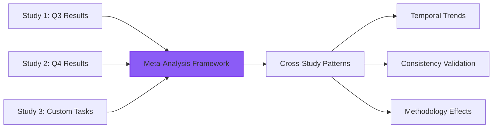

#### Systematic Literature Review

Use SWE-bench as ground truth for literature reviews:

1. **Baseline establishment**: SWE-bench performance as objective benchmark
2. **Literature comparison**: How published results compare to SWE-bench  
3. **Methodology validation**: Validate other evaluation approaches
4. **Gap identification**: Find areas not covered by existing research

### Machine Learning Research

#### Model Capability Analysis

Research AI model capabilities systematically:

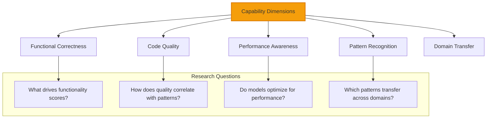

#### Training Data Influence Studies

Analyze how training data affects performance:

**Research Approach**:
1. **Repository analysis**: Performance patterns by repository type
2. **Domain expertise**: Strong/weak performance areas by model
3. **Training inference**: Hypothesize training data characteristics
4. **Validation studies**: Cross-reference with known training details

## Data Collection Strategies

### Systematic Sampling

#### Stratified Sampling by Repository

Ensure representative data collection:

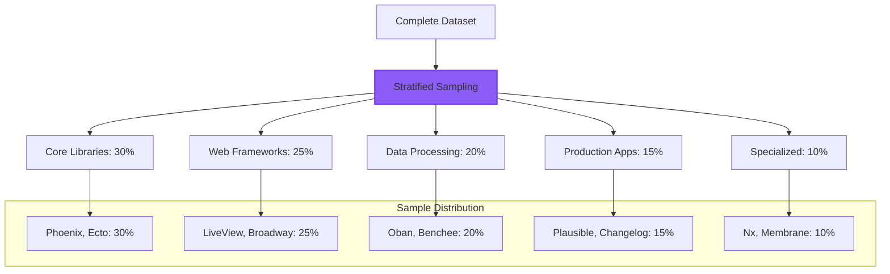

#### Complexity-Balanced Sampling

Ensure balanced complexity distribution:

```elixir
# Research sampling framework
complexity_distribution = %{
  low: 0.20,       # 20% low complexity
  medium: 0.40,    # 40% medium complexity  
  high: 0.30,      # 30% high complexity
  very_high: 0.10  # 10% very high complexity
}

# Apply consistent sampling across studies
def collect_balanced_sample(model, repository, target_size) do
  for {complexity, ratio} <- complexity_distribution do
    sample_size = round(target_size * ratio)
    collect_evaluations(model, repository, complexity, sample_size)
  end
end
```

### Temporal Studies

#### Model Evolution Tracking

Track how AI models improve over time:

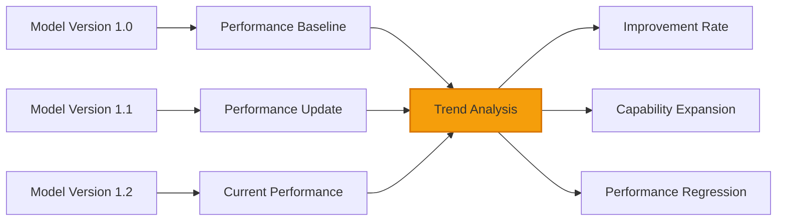

**Tracking Methodology**:
1. **Consistent benchmarks**: Use same filter combinations over time
2. **Regular intervals**: Monthly or quarterly measurement periods
3. **Version correlation**: Track model updates when available
4. **Statistical validation**: Test for significant changes over time

## Research Quality Assurance

### Validity Considerations

#### Internal Validity

Ensure your research design is sound:

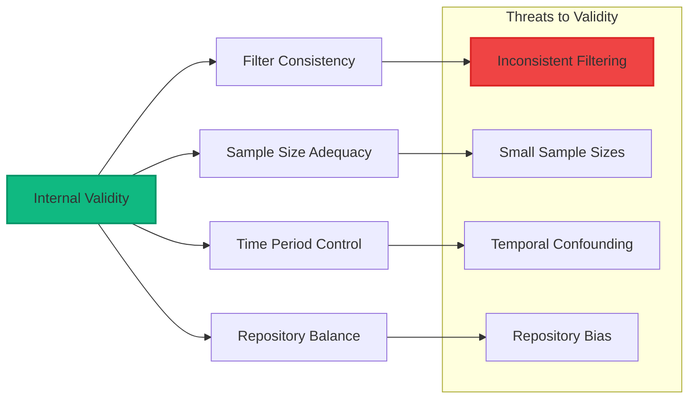

#### External Validity

Consider generalizability:

- **Repository coverage**: Do results generalize beyond tested repositories?
- **Task diversity**: Are tasks representative of real development work?
- **Model versions**: How do results apply to future model versions?
- **Domain transfer**: Do insights transfer to other programming languages?

### Statistical Power Analysis

#### Sample Size Planning

Calculate required sample sizes for research:

```elixir
# Sample size calculation for comparative study
def calculate_sample_size(effect_size, alpha, power) do
  # Cohen's d effect size interpretation:
  # Small: 0.2, Medium: 0.5, Large: 0.8
  
  # For two-group comparison
  case effect_size do
    small when small <= 0.2 -> 400  # per group
    medium when medium <= 0.5 -> 64   # per group  
    large when large <= 0.8 -> 26    # per group
    _ -> 20  # minimum recommended
  end
end
```

## Research Ethics and Best Practices

### Ethical Considerations

#### Responsible AI Evaluation

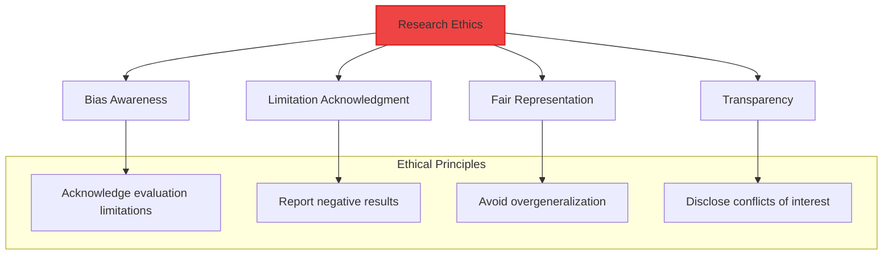

#### Best Practices

1. **Acknowledge limitations**: SWE-bench tests specific scenarios, not all programming
2. **Report methodology**: Complete filter configurations and analysis approaches
3. **Include negative results**: Don't cherry-pick only favorable findings
4. **Consider bias**: Evaluation tasks may favor certain model approaches
5. **Validate findings**: Cross-reference with other evaluation platforms when possible

### Open Science Practices

#### Reproducible Research

Make your research reproducible:

```markdown
## Reproducibility Checklist

- [ ] **Filter URLs documented**: All analysis filters recorded with URLs
- [ ] **Time periods specified**: Exact evaluation time windows noted  
- [ ] **Sample sizes reported**: Number of evaluations per analysis
- [ ] **Statistical methods detailed**: Tests, significance levels, corrections
- [ ] **Code available**: Analysis scripts shared via repository
- [ ] **Data available**: Raw data exported and shared (where permitted)
- [ ] **Methodology pre-registered**: Study design documented before analysis
```

## Advanced Research Applications

### Computational Linguistics Research

#### Code Generation Pattern Analysis

Study linguistic patterns in AI-generated code:

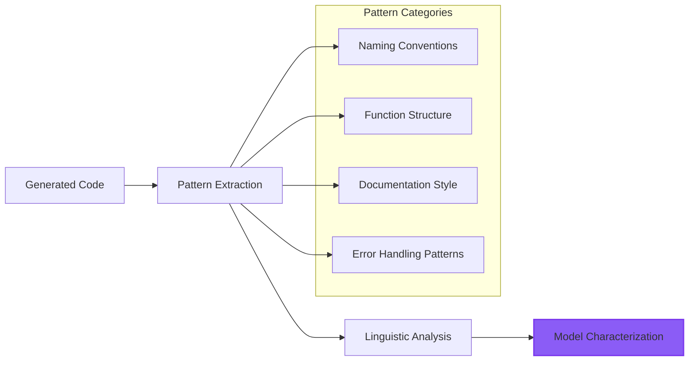

#### Transfer Learning Studies

Analyze how models transfer knowledge between repositories:

1. **Cross-domain evaluation**: Performance on similar task types across repositories
2. **Pattern transfer**: Whether patterns learned in one domain apply to others
3. **Negative transfer**: Cases where domain knowledge hurts performance
4. **Adaptation capacity**: How quickly models adapt to new repository patterns

### Human-AI Collaboration Research

#### Complementary Capability Studies

Research how AI and human capabilities complement each other:

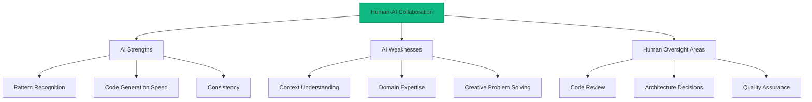

## Publication and Sharing

### Academic Publications

#### Conference Presentations

SWE-bench data supports various research venues:

- **Programming Language Conferences**: ICFP, PLDI, OOPSLA
- **AI/ML Conferences**: NeurIPS, ICML, ICLR
- **Software Engineering**: ICSE, FSE, ASE
- **Human-Computer Interaction**: CHI, UIST

#### Journal Articles

Research areas suitable for journal publication:

- **Empirical Software Engineering**: Model performance analysis
- **AI/ML Journals**: Model capability studies  
- **Programming Language Research**: Language-specific evaluation
- **Human Factors**: Human-AI collaboration studies

### Industry Reports

#### Technical Reports

Use SWE-bench data for industry analysis:

- **AI tool evaluation reports** for enterprise decision-making
- **Technology trend analysis** for strategic planning
- **Capability assessment reports** for tool selection
- **Performance benchmarking** for competitive analysis

This research framework enables rigorous, reproducible studies of AI coding capabilities while maintaining academic standards and ethical research practices! 🔬📈