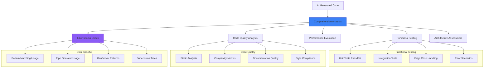
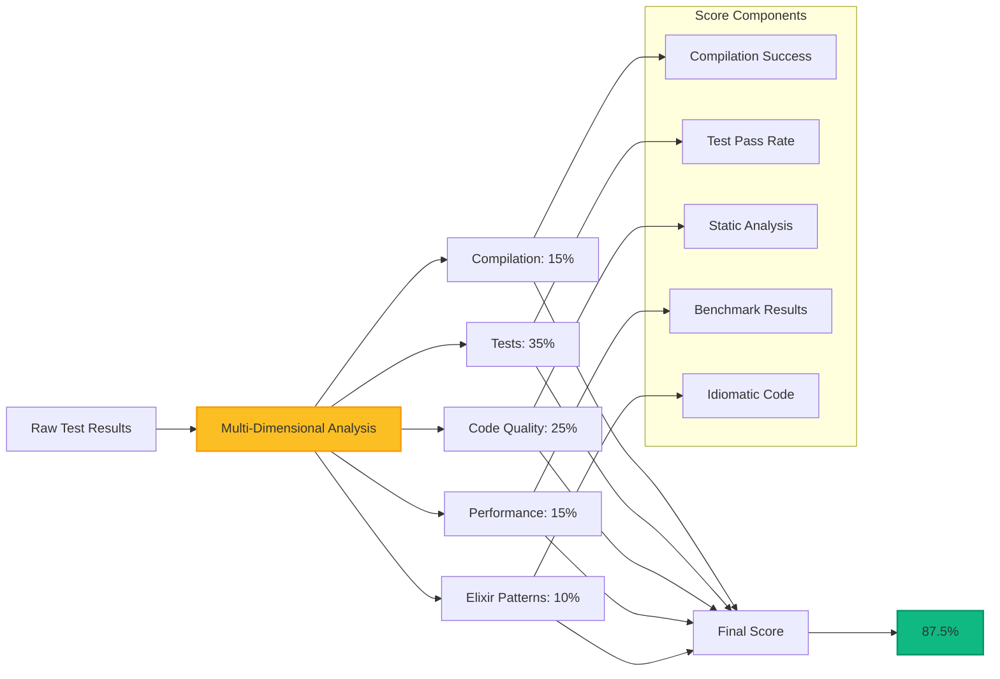
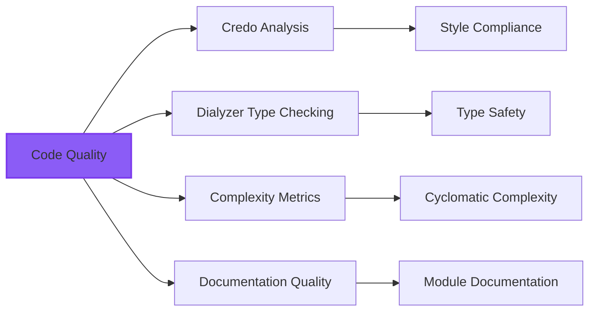
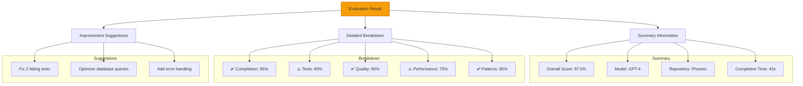
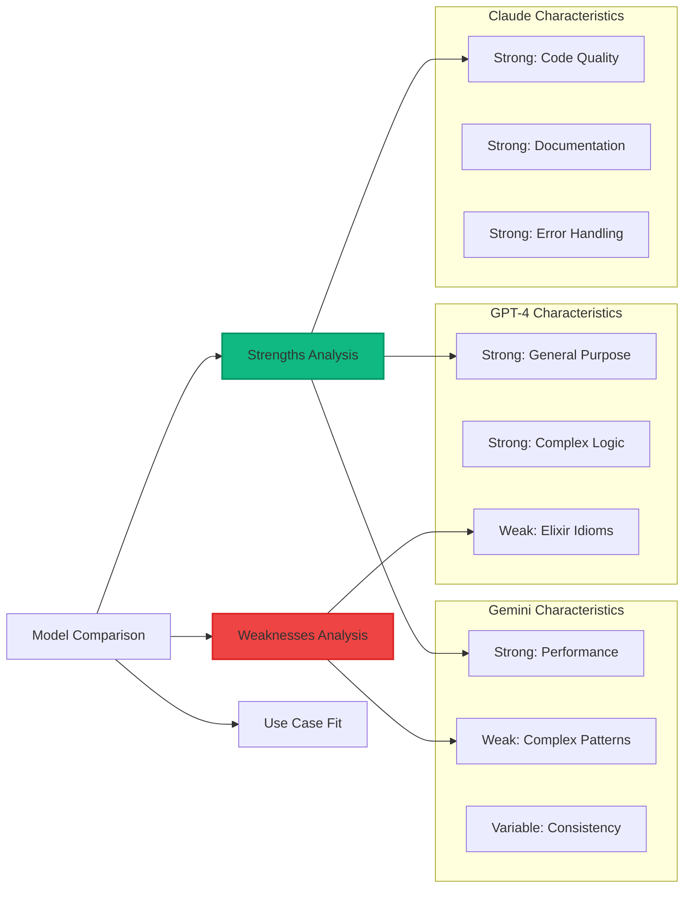
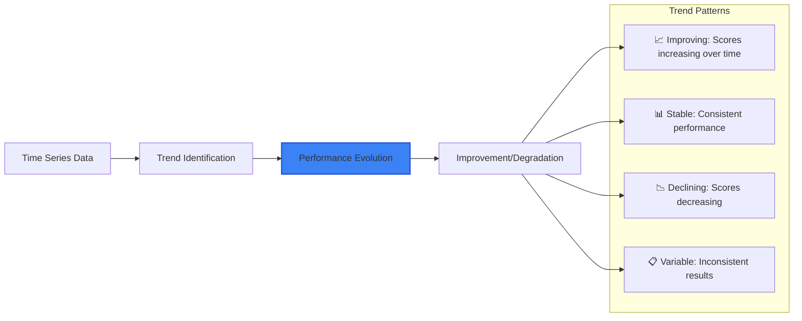
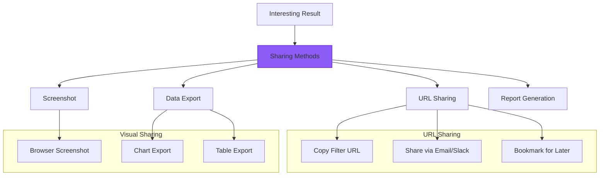
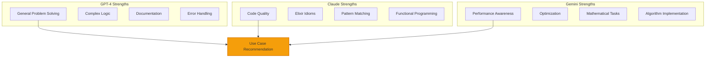
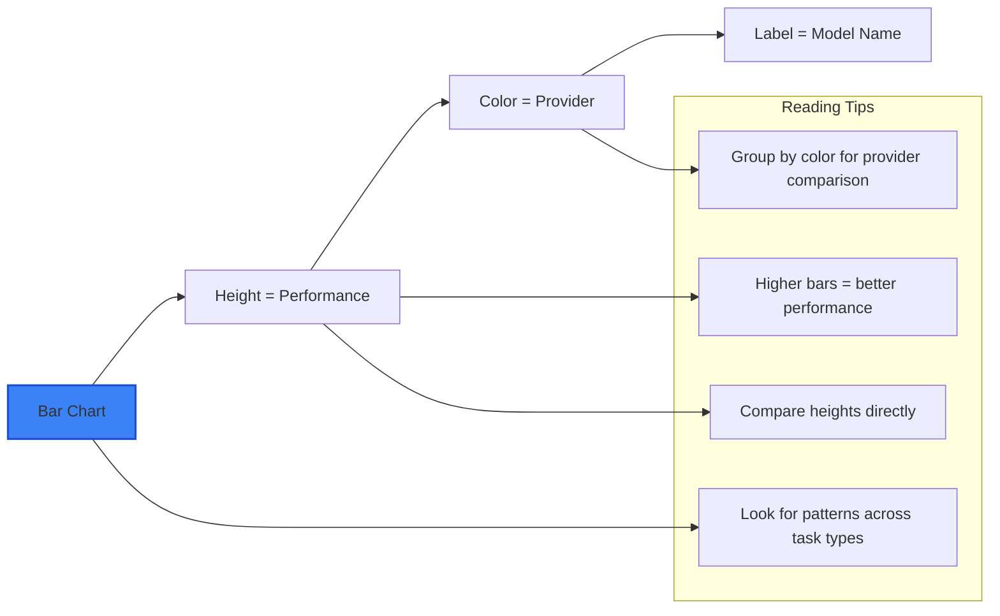
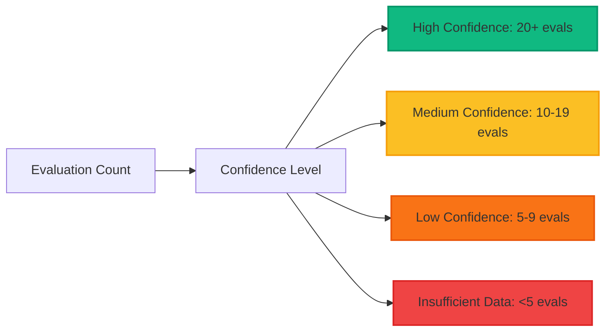

# Understanding Evaluation Results

This guide explains how to interpret SWE-bench evaluation results, understand scoring methodology, and extract meaningful insights about AI model performance.

## Evaluation Overview

### What Gets Evaluated



## Scoring Methodology

### Multi-Dimensional Scoring System

SWE-bench uses a sophisticated scoring system that goes beyond simple pass/fail:



### Scoring Breakdown

#### 1. Compilation Success (15%)
**What it measures**: Whether the generated code compiles without errors

- **100%**: Clean compilation with no errors or warnings
- **75-99%**: Compiles with minor warnings
- **50-74%**: Compiles with significant warnings
- **25-49%**: Compilation errors but some code structure intact
- **0-24%**: Major compilation failures

#### 2. Test Passage (35%)
**What it measures**: Percentage of tests that pass successfully

- **100%**: All tests pass
- **75-99%**: Most tests pass with minor failures
- **50-74%**: About half the tests pass
- **25-49%**: Many test failures but core functionality works
- **0-24%**: Most or all tests fail

#### 3. Code Quality (25%)
**What it measures**: Static analysis results and code organization



- **90-100%**: Excellent code quality with best practices
- **75-89%**: Good quality with minor style issues
- **60-74%**: Acceptable quality but needs improvement
- **40-59%**: Poor quality with significant issues
- **0-39%**: Very poor quality requiring major refactoring

#### 4. Performance (15%)
**What it measures**: Execution efficiency and resource usage

- **90-100%**: Highly optimized with excellent performance
- **75-89%**: Good performance with minor optimization opportunities
- **60-74%**: Acceptable performance for most use cases
- **40-59%**: Performance issues affecting user experience
- **0-39%**: Severe performance problems

#### 5. Elixir Patterns (10%)
**What it measures**: Proper use of Elixir idioms and patterns

- **90-100%**: Excellent use of Elixir patterns and idioms
- **75-89%**: Good pattern usage with minor improvements possible
- **60-74%**: Some pattern usage but not fully idiomatic
- **40-59%**: Limited pattern usage, more procedural style
- **0-39%**: Poor pattern usage, not leveraging Elixir strengths

## Result Details

### Detailed Breakdown

Each evaluation provides comprehensive details:



### Status Indicators

#### Evaluation Status
- 🟢 **Completed**: Evaluation finished successfully
- 🔵 **Running**: Currently executing (with progress %)
- 🟡 **Queued**: Waiting to start
- 🔴 **Failed**: Evaluation encountered errors
- ⚫ **Cancelled**: Manually cancelled by administrator

#### Quality Indicators
- ✅ **Excellent** (90%+): Green checkmark
- ⚠️ **Good** (75-89%): Yellow warning
- ❌ **Poor** (<75%): Red X mark

## Interpreting Model Performance

### Cross-Model Comparison

When comparing different AI models, consider:



### Repository-Specific Performance

Different repositories reveal different AI capabilities:

#### Web Framework Tasks (Phoenix, LiveView)
- Tests understanding of web development patterns
- Evaluates HTTP request handling and routing
- Assesses real-time features and WebSocket usage
- Measures template rendering and component architecture

#### Database Tasks (Ecto)
- Tests query construction and optimization
- Evaluates schema design and migrations
- Assesses relationship modeling and data validation
- Measures transaction handling and connection pooling

#### Performance Tasks (Benchee)
- Tests optimization awareness and algorithmic thinking
- Evaluates understanding of BEAM VM characteristics
- Assesses memory usage and garbage collection considerations
- Measures concurrent programming capabilities

## Advanced Analysis

### Trend Analysis

Track model performance evolution:



### Statistical Significance

When analyzing results, consider:

- **Sample Size**: More evaluations = more reliable results
- **Task Diversity**: Results across multiple repositories are more meaningful
- **Consistency**: Look for consistent performance rather than single outliers
- **Context**: Consider task complexity and repository characteristics

## Result Export and Sharing

### Sharing Results

Multiple ways to share interesting findings:



### URL-Based Sharing

The most powerful sharing feature is filter URL generation:

**Example URLs**:
```
# Compare top models on Phoenix tasks
/dashboard?models=gpt-4,claude-3-5-sonnet&tasks=phoenix

# High complexity analysis  
/dashboard?models=gpt-4,claude-3-5-sonnet,gemini-pro&tasks=high,very_high

# Database-specific comparison
/dashboard?models=gpt-4,claude-3-5-sonnet&tasks=ecto,database
```

## Best Practices

### For Effective Analysis

#### 1. **Start Broad, Then Narrow**
- Begin with overall model comparison
- Identify interesting patterns
- Use filters to investigate specific areas
- Draw conclusions based on multiple perspectives

#### 2. **Use Multiple Chart Types**
- **Bar charts** for direct comparison
- **Radar charts** for capability overview
- **Trend lines** for evolution analysis  
- **Heat maps** for pattern identification

#### 3. **Consider Context**
- **Task complexity** affects difficulty and scoring
- **Repository characteristics** influence what's being tested
- **Model training** may affect performance on specific domains
- **Evaluation date** matters for model comparison fairness

### For Researchers

#### Methodology Recommendations

1. **Document Filter Selections**: Record exactly which filters you used
2. **Use Consistent Approaches**: Apply same filtering methodology across studies
3. **Account for Variables**: Note task complexity, repository type, evaluation date
4. **Validate Findings**: Cross-reference results across multiple task types
5. **Consider Limitations**: Understand what the evaluation does and doesn't measure

#### Statistical Considerations

- **Sample Size**: Ensure sufficient evaluations for statistical significance
- **Distribution**: Check if results are normally distributed or skewed
- **Confidence Intervals**: Consider variance in model performance
- **Multiple Testing**: Account for multiple comparisons in statistical analysis

## Common Misinterpretations

### What Scores Don't Mean

❌ **Don't assume**: A higher score always means "better" for your use case
✅ **Do consider**: Different models excel in different areas

❌ **Don't ignore**: Task complexity and repository context
✅ **Do analyze**: Performance relative to task difficulty

❌ **Don't generalize**: Performance on one repository to all Elixir development
✅ **Do examine**: Performance across multiple repositories and task types

### Contextual Factors

#### Repository Differences
- **Phoenix**: Tests web development and HTTP handling
- **Ecto**: Tests database modeling and query construction
- **LiveView**: Tests real-time features and component architecture
- **Oban**: Tests background job processing and queue management

#### Task Complexity Impact
- **Low Complexity**: Basic functionality, suitable for learning model capabilities
- **Medium Complexity**: Typical development tasks, good for practical assessment  
- **High Complexity**: Advanced scenarios, reveals model limitations
- **Very High**: Expert-level tasks, tests deep Elixir knowledge

## Advanced Metrics

### Phase 4 Advanced Capabilities

For evaluations that include advanced analysis:

#### Distributed Systems Analysis
- **Multi-node coordination**: How well models handle distributed Elixir patterns
- **Cluster formation**: Understanding of Erlang distribution
- **Fault tolerance**: Proper supervision tree and error handling design

#### Concurrent Programming Assessment  
- **Race condition detection**: Identification of concurrent programming issues
- **Deadlock analysis**: Understanding of process communication patterns
- **Actor model usage**: Proper use of Elixir's actor model paradigm

#### Performance Benchmarking
- **Algorithmic complexity**: Understanding of performance implications
- **Memory efficiency**: Awareness of garbage collection and memory usage
- **BEAM VM optimization**: Leveraging virtual machine characteristics

### Hot Code Reloading Evaluation
- **State migration**: Proper handling of application state during upgrades
- **Zero-downtime**: Understanding of hot code deployment patterns
- **Backward compatibility**: Maintaining compatibility during updates

## Comparative Analysis

### Model Strengths by Category



### Use Case Recommendations

Based on evaluation results, different models excel in different scenarios:

#### **GPT-4**: Best for
- Complex business logic implementation
- Error handling and edge case coverage
- Documentation and code comments
- General-purpose Elixir development

#### **Claude-3.5-Sonnet**: Best for  
- Idiomatic Elixir code generation
- Functional programming patterns
- Code quality and style adherence
- Refactoring and code improvement

#### **Gemini-Pro**: Best for
- Performance-critical applications
- Mathematical and algorithmic tasks
- Optimization and efficiency improvements
- Large-scale data processing

## Reading the Charts

### Bar Chart Analysis



### Radar Chart Interpretation

Radar charts show multi-dimensional performance:

- **Larger area** = better overall performance
- **Balanced shape** = consistent across dimensions  
- **Spiky shape** = strong in some areas, weak in others
- **Small area** = poor performance across most dimensions

### Heat Map Reading

Repository vs Model performance matrix:

- **Darker colors** = better performance
- **Vertical patterns** = model consistency across repositories
- **Horizontal patterns** = repository difficulty across models
- **Outliers** = exceptional performance (good or bad) in specific combinations

## Advanced Interpretation

### Statistical Analysis

When conducting research or making decisions:

#### Confidence Assessment


#### Variance Analysis
- **Consistent performance**: Small range in scores indicates reliability
- **High variance**: Large range suggests inconsistent model behavior
- **Outliers**: Individual exceptional results (investigate further)
- **Trends**: Performance changes over time or task complexity

### Research Applications

#### Academic Research
- **Model capabilities assessment**: Understanding AI coding strengths/weaknesses
- **Comparative studies**: Systematic comparison across model families
- **Evolution tracking**: How models improve over time
- **Domain-specific analysis**: Performance in specific programming domains

#### Industry Applications  
- **Tool selection**: Choosing AI coding assistants for development teams
- **ROI analysis**: Understanding productivity benefits and limitations
- **Risk assessment**: Identifying areas where human oversight is critical
- **Training insights**: Understanding gaps for AI model improvement

## Common Questions

### Q: Why do scores vary for the same model?

**A**: Multiple factors affect scoring:
- **Task complexity**: Harder tasks naturally score lower
- **Repository differences**: Different domains test different capabilities
- **Evaluation date**: Model updates and improvements over time
- **Random factors**: Some variability is normal in AI evaluation

### Q: How do I know if a difference is significant?

**A**: Consider these factors:
- **Magnitude**: Differences >10% are generally meaningful
- **Consistency**: Similar patterns across multiple repositories
- **Sample size**: More evaluations = more reliable comparison
- **Context**: Task complexity and domain relevance

### Q: Can I trust these results for production decisions?

**A**: Use results as **one input** among many:
- ✅ **Do use**: As guidance for model selection and capability assessment
- ❌ **Don't use**: As the only factor in technology decisions
- ✅ **Do consider**: Your specific use case and requirements
- ❌ **Don't assume**: Results apply to all programming scenarios

## Next Steps

### Deep Dive Into Specific Areas

- **[Model Comparison](./model-comparison.md)**: Advanced comparison techniques
- **[Advanced Filtering](./advanced-filtering.md)**: Master the filtering system
- **[Research Features](./research-features.md)**: Tools for detailed analysis

### For Decision Making

1. **Define Requirements**: Clarify what capabilities matter most for your use case
2. **Filter Appropriately**: Focus on relevant repositories and task types
3. **Consider Multiple Dimensions**: Don't focus only on overall scores
4. **Validate with Testing**: Use results to guide but not replace your own testing
5. **Stay Updated**: Monitor how model performance evolves over time

Understanding evaluation results is key to extracting valuable insights about AI coding capabilities. Use this knowledge to make informed decisions about AI tool adoption and research directions! 📊✨