# Web Interface User Guide

This guide explains how to use the SWE-bench web interface to explore evaluation results, compare AI models, and analyze performance data through the intuitive dashboard.

## Interface Overview

### Main Navigation

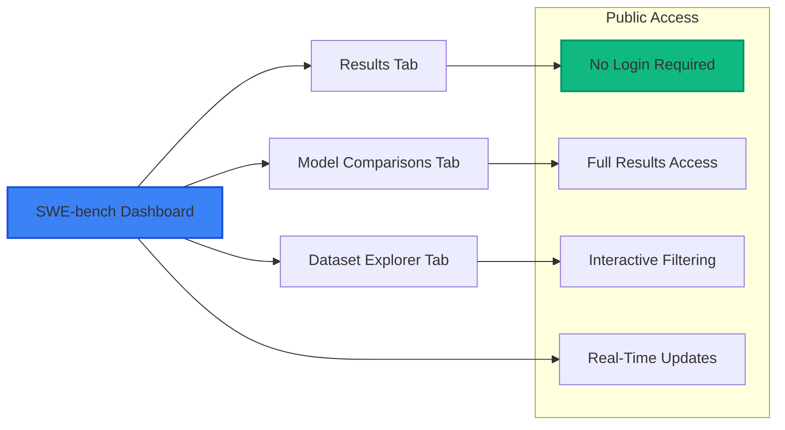

The interface has three main sections accessible to all users without registration:

- **Results**: Sortable table of all evaluation results
- **Model Comparisons**: Interactive charts comparing AI model performance  
- **Dataset Explorer**: Browse task instances and validation history

## Results Tab

### Results Table Features

The results table provides comprehensive evaluation data:

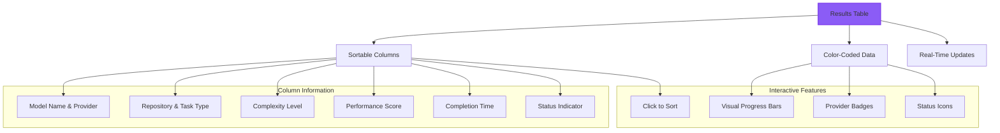

### Using the Results Table

#### Sorting Results

Click any column header to sort by that field:

- **Model**: Alphabetical model name sorting
- **Provider**: Group by AI provider (OpenAI, Anthropic, Google)
- **Repository**: Sort by repository name
- **Score**: Sort by performance (highest to lowest)
- **Completed**: Sort by completion time (most recent first)

Click again to reverse the sort order.

#### Understanding Score Displays

Each score includes both numerical value and visual indicator:

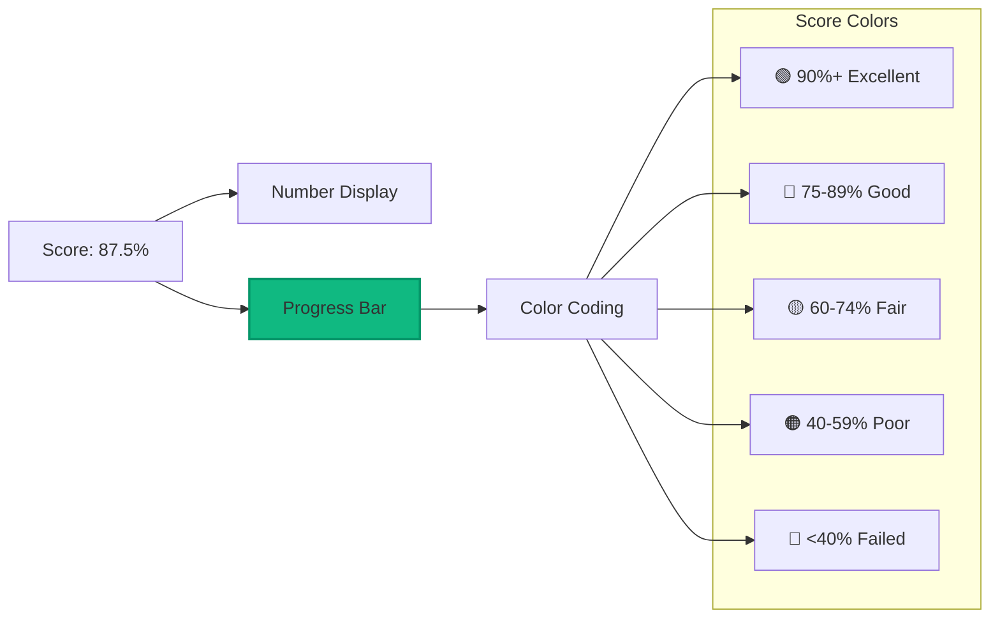

#### Provider Identification

Provider badges use consistent color coding:

- 🟢 **OpenAI** (Green): GPT-4, GPT-3.5-Turbo
- 🔵 **Anthropic** (Blue): Claude-3.5-Sonnet, Claude-3-Haiku  
- 🟡 **Google** (Yellow): Gemini-Pro, Gemini-1.5-Flash

## Model Comparisons Tab

### Interactive Chart System

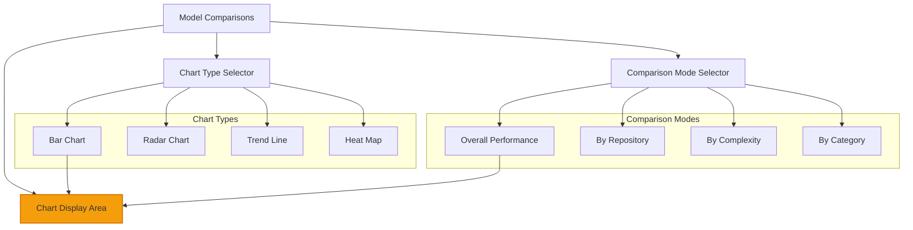

### Chart Types Explained

#### Bar Charts
**Best for**: Direct model performance comparison

Shows side-by-side performance bars for easy comparison across models. Use when you want to see which model performs best overall or in specific categories.

#### Radar Charts  
**Best for**: Multi-dimensional capability analysis

Displays model performance across multiple dimensions (functionality, performance, code quality, etc.) in a spider web format. Use to understand model strengths and weaknesses.

#### Trend Lines
**Best for**: Performance evolution over time

Shows how model performance changes over time or across different task complexities. Use to identify improvement patterns or performance degradation.

#### Heat Maps
**Best for**: Repository vs model performance matrix

Visual grid showing performance intensity across repository/model combinations. Darker colors indicate better performance. Use to identify which models excel at which types of tasks.

### Model Performance Summary Cards

Below the main chart, individual model performance cards provide:

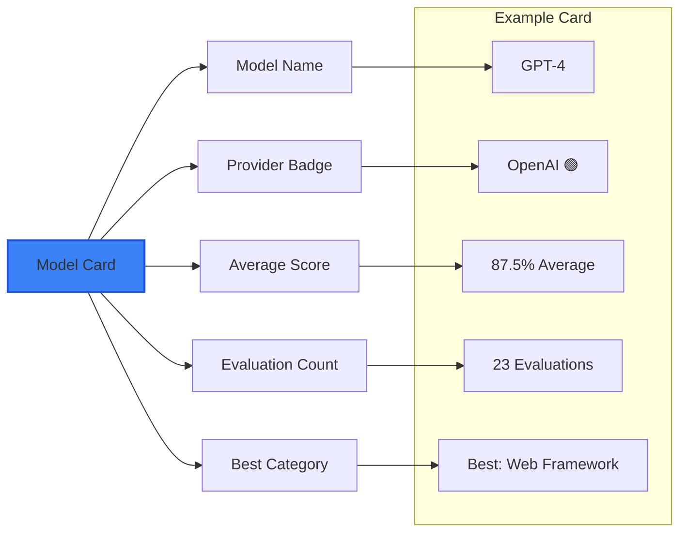

## Advanced Filtering System

### Dual Model+Task Filtering

The most powerful feature is the ability to filter by **both models AND tasks** simultaneously:

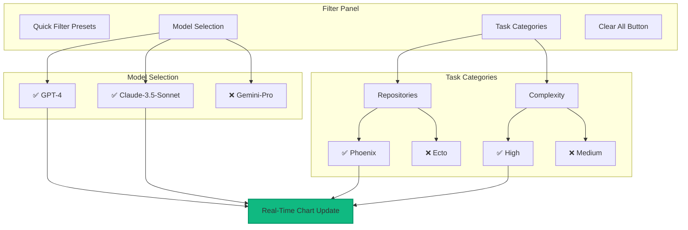

### Filter Categories

#### Model Selection
**Multi-select checkboxes** for AI models:
- Select any combination of available models
- Provider grouping shows model families
- Visual feedback shows number of selected models

#### Repository Filters
**Hierarchical task filtering** by:
- **Repository Name**: Phoenix, Ecto, LiveView, etc.
- **Category**: Web Framework, Database, Real-time Web
- **Task Count**: Shows available tasks per repository

#### Complexity Filters
**Difficulty-based filtering**:
- **Low**: Basic functionality and simple patterns
- **Medium**: Moderate complexity with multiple components  
- **High**: Complex logic and advanced patterns
- **Very High**: Expert-level tasks requiring deep knowledge

### Filter Presets

Quick access to common analysis scenarios:

#### "Top 3 Models"
**Filters**: GPT-4, Claude-3.5-Sonnet, Gemini-Pro
**Use Case**: Compare the best-performing models across all tasks

#### "Phoenix Tasks Only"  
**Filters**: Repository = Phoenix, Phoenix LiveView
**Use Case**: Focus on web framework development capabilities

#### "High Complexity"
**Filters**: Complexity = High, Very High
**Use Case**: Analyze how models handle difficult programming challenges

#### "Anthropic vs OpenAI"
**Filters**: Models = GPT-4, Claude-3.5-Sonnet
**Use Case**: Direct comparison between leading AI providers

### Shareable Filter URLs

Your filter selections are automatically saved in the URL:

```
https://swe-bench.com/dashboard?models=gpt-4,claude-3-5-sonnet&tasks=phoenix,high
```

**Benefits**:
- **Collaboration**: Share specific analyses with colleagues
- **Bookmarking**: Save interesting filter combinations
- **Reproducibility**: Return to exact same analysis later
- **Documentation**: Include specific URLs in reports or presentations

## Real-Time Features

### Live Updates

The interface updates automatically without page refresh:

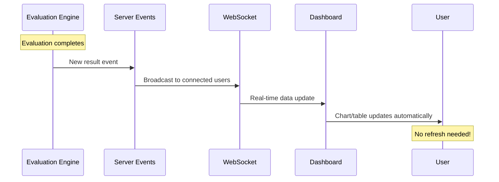

### Real-Time Indicators

Look for these indicators showing live functionality:

- **Live timestamps**: "Last updated: 14:30:45" with seconds updating
- **Connection status**: Green dot indicating active WebSocket connection
- **Auto-updating charts**: Charts refresh when new data arrives
- **Progress indicators**: Live progress bars for running evaluations

### Connection Recovery

If your internet connection is interrupted:

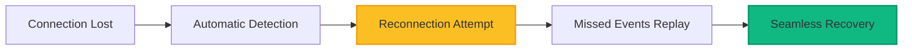

The system automatically:
1. **Detects** connection loss
2. **Reconnects** when connectivity returns
3. **Replays** missed events to catch up
4. **Resumes** normal operation seamlessly

## Dataset Explorer Tab

### Task Instance Browser

Explore the comprehensive task dataset:

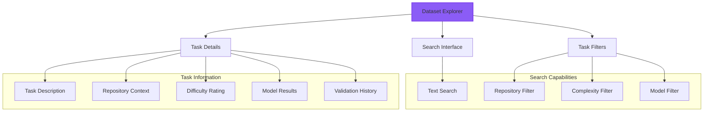

### Task Detail Views

Each task provides comprehensive information:

- **Task Description**: What the AI model needs to accomplish
- **Repository Context**: Which Elixir project and specific area
- **Code Requirements**: Expected functionality and constraints
- **Test Cases**: How solutions are validated
- **Model Results**: How different AI models performed
- **Performance Metrics**: Execution time and resource usage

## Admin Interface (For Administrators)

### Admin Access

Administrators have additional capabilities through the admin interface:

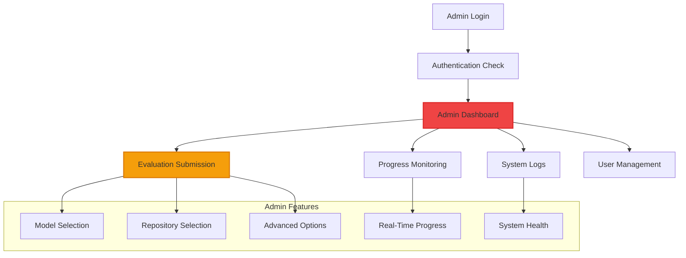

### Evaluation Submission

**Admin-only capability** for submitting new evaluations:

#### Submission Form Features
- **Model Selection**: Choose from 6 available AI models
- **Repository Selection**: Select from 17+ supported repositories  
- **Task Type Filtering**: Optional task category selection
- **Complexity Control**: Choose difficulty levels to evaluate
- **Advanced Options**: Enable Phase 4 advanced capabilities

#### Real-Time Progress Monitoring
- **Live Progress Bars**: Visual progress with percentage completion
- **Status Indicators**: Color-coded status (Running, Queued, Completed)
- **Stage Information**: Current evaluation stage with detailed progress
- **Cancellation Control**: Ability to cancel running evaluations
- **Duration Tracking**: Real-time duration and estimated completion

### System Monitoring

Administrators can monitor system health:

#### Live System Logs
- **Terminal-style interface** with real-time log streaming
- **Log level filtering** (Debug, Info, Warning, Error)
- **Search functionality** with debounced search input
- **Auto-scroll control** with manual override option

#### System Health Dashboard
- **Resource monitoring**: CPU, memory, and container utilization
- **Performance metrics**: Throughput, response times, error rates
- **Alert notifications**: Real-time system alerts and warnings

## Keyboard Shortcuts

### Navigation Shortcuts
- **Tab**: Navigate between interface elements
- **Enter**: Activate buttons and links
- **Escape**: Close modal dialogs and dropdowns
- **Space**: Toggle checkboxes in filter panel

### Filter Shortcuts
- **Ctrl+F**: Focus search input in dataset explorer
- **Ctrl+R**: Clear all filters (same as "Clear All" button)
- **Ctrl+1**: Switch to Results tab
- **Ctrl+2**: Switch to Model Comparisons tab
- **Ctrl+3**: Switch to Dataset Explorer tab

## Mobile Interface

### Responsive Design

The interface is fully responsive and mobile-friendly:

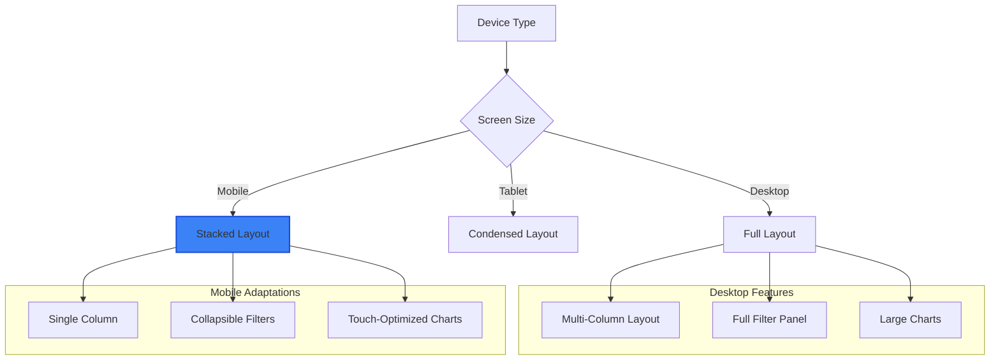

### Mobile-Specific Features

- **Touch-friendly controls**: Large tap targets for filter selection
- **Swipe gestures**: Swipe between tabs on mobile devices
- **Optimized tables**: Horizontal scrolling for data tables
- **Collapsible panels**: Expandable filter and info panels

## Accessibility Features

### Screen Reader Support

The interface includes comprehensive accessibility features:

- **Semantic HTML**: Proper heading hierarchy and landmark regions
- **ARIA labels**: Descriptive labels for interactive elements
- **Alt text**: Alternative text for charts and visualizations
- **Focus management**: Logical tab order and focus indicators
- **Color alternatives**: Information not conveyed by color alone

### Keyboard Navigation

Full keyboard accessibility:
- **Tab navigation**: Access all interactive elements
- **Focus indicators**: Clear visual focus indicators
- **Keyboard shortcuts**: Efficient navigation for power users
- **Screen reader announcements**: Live region updates for dynamic content

## Performance Features

### Optimization for Large Datasets

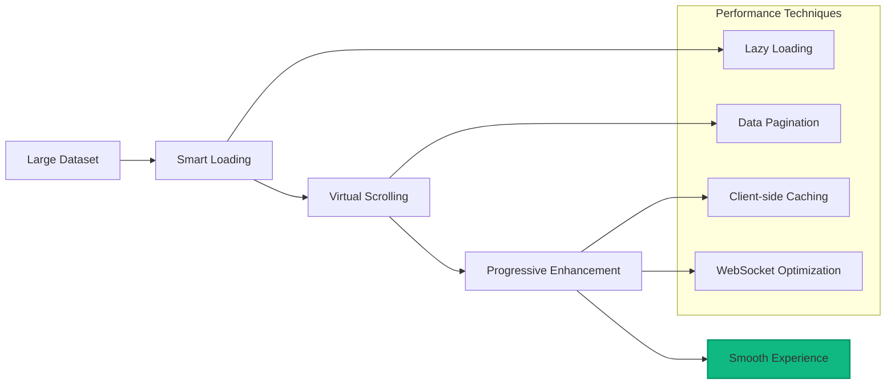

### Loading States

The interface provides clear feedback during data loading:

- **Skeleton screens**: Placeholder content while loading
- **Loading spinners**: Visual indicators for active operations
- **Progress indicators**: Shows completion percentage for long operations
- **Error states**: Clear error messages with recovery suggestions

## Browser Compatibility

### Supported Browsers

**Fully Supported**:
- Chrome 90+ (recommended)
- Firefox 88+
- Safari 14+  
- Edge 90+

**Limited Support**:
- Internet Explorer: Not supported (use modern browser)
- Older browser versions: Some features may not work

### Required Browser Features

The interface relies on modern web technologies:
- **WebSockets**: For real-time updates
- **CSS Grid**: For responsive layouts
- **ES6+**: For interactive functionality
- **SVG**: For chart rendering

## Troubleshooting

### Common Issues

#### Charts Not Loading
**Symptoms**: Blank chart areas or loading indicators
**Causes**: 
- Slow internet connection
- JavaScript disabled
- Browser compatibility issues

**Solutions**:
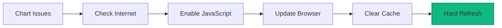

#### Real-Time Updates Not Working
**Symptoms**: Data doesn't update automatically
**Causes**:
- WebSocket connection issues
- Firewall blocking WebSocket traffic
- Browser settings

**Solutions**:
1. Check browser console for WebSocket errors
2. Disable browser extensions temporarily  
3. Try incognito/private browsing mode
4. Check firewall settings for WebSocket traffic

#### Filter Not Responding
**Symptoms**: Selecting filters doesn't update results
**Causes**:
- JavaScript errors
- Network connectivity issues
- Server overload

**Solutions**:
1. Refresh the page (Ctrl+F5 or Cmd+Shift+R)
2. Clear browser cache and cookies
3. Try different browser or incognito mode
4. Check browser developer console for errors

### Getting Help

If you encounter issues:

1. **Check Browser Console**: Press F12 and look for error messages
2. **Try Hard Refresh**: Ctrl+F5 (Windows/Linux) or Cmd+Shift+R (Mac)
3. **Test Different Browser**: Rule out browser-specific issues
4. **Check Connection**: Ensure stable internet connection
5. **Report Issues**: Use GitHub issues for persistent problems

## Advanced Tips

### Power User Tips

#### Efficient Model Analysis
1. **Start with presets** to quickly see common comparisons
2. **Use bookmarks** to save interesting filter combinations
3. **Export URLs** to share specific analyses with colleagues
4. **Watch for patterns** across different repositories and complexities

#### Research Workflow
1. **Document methodology** by saving filter URLs
2. **Compare systematically** using consistent filter approaches
3. **Track changes** by bookmarking specific model/task combinations
4. **Export insights** using browser tools or screenshot capabilities

### Integration with External Tools

#### Data Analysis
- **Screenshot tools**: Capture charts for presentations
- **Browser bookmarks**: Save interesting filter combinations
- **URL sharing**: Share specific analyses via messaging or email
- **Print functionality**: Generate PDF reports using browser print

#### Academic Usage
- **Citation**: Reference specific evaluation URLs in academic work
- **Methodology**: Document filter selections and analysis approach
- **Reproducibility**: Use shareable URLs to enable result verification
- **Collaboration**: Share filter combinations with research collaborators

This web interface provides a powerful, user-friendly way to explore AI coding capabilities in the Elixir ecosystem. The real-time features and advanced filtering make it easy to find insights and compare model performance across any dimension you're interested in analyzing.